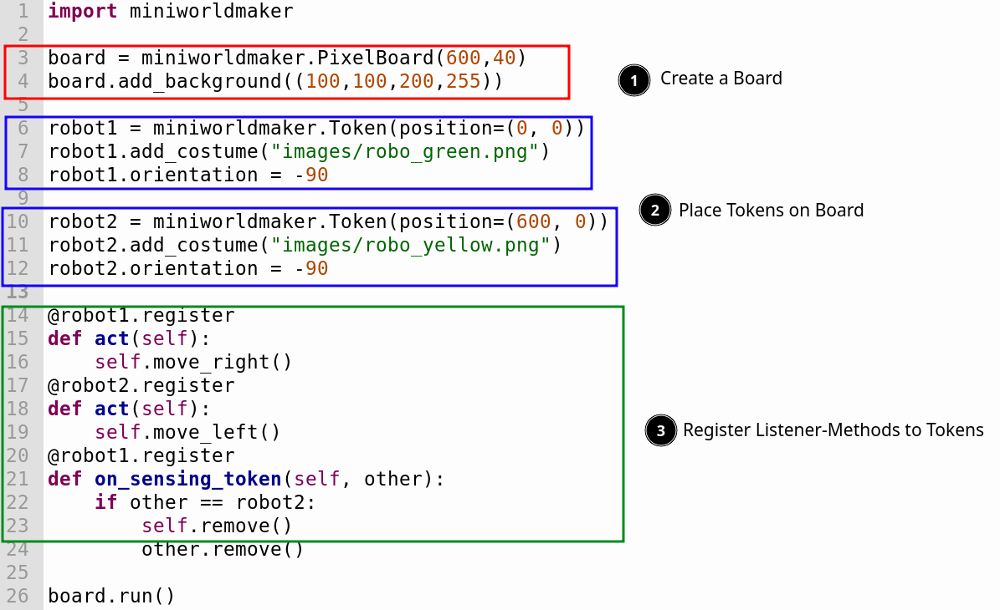

miniworldmaker
---------

miniworldmaker allows you to create 2D mini worlds and games. 

It is a 2D engine inspired by greenfoot and gamegrid based on pygame.

<kbd>
</img>
</kbd>

### Tutorial

[English](https://miniworldmaker.de/objectsfirst_english/01_installation.html) | [German](https://miniworldmaker.de/objectsfirst_german/01_installation.html) 

### Examples

  * [Angry Birds](https://replit.com/@a_siebel/miniworldmaker-Angry-birds): This demonstrates the physics engine. It runs somewhat slowly on repl.it, should buy smoothly on modern computers without problems.

  * [Kara](https://replit.com/@a_siebel/Kara-in-miniworldmaker"): Kara Prototype
 
  * [RPG Framework](https://replit.com/@a_siebel/RPG-Framework-for-miniworldmaker): Framework for simple RPGs and Textadventures

### Features

  * miniworldmaker supports pixel-based games as well as games with 
  tiles (e.g. Rogue-Likes)
  
  * Easy creation of animations
  
  * Music and sound effects
  
  * Integrated GUI elements like console for output, toolbar, ...
    
  * Load and Save to SQLite Databases
  
  * Integrated Physics-Engine based on Pymunk
  
  * Open Source
  
  * miniworldmaker is a 2D Engine based on Python 3, pygame and pymunk.

Examples
========

Top-Down games
  
<video controls loop width=100%>
<source src="_static/asteroids.webm" type="video/webm">
  <source src="_static/asteroids.mp4" type="video/mp4">
  Your browser does not support the video tag.
</video>

Tile Based RPGs

<video controls loop width=100%>
<source src="_static/rpg1.webm" type="video/webm">
  <source src="_static/rpg1.mp4" type="video/mp4">
  Your browser does not support the video tag.
</video>

Image Processing

.. image:: _images/sunflower6black.png
  :width: 100%
  :alt: Miniworldmaker

Physics

<video controls loop width=100%>
<source src="_static/physics_sim.webm" type="video/webm">
  <source src="_static/physics_sim.mp4" type="video/mp4">
  Your browser does not support the video tag.
</video>

<video controls loop width=100%>
<source src="_static/joints.webm" type="video/webm">
  <source src="_static/joints.mp4" type="video/mp4">
  Your browser does not support the video tag.
</video>

Angry Birds

Physics

<video controls loop width=100%>
<source src="_static/angry.webm" type="video/webm">
  <source src="_static/angry.mp4" type="video/mp4">
  Your browser does not support the video tag.
</video>

NEW: Hex Boardgame:

<video controls loop width=100%>
  <source src="_static/hex_boardgame_short.mp4" type="video/mp4">
  Your browser does not support the video tag.
</video>

[Source](https://codeberg.org/a_siebel/miniworldmaker_cookbook/src/branch/main/objects_first/boardgame/boardgame.py)

### Links

[Codeberg](https://codeberg.org/a_siebel/miniworldmaker) | [Documentation](http://miniworldmaker.de/) | [PyPi](https://pypi.org/project/miniworldmaker/) | [Cookbook](https://codeberg.org/a_siebel/miniworldmaker_cookbook/src/branch/main/)
