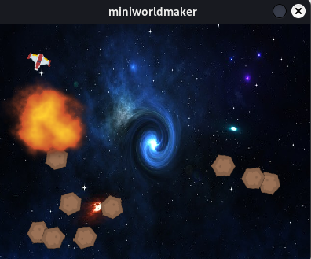
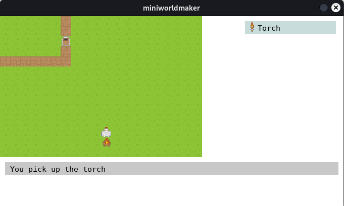
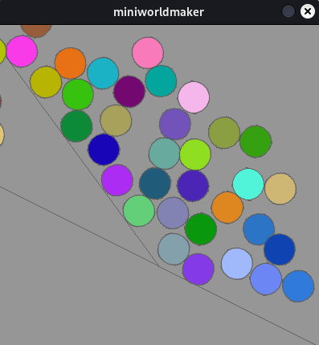
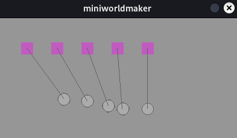
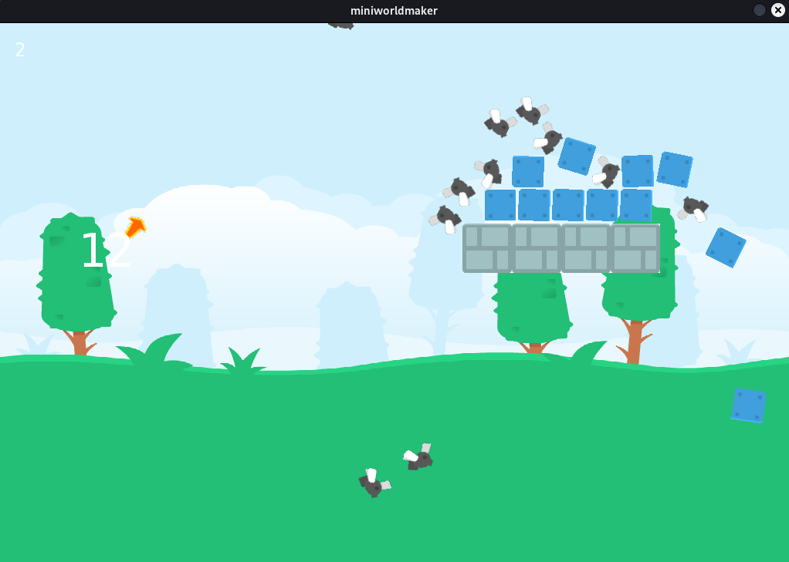
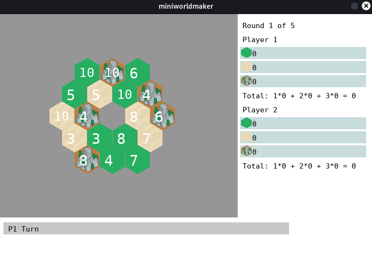

miniworldmaker
==============

miniworldmaker allows you to create 2D mini worlds and games. 

It is a 2D engine inspired by greenfoot and gamegrid based on pygame.

![example.png]
## Tutorial

* [English](https://miniworldmaker.de/objectsfirst_english/index.html)
* [German - Objects First](https://miniworldmaker.de/objectsfirst_german/index.html) 
* [German - Processing](https://miniworldmaker.de/processing_german/index.html)

## Features

* miniworldmaker supports pixel-based games as well as games with 
  tiles (e.g. Rogue-Likes), hexboards and processing-like graphics
* Easy creation of animations
* Music and sound effects
* Integrated GUI elements like console for output, toolbar, ...
* Load and Save to SQLite Databases
* Integrated Physics-Engine based on Pymunk
* Open Source  
* miniworldmaker is a 2D Engine based on Python 3, pygame and pymunk.

## Examples

Top-Down games

Tile Based RPGs

Image Processing

]

Physics

Angry-Birds-like

NEW: Hex Boardgame:

## Links

[Codeberg](https://codeberg.org/a_siebel/miniworldmaker) | [Documentation](http://miniworldmaker.de/) | [PyPi](https://pypi.org/project/miniworldmaker/) | [Cookbook](https://codeberg.org/a_siebel/miniworldmaker_cookbook/src/branch/main/)
