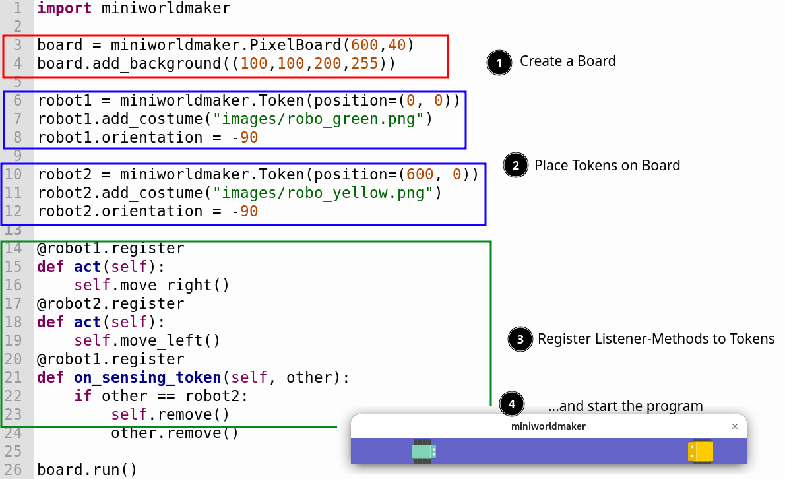

MiniWorldMaker
---------

MiniWorldMaker allows you to create 2D mini worlds and games. 

It is a 2D engine inspired by greenfoot and gamegrid based on pygame.

### Examples

  * [Angry Birds](https://replit.com/@a_siebel/miniworldmaker-Angry-birds): This demonstrates the physics engine. It runs somewhat slowly on repl.it, should buy smoothly on modern computers without problems.

  * [Kara](https://replit.com/@a_siebel/Kara-in-miniworldmaker"): Kara Prototype
 
  * [RPG Framework](https://replit.com/@a_siebel/RPG-Framework-for-miniworldmaker): Framework for simple RPGs and Textadventures

### Features

  * MiniWorldMaker supports pixel-based games as well as games with 
  tiles (e.g. Rogue-Likes)
  
  * Easy creation of animations
  
  * Music and sound effects
  
  * Integrated GUI elements like console for output, toolbar, ...
    
  * Load and Save to SQLite Databases
  
  * Integrated Physics-Engine based on Pymunk
  
  * Open Source
  
  * Miniworldmaker is a 2D Engine based on Python 3, pygame and pymunk.

### Links

[Codeberg](https://codeberg.org/a_siebel/miniworldmaker) | [Documentation](http://miniworldmaker.de/) | [PyPi](https://pypi.org/project/miniworldmaker/) | [Cookbook](https://codeberg.org/a_siebel/miniworldmaker_cookbook/src/branch/main/)
