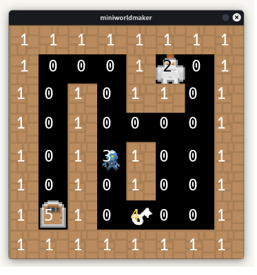
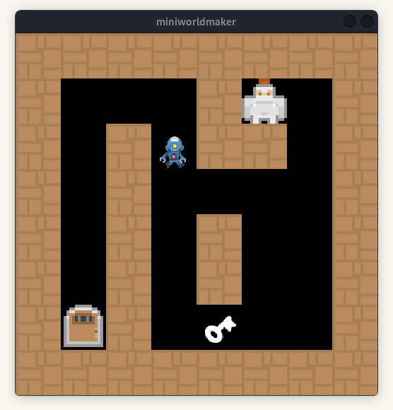

Tutorial: Maze Game
===================

In this chapter we will build a maze game together, step by step. 



The technique of creating a tilemap is common in games and after seeing it here you should be able to incorporate it into your own projects.

* **Based on**: `https://github.com/electronstudio/pygame-zero-book`
* **License:**  Attribution-NonCommercial-ShareAlike 4.0 International

## Step 1: Reading tokens from Tilemap

A tilemap uses a small number of images (the tiles) and draws them many times to build a much larger game level (the map). This saves you from creating a lot of artwork and makes it very easy to change the design of the level on a whim. Here we create a maze level.

We must create three image files for the tiles: `player.png `, `wall.png` and save them in the `mu_code/images` folder.

```
my_code
|
|--images
|----images/player.png
|----images/wall.png
```

Now we can code a framework:

### Create a board:

You can use this framework for your game:

In line 2 a TiledBoard is created, which contains the logic for tiled boards.
In the last line you **must** call board.run() to start the game.

``` python
from miniworldmaker import * 
board = TiledBoard(8, 8)
board.tile_size = 64
board.add_background((0,0,0,255))

# Your code here

board.run() 
```

#### Create Token-Subclasses

Create Token-Subclasses for every *type* of Token:

``` python
class Player(Token):
    def on_setup(self):
        self.add_costume("player")
        self.layer = 1
        
class Wall(Token):
    def on_setup(self):
        self.add_costume("wall")
```

`self.add_costume` adds a costume to the token. A costume can be based on an image ("player", "wall" - You can ommit file endings like .png or .jpeg) or on a color. 

A color can be a 3-tuple (r,g,b) or an 4-tuple (r,g,b,a).


### Create a Tile-Map

A Tile-Map is a 2D-List which contains information, where tokens should be positioned.

The value in the maze-list defines the position in the tiles list.
0: None
1: Wall
2: Player

``` python
tiles = [None, Wall, Player]

maze = [
    [1, 1, 1, 1, 1, 1, 1, 1],
    [1, 0, 0, 0, 1, 2, 0, 1],
    [1, 0, 1, 0, 1, 1, 0, 1],
    [1, 0, 1, 0, 0, 0, 0, 1],
    [1, 0, 1, 0, 1, 0, 0, 1],
    [1, 0, 1, 0, 1, 0, 0, 1],
    [1, 0, 1, 0, 0, 0, 0, 1],
    [1, 1, 1, 1, 1, 1, 1, 1]
]
```

### Create Objects for each cell in Tile-Map

For each cell in Tile-Map, a Token can/must be generated.
You can get the class from tilemap.

```python
@board.register
def on_setup(self):
    for row in range(len(maze)):
        for column in range(len(maze[row])):
            x = column
            y = row
            token_cls = tiles[maze[row][column]]
            if token_cls:
                t = token_cls(x, y)
```

## Step 2: Movement

### Move Player

Add this code to the class Player:

``` python
class Player(Token):
    def on_setup(self):
        self.add_costume("player")
        self.layer = 1

    def on_key_down(self, keys):
        if "UP" in keys:
            self.y -= 1
        elif "DOWN" in keys:
            self.y += 1
        elif "LEFT" in keys:
            self.x -= 1
        elif "RIGHT" in keys:
            self.x += 1
```

The on_key_down-Method reacts to key-down events. The argument `keys` stores the keys pressed as list.

### Block Movement

You can restrict Movement with the `move_back()`-Method - It moves a token back to its last position.

You can modify the methon `on_key_down` in the `Player`-class

``` python
def on_key_down(self, keys):
        if "UP" in keys:
            self.y -= 1
        elif "DOWN" in keys:
            self.y += 1
        elif "LEFT" in keys:
            self.x -= 1
        elif "RIGHT" in keys:
            self.x += 1
        if self.sensing_token(Wall):
            self.move_back()
```

## Create an Enemy

Create an Enemy-Class (put it in your code near to your other classes):

### Create enemy class

Create the enemy class:

```python
class Enemy(Token):
    def on_setup(self):
        self.add_costume("enemy")
        self.layer = 1
```

The layer must be 1, so that the token is placed before the `Nothing`-Token.

### Enemy Movement

Add a `velocity`-attribute to Player-setup and add a method `act()` to the Player.

act() is called every frame. The Enemy token should move `velocity`.

The opponent token should move "velocity" many steps in y-direction. If it detects a wall, 
the direction should be inverted. For this the variable "velocity" is inverted, 
so that the token either goes 1 step in y-direction or -1 step in y-direction.


``` python
def on_setup(self):
        self.add_costume("enemy") # add enemy.png to your images-folder 
        self.velocity = 1
        self.layer = 1

    def act(self):
        self.move(self.velocity)
        if self.sensing_token(Wall):
            self.move_back()
            self.velocity = - self.velocity
            self.move(self.velocity)
        if self.sensing_token(Player):
            print("You died")
            exit()
```

### Exercises


#### Exercise

Verify that the enemy moves up and down and kills the player.

#### Advanced

Make another enemy that moves horizontally (left and right).

## A door and a key

Add three images: `key.png` `door_open.png` and `door_closed` to your `images`-Directory

### Add classes

Add a Door-Class:

``` python
class Door(Token):
    def on_setup(self):
        self.add_costume("door_closed")
        self.add_costume("door_open")
        self.switch_costume(0)
        self.layer = 1
        self.open = False

    def open_door(self):
        self.open = True
        self.switch_costume(1)
``` 

Add a global variable `has_key` to store whether the player has picked up the key. 
(Alternatively, you can add an attribute `self.has_key` to the player class. )

``` python
from miniworldmaker import * 

has_key = False
board = TiledBoard(8, 8)
board.tile_size = 64

...
```

Add a Key-Class

```  python
class Key(Token):
    def on_setup(self):
        self.add_costume("key")
        self.layer = 1
        
    def get_key(self):
        global has_key
        has_key = True
        self.remove()
```

### Modify the tilemap

Modify the Tilemap:

``` python
tiles = [None, Wall, Player, Enemy, Key, Door]

maze = [
    [1, 1, 1, 1, 1, 1, 1, 1],
    [1, 0, 0, 0, 1, 2, 0, 1],
    [1, 0, 1, 0, 1, 1, 0, 1],
    [1, 0, 1, 0, 0, 0, 0, 1],
    [1, 0, 1, 0, 1, 0, 0, 1],
    [1, 0, 1, 0, 1, 0, 0, 1],
    [1, 5, 1, 3, 4, 0, 0, 1],
    [1, 1, 1, 1, 1, 1, 1, 1]
]
```

### Add sensor to Player-Class


Add the folowing sensor to player class. It detects other tokens, if other tokens have the class `key`:

``` python
def on_sensing_key(self, other):
    other.get_key()
```
### Exercise


#### Exercise

Check that the game ends when the player reaches the door and the door is open.


## Full Code

``` python
from miniworldmaker import * 

has_key = False
board = TiledBoard(8, 8)
board.tile_size = 64
board.add_background((0,0,0,255))

class Player(Token):
    def on_setup(self):
        self.add_costume("player")
        self.layer = 1

    def on_key_down(self, keys):
        if "UP" in keys:
            self.y -= 1
        elif "DOWN" in keys:
            self.y += 1
        elif "LEFT" in keys:
            self.x -= 1
        elif "RIGHT" in keys:
            self.x += 1
        if self.sensing_token(Wall):
            self.move_back()
            
    def on_sensing_key(self, other):
        other.get_key()
        
class Wall(Token):
    def on_setup(self):
        self.add_costume("wall")
        
class Enemy(Token):
    def on_setup(self):
        self.add_costume("enemy") # add enemy.png to your images-folder 
        self.velocity = 1
        self.layer = 1
        
    def act(self):
        self.move(self.velocity)
        if self.sensing_token(Wall):
            self.move_back()
            self.velocity = - self.velocity
            self.move(self.velocity)
        if self.sensing_token(Player):
            print("You died")
            exit()

class Door(Token):
    def on_setup(self):
        self.add_costume("door_closed")
        self.add_costume("door_open")
        self.switch_costume(0)
        self.layer = 1
        self.open = False

    def open_door(self):
        self.open = True
        self.switch_costume(1)

class Key(Token):
    def on_setup(self):
        self.add_costume("key")
        self.layer = 1
        
    def get_key(self):
        global has_key
        has_key = True
        self.remove()
        
            
tiles = [None, Wall, Player, Enemy, Key, Door]

maze = [
    [1, 1, 1, 1, 1, 1, 1, 1],
    [1, 0, 0, 0, 1, 2, 0, 1],
    [1, 0, 1, 0, 1, 1, 0, 1],
    [1, 0, 1, 0, 0, 0, 0, 1],
    [1, 0, 1, 0, 1, 0, 0, 1],
    [1, 0, 1, 0, 1, 0, 0, 1],
    [1, 5, 1, 3, 4, 0, 0, 1],
    [1, 1, 1, 1, 1, 1, 1, 1]
]

@board.register
def on_setup(self):
    for row in range(len(maze)):
        for column in range(len(maze[row])):
            x = column
            y = row
            token_cls = tiles[maze[row][column]]
            if token_cls:
                t = token_cls(x, y)


board.run()
```

            

## Ideas for extension

However that is not the end! There are many things you could add to this game.

* Show the player score.

* Coins that the player collects to increase score.

* Trap tiles that are difficult to see and kill the player.

* Treasure chest that is unlocked with the key and increases score.

* Instead of ending the game, give the player 3 lives.

* Add more types of tile to the map: water, rock, brick, etc.

* Change the player image depending on the direction they are moving.
