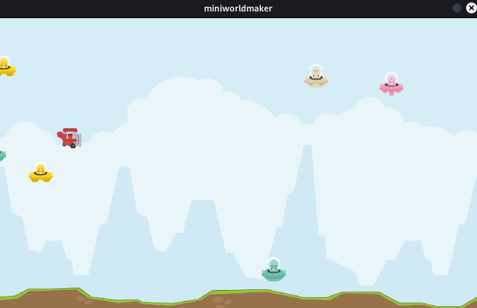

Tutorial: Red Baron
===================

In this chapter we will build a Side-Scrolling shoter together, step by step. 

 <video controls loop width=100%>
  <source src="../_static/red_baron.mp4" type="video/mp4">
  Your browser does not support the video tag.
</video> 

The techniques of creating a parallax backgrounds, managing speed and velocity and generating enemies is common in games and after seeing it here you should be able to incorporate it into your own projects.

* **Based on**: `https://github.com/kantel/pygamezero/tree/master/tappyplane`
* **License:**  Attribution-NonCommercial-ShareAlike 4.0 International

##b Step 1: Create a base framework

Create a base framework: You need a board on which tokens can be placed.

Your last line must be `board.run()`.
``` python
from miniworldmaker import *
board = Board(800, 480)

// your code here

board.run()
```

## Prepare your folder

You must place images for backgrounds, player and enemies in a directory `images` inside your code directory.

```
my_code
|
|--images
|----images/planered1.png
|----images/background.png
|----images/groundgrass.png
|----images/shipbeige.png
|----images/shipblue.png
|----images/shipgreen.png
|----images/shippink.png
|----images/shipyellow.png
```

(You can find the images in this repository: [miniworldmaker-cookbook - red baron](https://codeberg.org/a_siebel/miniworldmaker_cookbook/src/branch/main/classes_first/red_baron) ) 

## Create backgrounds

With the following code, you can generate two backgrounds. 

You need two backgrounds to generate a *infinite scrolling*-effect:

Generate this background next to each other so they are filling the complete screen:

``` python
back0 = Token()
back0.add_costume("background")
back0.size = board.width, board.height
back1 = Token(board.width, 0)
back1.size = board.width, board.height
back1.add_costume("background")
backs = [back0, back1]
```

Now we *animate* the backgrounds:

* Both backgrounds move constantly from left to right.
* if a background leaves the left side of screen, it will  be be moved to the right side.

``` python
@board.register
def act(self):
    for back in backs:
        back.x -= 1
        if back.x <= - board.width:
            back.x = board.width
    for ground in grounds:
        ground.x -= 2
        if ground.x <= - board.width:
            ground.x = board.width
```

This will generate a *infinite scrolling background.


## Step 2: Create a plane class

### Create a plane class

Create a plane class as template for your player.

``` python
class Plane(Token):
    def on_setup(self):
        self.add_costume("planered1")
```

### Create a plane instance

At the end of your code before `board.run()` create an instance of this template-class:

``` python
plane = Plane(100, board.height / 2)
```

### Add physics

Now we add physics to the plane-Token.

Modify the `on_setup()`-Method of Plane:

``` python
    def on_setup(self):
        self.add_costume("planered1")
        self.gravity = 0.1
        self.velocity_y = 0
```

* `velocity` describes the current velocity. The Plane will move `velocity` steps in y-direction.
* `gravity` describes the current gravity: The y-velocity of player will be reduced by gravity in every frame.

#### Simulate physics

Physics can be simulated in the `act()`-Method of Token:

``` python
    def act(self):
        self.velocity_y += self.gravity
        self.velocity_y *= 0.9 # friction
        self.y += self.velocity_y
```

This will add the velocity to the y-coordinates of player. The gravity constantly reduces the velocity.

Line 3 will smoothen the simulation.

### Add force on key press

You must use the `on_key_down` event to add a force to the token:

``` python
    def on_key_down_w(self):
        self.velocity_y -= 5
```

## Step 3: Add enemies

Import randint and choice for randomization at the beginning of your code:

``` python
from random import randint, choice
```

### Add an enemy class

Add an enemy class as template:

``` python
class Enemy(Token):
    
    def on_setup(self):
        enemy.add_costume(choice(enemyships))

    def reset(self):
        self.x = randint(board.width + 50, board.width + 500)
        self.y = randint(25, board.height - 85)  
```

The on_setup-Method adds a random costume to the token.

### Add enemy instances from class-template

Add mutliple enemies to the board with a for-loop at the end of your code before board.run().

``` python
enemies = []
for _ in range(10):
    enemy = Enemy()
    enemy.reset()
    enemies.append(enemy)
```

### Move enemies

Modify the `on_setup`-Method:

``` python
def on_setup(self):
    self.add_costume(choice(enemyships))
    self.speed = -1.5
```

`self.speed` defines how many steps the Enemy-Token will move in x-direction each frame.

Add an `act()-Method`:

``` python
def act(self):
    self.x += self.speed
    if self.x <= -self.width:
        self.reset()
```

## Step 3: Add shooting

Add a Bullet-Class to your Token:

``` python
class Bullet(Token):
    def on_setup(self):
        self.add_costume("laserred")
        self.x = plane.x
        self.y = plane.y
        self.speed = 25
        self.fire = False
    
    def act(self):
        self.x += self.speed

    def on_sensing_enemy(self, enemy):
        enemy.reset()
        
    def on_sensing_not_on_board(self):
        self.remove()
```

The Bullet has `sensors` - With the method `on_sensing_enemy` it can detect all Tokens with of class `Enemey' and call their reset()-Methods.

With `on_sensing_not_on_board` it an detect, if Bullet is on the board.


## Complete Code:



``` python
from miniworldmaker import *
from random import randint, choice

# based on https://github.com/kantel/pygamezero/tree/master/tappyplane

board = Board(800, 480)

left = board.width / 2
bottom = board.height / 2
bottomground = board.height - 35

no_enemies = 10
enemyships = ["shipbeige", "shipblue", "shipgreen", "shippink", "shipyellow"]

# Add backgrounds
back0 = Token()
back0.add_costume("background")
back0.size = board.width, board.height
back1 = Token(board.width, 0)
back1.size = board.width, board.height
back1.add_costume("background")
backs = [back0, back1]

ground0 = Token((0, bottomground))
ground0.add_costume("groundgrass")
ground0.width = board.width 
ground0.costume.is_scaled = True
ground1 = Token((board.width, bottomground))
ground1.add_costume("groundgrass")
ground1.width = board.width
ground1.costume.is_scaled = True
grounds = [ground0, ground1]


groundlevel = board.height - 85

@board.register
def act(self):
    for back in backs:
        back.x -= 1
        if back.x <= - board.width:
            back.x = board.width
    for ground in grounds:
        ground.x -= 2
        if ground.x <= - board.width:
            ground.x = board.width

class Plane(Token):
    def on_setup(self):
        self.add_costume("planered1")
        self.gravity = 0.1
        self.velocity_y = 0
        self.fire = False

    def act(self):
        self.velocity_y += self.gravity
        self.velocity_y *= 0.9 # friction
        self.y += self.velocity_y
        if self.y >= groundlevel:    
            self.y = groundlevel
            self.velocity_y = 0
        if self.y <= 20:             
            self.y = 20
            self.velocity_y = 0

    def on_key_down_w(self):
        self.velocity_y -= 5
        
    def on_key_down_d(self):
        if not self.fire:
            self.fire = True
            bullet = Bullet()
            @timer(frames=30)
            def downtime():
                self.fire = False
      
class Bullet(Token):
    def on_setup(self):
        self.add_costume("laserred")
        self.x = plane.x
        self.y = plane.y
        self.speed = 25
        self.fire = False
    
    def act(self):
        self.x += self.speed

    def on_sensing_enemy(self, enemy):
        enemy.reset()
        
    def on_sensing_not_on_board(self):
        self.remove()
        
class Enemy(Token):
    
    def on_setup(self):
        self.add_costume(choice(enemyships))
        self.speed = -1.5

    def reset(self):
        self.x = randint(board.width + 50, board.width + 500)
        self.y = randint(25, groundlevel)    

    def act(self):
        self.x += self.speed
        if self.x <= -self.width:
            self.reset()

plane = Plane((100, board.height / 2))

enemies = []
for _ in range(no_enemies):
    enemy = Enemy()
    enemy.reset()
    enemies.append(enemy)

        
board.run()
```