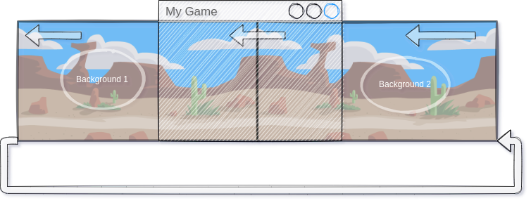

# Scrolling

Oft möchtest du den Bildschirm "scrollen lassen.

 <video controls loop width=100%>
  <source src="../_static/scrolling.mp4" type="video/mp4">
  Your browser does not support the video tag.
</video> 

Die einfachste Möglichkeit dazu ist es einen Hintergrund zu "verschieben":

Damit dies wirklich gut funktioniert, musst du den Hintergrund als "Token anlegen" und benötigst zwei Hintergründe.



Beide Hintergründe wandern von rechts nach links (oder von oben nach unten, links nach rechts, ... - Je nach Spiel) - Sobald ein Hintergrund das Spielfeld verlassen würde, wird er wieder ganz rechts angefügt.

Auf diese Weise entsteht der Eindruck einer "unendlich langen Landschaft".

Im Code kann man dies wie folgt umsetzen:

* Lege mden Hintergrund zweimal mit dem gleichen Hintergrund an und platziere diese nebeneinander.
* Es kann sinnvoll sein die Hintergründe in einer Liste zu speichern, da du sie dann gemeinsam bewegen kannst.

``` python
back0 = Token()
back0.add_costume(BACKGROUND)
back0.size = WIDTH, HEIGHT
back1 = Token(WIDTH, 0)
back1.size = WIDTH, HEIGHT
back1.add_costume(BACKGROUND)
backs = [back0, back1]
```

In der `board.act`-Methode die jedes Frame einmal aufgerufen wird, kannst den Bildschirm langsam verschieben:

``` python
@board.register
def act(self):
    for back in backs:
        back.x -= 1
        if back.x <= - WIDTH:
            back.x = WIDTH
```


Als Code sieht dies so aus:

``` python

from miniworldmaker import *

WIDTH, HEIGHT = 800, 400
board = Board(WIDTH, HEIGHT)
left, bottom = WIDTH/2, HEIGHT/2

BACKGROUND = "desertback"

back0 = Token()
back0.add_costume(BACKGROUND)
back0.size = WIDTH, HEIGHT
back1 = Token(WIDTH, 0)
back1.size = WIDTH, HEIGHT
back1.add_costume(BACKGROUND)
backs = [back0, back1]

walker = Token((100, HEIGHT - 100))
walker.size = 100, 60
walker.add_costumes(["walk1", "walk2"])
walker.speed = 1
walker.count = 0

@board.register
def act(self):
    for back in backs:
        back.x -= 1
        if back.x <= - WIDTH:
            back.x = WIDTH
    walker.count += walker.speed
    if walker.count > 11:
        costume = walker.next_costume()
        walker.count = 0

@board.register
def on_key_down(self, keys):
    if "q" in keys:
        board.quit
        
board.run()
```

Notiz: Die Idee stammt von dem Blog [schockwellenreiter](http://blog.schockwellenreiter.de/2022/05/2022051502.html) - Jörg Kantereit hat dort dieses Snippet mit Pygame Zero programmiert.