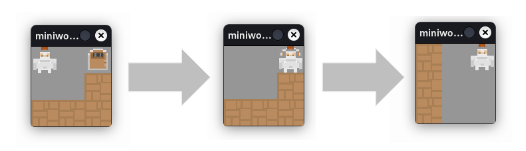

# Level Loading

Ein typischer Anwendungsfall: Du möchtest ein neues Level starten, wenn die Bildschirmfigur den Rand erreicht oder durch eine Tür geht, usw.

Dies geht folgendermaßen:

* Speichere dein Level in einer Datenbank, einer Textdatei oder einer einfachen Liste.
* Du brauchst eine **Funktion**, die dein Level lädt, sobald etwas passiert (du erreichst den Rand, berührst ein Token, ...)

## Speichern deines Levels als Liste

Du kannst dein Level in einer mehrdimensionalen Liste speichern. In einem ganz einfachen Fall könnte dies z.B. so aussehen:

``` python
r00 = [    "  d",
           "  w",
           "www"]
```

Du brauchst dann eine Übersetzung in Tokens, `w` steht hier für eine `Wall`, `d` für eine `Door`.

Die Räume kannst du dann in einer Liste oder als Dictionary speichern, z.B. so als Liste:

``` python
rooms = [r00, r01]
```

...oder so als Dictionary:

``` python
rooms = {0: r00, 1: r01}
```

### Anlegen von Klassen für die einzelnen Objekte

Damit ein Objekt einer *bestimmten Art* erzeugt werden kann, ist es sinnvoll, eine Klasse für dieses Objekt zu speichern.

Dies könnte z.B. so aussehen:

``` python
class Wall(Token):
    def on_setup(self):
        self.add_costume("wall")
``` 

Die Klasse `Wall` definiert Objekte, sich wie Tokens verhalten, aber von dem Standard-Token insofern unterscheidet, dass diese immer als Kostüm ein Bild mit einer Wand besitzen.

## Übersetzen der Liste

Die Liste kannst du nun in Tokens übersetzen:

``` python
def setup_room(room):
    for token in board.tokens:
        if token != player:
            token.remove()
    for i, row in enumerate(room):
        for j, column in enumerate(row):
            x = j
            y = i
            if room[i][j] == "w":
                t = Wall(x, y)
            if room[i][j] == "d":
                d = Door(x, y) 
```

Zunächst werden in der ersten For-Schleife alle Tokens bis auf das Player-Objekt gelöscht

In der zweiten Schleife wird nun über die Listen iteriert. Dabei wird jedesmal, wenn ein entsprechender Token in der String-Liste gefunden wird, ein entsprechendes Token angelegt.

## Wechseln des Raums

Mit der Vorarbeit ist es einfach den Raum zu wechseln: Du musst einfach nur die Methode setup_room an geeigneter Stelle aufrufen um den Raum zu wechseln, z.B. so:

``` python
    def on_key_down(self, keys):
        global r01
        if "SPACE" in keys:
            if self.sensing_token(Wall):
                setup_room(rooms[1]) 
```

So könnte das ganze Programm aussehen:

``` python
from miniworldmaker import *

board = TiledBoard()
board.columns = 3
board.rows = 3

r00 = [    "  d",
           "  w",
           "www"]

r01 =     ["w  ",
           "w  ",
           "w  ",
           ]

rooms = {0: r00, 1: r01}

class Player(Token):
    
    def on_setup(self):
        self.add_costume("knight")
        self.costume.is_rotatable = False
        self.layer = 1
        
    def on_key_down_w(self):
        self.move_up()

    def on_key_down_s(self):
        self.move_down()

    def on_key_down_a(self):
        self.move_left()
    
    def on_key_down_d(self):
        self.move_right()
        
    def on_sensing_not_on_board(self):
        self.move_back()

    def on_sensing_wall(self, other):
        self.move_back()
        
    def on_key_down(self, keys):
        global r01
        if "SPACE" in keys:
            if self.sensing_token(Wall):
                setup_room(rooms[1])

class Wall(Token):
    def on_setup(self):
        self.add_costume("wall")

class Door(Token):
    def on_setup(self):
        self.add_costume("door_closed")


@board.register
def on_setup(self):
    setup_room(r00)
    
def setup_room(room):
    for token in board.tokens:
        if token != player:
            token.remove()
    for i, row in enumerate(room):
        for j, column in enumerate(row):
            x = j
            y = i
            if room[i][j] == "w":
                t = Wall(x, y)
            if room[i][j] == "d":
                d = Door(x, y)                
                
player = Player(0, 0)
board.run()
```

Sobald ein Spieler auf der Tür steht und die Leertaste drückt, wird der Raum gewechselt.

