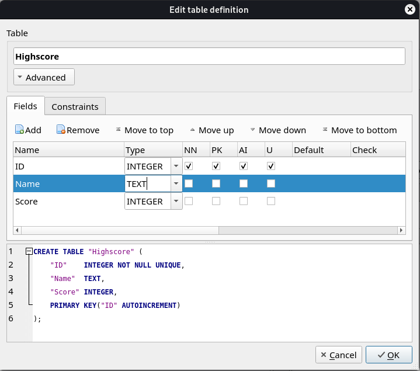
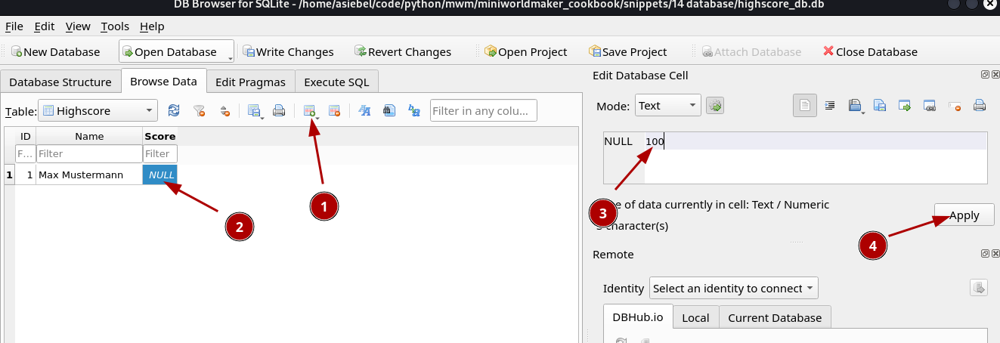
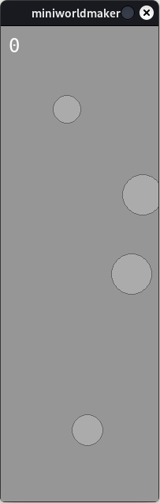

Daten aus der Datenbank laden
=============================

In diesem Artikel wirst du lernen, wie man ein Datenmodell erstellt und dieses mit einer Datenbank synchronisiert. Du kannst dies für vielfältige Zwecke einsetzen, z.B. Fragen und Antworten in einem Quiz-Spiel, eine High-Score, Laden von Spieldaten, ...

## Erster Schritt: Erstellen des Modells:

Erstelle in einer neuen Datei ein Modell für deine Daten, *so wie du sie in Python* speichern würdest. 

Eine Highscore z.B. könntest du als einfache Liste speichern, in der du Namen und Punktezahl speicherst, z.B. so:

```
[(Andreas, 100), (Martin, 200), (Julius,50)]
```

Die Reihenfolge der Daten spielt noch keine Rolle, denn du kannst diese ja jederzeit sortieren

Deine Klasse könnte also erstmal so aussehen:

Datei: highscore_model.py:

```python 
import sqlite3

class Highscore:
    def __init__(self, scores = []):
        self.scores : list = scores
```

Die Klasse enthält ein Attribut `scores`, welches entweder aus dem Parameter der __init__-Methode gelesen wird oder eine leere Liste enthält.

## Einrichten der Datenbank

Mit dem Programm DBBrowser for sqlite kannst du die Datenbank einrichten.

Richte einer Tabelle und 3 Feldern ein: Name, Score und ID.



:::{note}
Warum benötige ich eine ID?

Wenn du dein Programm später erweitern willst, dann können die einzelnen Datensätze in der Tabelle nur identifiziert werden,
wenn du ein eindeutiges Attribut ergänzt. Daher ist es sinnvoll eine *ID* zu ergänzen.
::::

Speichere Beispieldaten in die Datenbank, damit du damit später das Einlesen testen kannst:




## Aus der Datenbank lesen

Als nächstes kannst du eine Methode zum Lesen der Daten implementieren.

Füge dazu folgende Klasse deiner Datenbank hinzu:

``` python
@classmethod
def from_db(cls):
    connection = sqlite3.connect("highscore_db.db")
    cursor = connection.cursor()
    sql = f'SELECT Name, Score FROM Highscore'
    cursor.execute(sql)
    rows = cursor.fetchall()        
    connection.close()
    return cls(rows)
```

Die Methode ist eine `classmethod` - Diese Methoden dienen dazu, Objekte einer Klasse (wie eine Art *Factory*) zu erzeugen, in diesem Fall wird ein neues Highscore-Objekt mit Daten aus der Datenbank erzeugt.

Zunächst wird dazu eine Verbindung aufgebaut. Hier muss der Dateiname zu deiner sqlite3-Datenbank angegegeben werden.

Anschließend wird ein Cursor erstellt, der SQL-Abfragen aus der Datenbank auslesen und diese ausführen kann.

Mit `cursor.fetchone` bzw. `cursor.fetchall()` können diese Daten dann zurückgegeben werden.

:::{note}
Aufgabe: Sortiere die Ergebnisse der Highscore absteigend.
::::

Du kannst dein Programm testen, indem du am Ende der Datei ein Highscore-Objekt erzeugst. Vergiss aber nicht dies zu löschen, wenn du die Datei später importierst!

```python
hs = Highscore.from_db()
print(hs.scores)
```

## In die Datenbank schreiben

Ergänze folgende Funktion, um in die Datenbank zu schreiben:

```python
    def create(self, name, score):
        connection = sqlite3.connect("highscore_db.db")
        cursor = connection.cursor()
        sql = f"INSERT INTO Highscore (Name, Score) VALUES ('{name}', '{score}')"
        cursor.execute(sql)
        connection.commit()
        connection.close()
        self.scores.append((name,score))
```

Hier wird wieder zunächst eine Verbindung aufgebaut und ein Cursor erstellt, der diesesmal eine INSERT-Anfrage an die Datenbank stellt, um einen neuen Datensatz hinzuzufügen.

Damit die lokalen Daten und die Daten in der Datenbank synchron bleiben, wird der Datensatz auch in der Tabelle gelöscht.

## CRUD

Als CRUD bezeichnet man:

* **C**reate, einen Datensatz anlegen,
* **R**ead, Datensatz lesen,
* **U**pdate, Datensatz aktualisieren
* **D**elete oder Destroy, Datensatz löschen.

Dies sind die Operationen über die du dir Gedanken machen musst, wenn du eine Verbindung zur Datenbank herstellen möchtest.

### Create

Die Create-Funktion wurde mit der Funktion `create` implementiert.

### Read

Mit der Funktion `from_db` wurde die komplette Tabelle `Highscore` in unserer Datenbank in die Liste `self.scores` geladen.

### Update

Einen Datensatz kannst du aktualisieren (Wenn ein Spieler das Spiel z.B. wiederholt.)

Ergänze dazu folgende Methode:

``` python
    def update(self, score_id, name, new_score):
        connection = sqlite3.connect("highscore_db.db")
        cursor = connection.cursor()
        sql = f"UPDATE Highscore SET Name = '{name}', Score = '{new_score}' WHERE ID='{score_id}'"
        cursor.execute(sql)
        connection.commit()
        connection.close()
        for score in self.scores:
            if score[0] == score_id:
                self.scores.remove(score)
                self.scores.append((score_id, name, new_score))
```

### Delete

Ergänze folgende Methode:

```python
    def delete(self, score_id):
        connection = sqlite3.connect("highscore_db.db")
        cursor = connection.cursor()
        sql = f"DELETE FROM Highscore WHERE ID='{score_id}'"
        cursor.execute(sql)
        connection.commit()
        connection.close()
        for score in self.scores:
            if score[0] == score_id:
                self.scores.remove(score)
```

Kompletter Code:

```python
import sqlite3

class Highscore:
    def __init__(self, scores = []):
        self.scores : list = scores
        
    @classmethod
    def from_db(cls):
        connection = sqlite3.connect("highscore_db.db")
        cursor = connection.cursor()
        sql = f'SELECT ID, Name, Score FROM Highscore'
        cursor.execute(sql)
        rows = cursor.fetchall()        
        connection.close()
        return cls(rows)

    def create(self, name, score):
        connection = sqlite3.connect("highscore_db.db")
        cursor = connection.cursor()
        sql = f"INSERT INTO Highscore (Name, Score) VALUES ('{name}', '{score}')"
        cursor.execute(sql)
        connection.commit()
        connection.close()
        self.scores.append((name,score))

    def update(self, score_id, name, new_score):
        connection = sqlite3.connect("highscore_db.db")
        cursor = connection.cursor()
        sql = f"UPDATE Highscore SET Name = '{name}', Score = '{new_score}' WHERE ID='{score_id}'"
        cursor.execute(sql)
        connection.commit()
        connection.close()
        for score in self.scores:
            if score[0] == score_id:
                self.scores.remove(score)
                self.scores.append((score_id, name, new_score))

    def delete(self, score_id):
        connection = sqlite3.connect("highscore_db.db")
        cursor = connection.cursor()
        sql = f"DELETE FROM Highscore WHERE ID='{score_id}'"
        cursor.execute(sql)
        connection.commit()
        connection.close()
        for score in self.scores:
            if score[0] == score_id:
                self.scores.remove(score)

hs = Highscore.from_db()
#hs.create("Max Meier", 200)
hs.update(2, 'Max Meier2', 200)
hs.delete(2)
print(hs.scores)
```

## Dein Modell in deine Anwendung einbinden.

Wenn du dein Modell geschrieben hast, kannst du dies in deinem Basisprogramm einbinden.

Hier wurde z.B. ein Programm geschrieben, bei welchem man Kugeln ausweichen muss. Sobald du getroffen wirst. Das Spiel sieht zunächst so aus:

```python
from miniworldmaker import *
import random
import highscore_model

board = Board(200,600)
enemies = []
player = Circle(100,500)
player.radius = 20
my_score = 0
score_token = Number(10,10)


@player.register
def on_key_pressed_a(self):
    self.move_left()
    
@player.register
def on_key_pressed_d(self):
    self.move_right()

@player.register
def on_detecting_right_border(self):
    self.move_back()

@player.register
def on_detecting_left_border(self):
    self.move_back()
    
def create_enemy():
    enemy = Circle(random.randint(20,180), 50)
    enemy.radius = random.randint(10,30)
    enemies.append(enemy)

@board.register
def act(self):
    global my_score
    if self.frame % 100 == 0:
        create_enemy()
    for enemy in enemies:
        enemy.move_down()
        if "bottom" in enemy.detect_borders():
            enemies.remove(enemy)
            enemy.remove()
            my_score += 1
            score_token.set_number(my_score)            
    
board.run()
```



Dieses Spiel braucht nun zwei Funktionalitäten:

1. Nach Spielende wird das Spiel gelöscht.
2. Es wird die Highscore angezeigt.

Ändere dafür zunächst die act-Methode:

```python
@board.register
def act(self):
    global my_score
    if self.frame % 100 == 0:
        create_enemy()
    for enemy in enemies:
        enemy.move_down()
        if "bottom" in enemy.detect_borders():
            enemies.remove(enemy)
            enemy.remove()
            my_score += 1
            score_token.set_number(my_score)
        if enemy in player.detect_tokens():
            board.reset()
            name = board.ask.text(f"You reached {my_score} points! Enter your name")
            new_highscore(name, my_score)
```

Die letzte if-Anweisung beinhaltet die Funktionalität. Das Board wird gelöscht, es wird nach einer neuen Highscore gefragt die dann mit der Funktion `new_highscore` angezeigt wird.

Diese sieht so aus:

``` python
def new_highscore(name, points):
    highscore = highscore_model.Highscore.from_db()
    highscore.create(name, points)
    scores = highscore.from_db().scores
    scores.sort()
    for index, ranking in enumerate(scores[0:10]):
        t = Text((20, index * 40))
        t.text = f"{ranking[0]} - Points: {ranking[1]}"
        t.font_size = 10
```

Zuerst wird die aktuelle Highscore geladen, dann wird ein neuer Eintrag erstellt und dann die ersten 10 Elemente der Highscore mit Hilfe neuer Tokens auf dem Bildschirm ausgegeben.


Den kompletten Code findest du [hier](https://codeberg.org/a_siebel/miniworldmaker_cookbook/src/branch/main/objects_first/highscore)