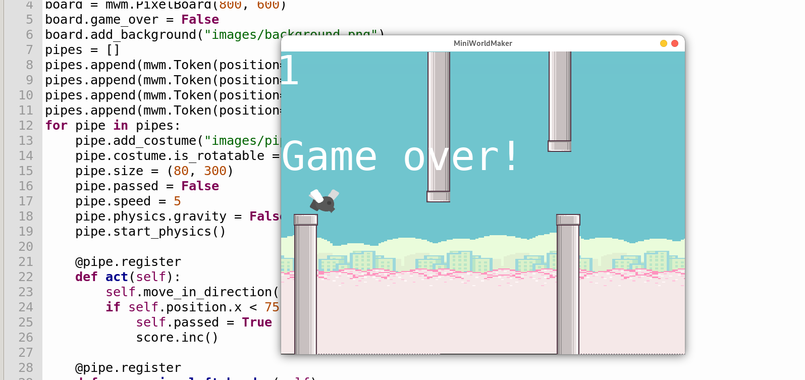
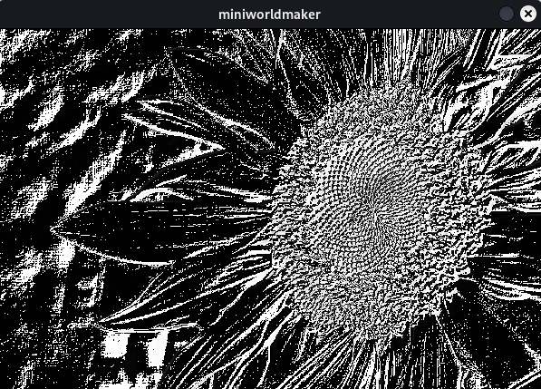

miniworldmaker
##############

miniworldmaker is a game-engine written in python and pygame designed for pupils to create 2D mini worlds and games.

* **Objects First** programming: Object oriented programming without classes.
* **Tiles and Pixel-Games**: For different types of games.
* **Integrated physics engine**: For physics based games, based on **pymunk**
* Integrated Manager for GUI Elements, Music and Sound effects
* **Open Source**

Credits
========

* `Greenfoot <https://www.greenfoot.org/>`_ 

miniworldmaker is strongly inspired by the high-level abstraction approach to object orientation in Greenfoot. miniworldmaker extends the approach with its own ideas.

* `Deepl <https://www.deepl.com/>`_   
  
  Assistant for translating pages.
  
* `Kenney Assets <https://www.kenney.nl/assets>`_ 
  
  Most of the images in the example-code are based on kenny assets. 

Examples
========

Top-Down games

.. raw:: html
  
  <video controls loop width=100%>
  <source src="_static/asteroids.webm" type="video/webm">
    <source src="_static/asteroids.mp4" type="video/mp4">
    Your browser does not support the video tag.
  </video>

Tile Based RPGs

.. raw:: html

  <video controls loop width=100%>
  <source src="_static/rpg1.webm" type="video/webm">
    <source src="_static/rpg1.mp4" type="video/mp4">
    Your browser does not support the video tag.
  </video>

Image Processing

Physics

.. raw:: html

  <video controls loop width=100%>
  <source src="_static/physics_sim.webm" type="video/webm">
    <source src="_static/physics_sim.mp4" type="video/mp4">
    Your browser does not support the video tag.
  </video>

.. raw:: html

  <video controls loop width=100%>
  <source src="_static/joints.webm" type="video/webm">
    <source src="_static/joints.mp4" type="video/mp4">
    Your browser does not support the video tag.
  </video>

Angry Birds

Physics

.. raw:: html

  <video controls loop width=100%>
  <source src="_static/angry.webm" type="video/webm">
    <source src="_static/angry.mp4" type="video/mp4">
    Your browser does not support the video tag.
  </video>

NEW: Hex Boardgame:

.. raw:: html

  <video controls loop width=100%>
    <source src="_static/hex_boardgame_short.mp4" type="video/mp4">
    Your browser does not support the video tag.
  </video>

* `Source <https://codeberg.org/a_siebel/miniworldmaker_cookbook/src/branch/main/objects_first/boardgame/boardgame.py>`_

Links
=====

* `Codeberg Repository <https://codeberg.org/a_siebel/miniworldmaker>`_  
* `miniworldmaker cookbook - Examples and Snippets <https://codeberg.org/a_siebel/miniworldmaker_cookbook>`_  

.. toctree::
  :maxdepth: 1
  :titlesonly:
  
  examples

.. toctree::
  :maxdepth: 1
  :caption: Tutorial (English)
  :titlesonly:
  
  objectsfirst_english/index
  
.. toctree::
  :maxdepth: 1
  :caption: Tutorial (Deutsch)
  :titlesonly:
  
  objectsfirst_german/index
  processing_german/index
  howto_german/index

.. toctree::
  :maxdepth: 1
  :caption: API
  
  api/index

.. toctree::
  :maxdepth: 1
  :titlesonly:
  
  impressum

