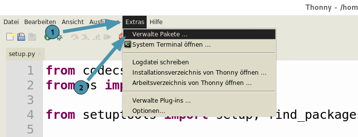
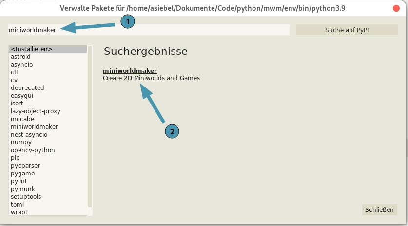

# Installation

You can install miniworldmaker on your computer or with the help of Thonny
to install it:

## On your computer

1. install Python first.

   Python can be downloaded from [Python.org](https://www.python.org).
   download.

   Alternatively you can install the development environment
   [Thonny](https://thonny.org/) - This comes with Python
   directly with it.

Install the framework with:

``` python
pip install miniworldmaker
```

1. install a suitable development environment, e.g.:

   - [Thonny](https://thonny.org/)
   - [Pycharm](https://www.jetbrains.com/de-de/pycharm/)

\...now you can start.

## With Thonny

First click on \"Extras -\> Manage packages\".



Then type \"miniworldmaker\" in the search field and install the
miniworldmaker


