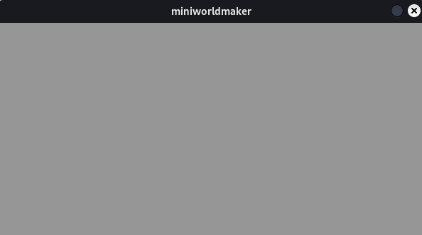

# Boards and Tokens

Let's go!

## The first world

We create a first world. This can be created with the following code
code:

``` {code-block} python
import miniworldmaker as mwm

board = mwm.Board(600, 300)
board.run()
```

What happens here?

* The first line imports the miniworldmaker library under the name ``mwm``. With ``mwm.`` you can then access the components of the library.
* In the second line a new ``board`` is created. This is 600 pixels wide and 300 pixels high.
* In the 3rd line the board is created. Later you will learn more about what this line means.
* For now it is enough to know that this line must always be at the end of your programs.



## Background

We modify the program above to add a background:

To do this, you must first place an image in the `images` subfolder of your project. The directory structure will then look like this:

```
project
│ my_board.py # file with your python code
└──images
│ │ grass.png
```

With the method ``add_background`` you can now add the image as background to the board:

``` python
import miniworldmaker as mwm
board = mwm.Board(600, 300)
board.add_background("images/grass.png")
board.run()

```

[--> Open in repl.it](https://replit.com/@a_siebel/mwm-background?v=1)


:::{note}

There are several types of boards in miniworldmaker. The `TiledBoard` is specially designed for games on tiled surfaces, e.g. top-down RPGs.
:::

:::{seealso}
[concept: naming and variables](concept_naming)
:::

:::{seealso}
[concept: imports](concept_imports)
:::