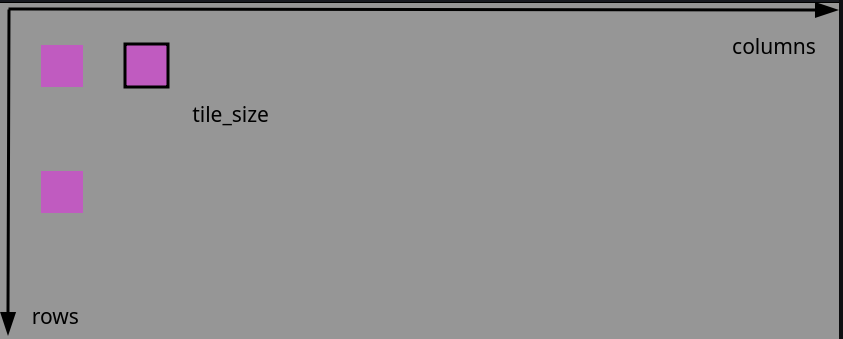
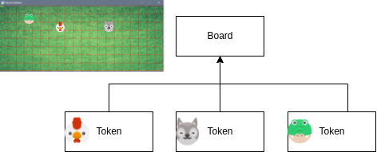

# Boards

Let's go!

## The first world

We create a first world. This can be created with the following code
code:

``` {code-block} python
---
lineno-start: 1
---
from miniworldmaker import *
board = TiledBoard()
board.columns = 20
board.rows = 8
board.tile_size = 40

board.run()
```

What happens here?

* Line 1: The miniworldmaker library is imported.

* Line 2: A new **object** of type `TiledBoard` is created. In the following you can access it with the name `board`.

* Lines 3-5: Various attributes of `board` are changed by accessing it with board.attributsname.

* Line 7: The game is started. With `board.run()` a mainloop is started.
    mainloop is started, which draws the board over and over again.
    again and again. This statement **must** always be the last line of your
    code.

This is what your first board looks like.


## Background

With board.objectname you have changed *attributes* of the board,
e.g. `columns`, `rows` or `tile_size`.
The board also brings some *methods* with which you can change it,
e.g. the method `add_background()`.

Methods are instructions to the `board` to do something specific, e.g. add a background.
You can recognize them by the fact that they end with brackets `()`. Sometimes there is also something inside these brackets,
if more information is needed for the statement - more about that later.

We modify the program above to add a background:

``` python
from miniworldmaker import *
board = TiledBoard()
board.add_background("images/soccer_green.jpg")
board.columns = 20
board.rows = 8
board.tile_size = 40

board.run()
```


## The size of the board

The size of the board

After you have created a board with board = miniworldmaker.TiledBoard(),
you can change the properties of the board with the name board.

The most important properties are rows, columns and tile_size.
With these you can change the size of the board:



## Some theory: How does the Miniworldmaker work?

In Miniworldmaker there are two different types of objects that you can create
you can create:

* `Board`: A game board on which there are game pieces.

* `Token`: Game pieces that bring numerous attributes and methods, e.g. movement. collision detection, \....



In the next chapters you will learn how to create tokens which can
communicate with each other.

``` {note}
There are several child classes of board

- A `TiledBoard` is suitable for boards, where the actors move
    move on \tiles`.
- A `PixelBoard` is intended for pixel-precise representations
- A `PhysicsBoard` simulates physical properties and objects on the board.
    on the board.

These different boards are intended for different purposes. Choose the right board for your miniworld.
```

## View

* For more information, see [Key Concepts: Boards](/key_concepts/boards)
* [More examples](https://codeberg.org/a_siebel/miniworldmaker_cookbook/src/branch/main/tests/1%20Costumes%20and%20Backgrounds)
