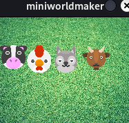
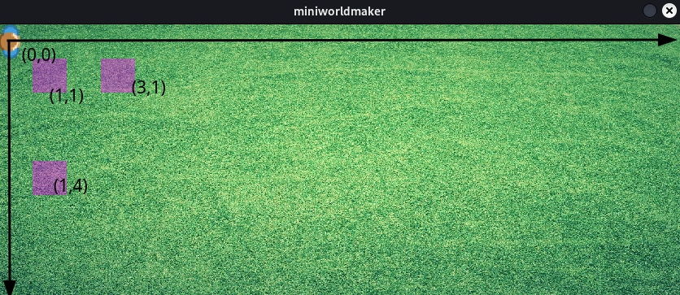
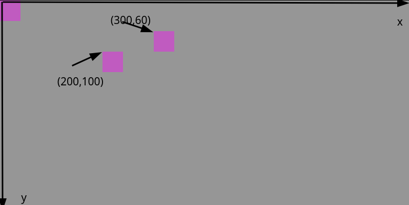
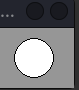
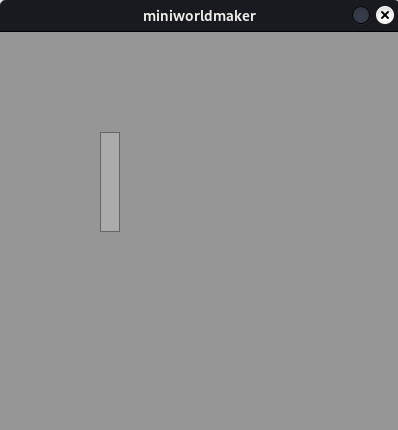

# Tokens

## What are tokens?

A **Token** is a token on your board.

All objects on your board are tokens, which can be moved around the board
and can communicate with each other.

## Example: Create a token

After you have created the board, a token (i.e. a character) is placed on the board.
character)* is placed on the board. This goes like this:

``` {code-block} python
---
lineno-start: 1
---
from miniworldmaker import *
board = TiledBoard()
board.columns = 20
board.rows = 8
board.tile_size = 42
board.add_background("images/soccer_green.jpg")
player = Token()

board.run()
```

What happens here?

In line 7 a `player` object is created. The token is added in the upper left corner.
Initially, the token is displayed as a purple rectangle because it has no color or background.

Output:


## Costumes

Every 'token' has a 'costume'.
To make your tokens look different, you can *put* a costume on your token.
costume to your token.


### Examples

#### Add a new costume

You can add a new costume with the following command.

``` python
token_name.add_costume("path_to_image")
```

``` {note}
Note: `path_to_image` is a (relative path) to the image.

You should put your images in the subfolder `images`. To the image
`my_image.png` in the subfolder `images` you can access with the path `images/my_image.png`.
```

### First example

We add a costume in the example from above:


``` python
from miniworldmaker import *

board = TiledBoard()
board.columns = 20
board.rows = 8
board.tile_size = 42
board.add_background("images/soccer_green.jpg")
board.speed = 30
player = Token()
player.add_costume("images/player.png")

board.run()
```

Output:


### Example: Multiple costumes

Here four tokens are created that all have different costumes:

``` python
import miniworldmaker

board = miniworldmaker.TiledBoard()
board.columns = 5
board.rows = 4
board.add_background("images/soccer_green.jpg")

t1 = miniworldmaker.Token((0,1))
t1.add_costume("images/cow.png")

t2 = miniworldmaker.Token((1,1))
t2.add_costume("images/chicken.png")

t3 = miniworldmaker.Token((2,1))
t3.add_costume("images/dog.png")

t4 = miniworldmaker.Token((3,1))
t4.add_costume("images/goat.png")

board.run()
```

Output:



### FAQ about costumes

- My token is **misaligned**, what should I do?

    A token is correctly aligned when the image is facing upwards.
    faces upwards. If the image is aligned in another direction by default
    then you have two possibilities

- You can rotate the image with an image editor.

- You can change the orientation of the costume in Miniworldmaker.
    This can be done with `my_token.costume.orientation = 90` Set for
    orientation so that the costume is oriented correctly.
    oriented.

- Sometimes it is also necessary to set, that the token can rotate but the costume
    can rotate, but the costume should always be oriented the same way.
    This can be done with `my_token.costume.is_rotatable = False`.

## The position

The token was created in the upper left corner. If you want to create the token at an arbitrary position, then you have to pass a position when calling it.

The miniworldmaker uses a coordinate system for this, the upper left corner is the position (0,0):

### Position on a TiledBoard

On a TiledBoard, the tiles can be accessed directly with coordinates. The coordinate (2,1) therefore indicates the tile that is reached if you move from the top left 2 tiles to the right and 1 tile down.

Tokens always have the size of a tile.



### Position on a PixelBoard

On a PixelBoard, the ``position`` denotes the x and y coordinates that you can read on the screen. The ``position`` of a token is always the upper left corner of the token.



## Examples

In the example above you can change the position as follows:

```
from miniworldmaker import *

board = TiledBoard()
board.columns = 20
board.rows = 8
board.tile_size = 42
board.add_background("images/soccer_green.jpg")
board.speed = 30
player = token()
player.add_costume("images/player.png")
player.position = (3,4)
board.run()
```

Output:


## Types of tokens

There are some special tokens you can use:

### Shapes

There are several shapes, e.g. `Rectangle`, `Line`, `Circle`, `Ellipse` with which you can draw geometric objects. These objects do not require a costume.

``` {warning}
Geometric objects can currently only be drawn on a `PixelBoard`, not on a `TiledBoard`.
```

#### Example:

Drawing a circle using position and radius:

``` python
import miniworldmaker
board = miniworldmaker.PixelBoard(80, 60)
miniworldmaker.Circle((40,30), 20)
board.run()
```



You can use the following geometric objects:

### Lines

The syntax for drawing a line looks like this:

``` python
  Line(startpoint, endpoint)
```

The parameters `startpoint` and `endpoint` are tuples, e.g. (1, 2) for x=1 and y=2.

If you want to draw a line from (10,10) to (100, 200) you have to write e.g. the following:

``` python
from miniworldmaker import *

board = PixelBoard(800, 600)
line((10,10), (100, 200))
board.run()
```

### Circles

You can create circles in general as follows:

``` python
  Line(position, radius)
```

The position is the center of the circle.

If you want to create a circle at the position (400,300) with radius 20, you have to write the following:


``` python
from miniworldmaker import *

board = PixelBoard(800, 600)
Circle((400,300), 20)
board.run()
```

### Rectangle

A rectangle is described by position, width and height:

``` python
Rectangle(position, width, height)
```

The parameter `position` describes the upper left corner of the rectangle.

If you want to draw a rectangle at position (100, 100) with width 20 and height 100, you have to write the following:

``` python
code-block:: python
from miniworldmaker import *

board = PixelBoard(800, 600)
Rectangle((100, 100), 20, 100)
board.run()
```



### Ellipse

Ellipses are described in the same way as rectangles, i.e. the ellipse is then drawn so that it fits exactly inside the rectangle. Width and height refer to the diameter of the ellipse.

``` python
ellipse(position, width, height)
```

If you want to draw an ellipse at position (100, 100) with width 20 and height 100, you must write the following:

``` python
from miniworldmaker import *

board = PixelBoard(800, 600)
Rectangle((100, 100), 20, 100)
board.run()
```