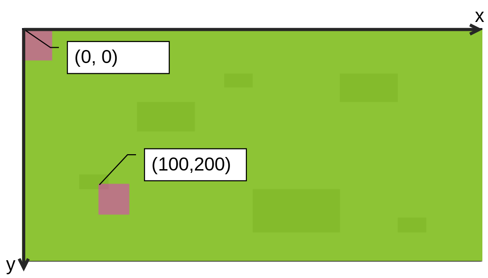
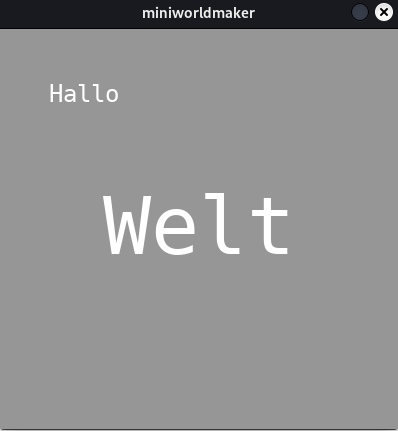

# Tokens

A **Token** is a token on your board.

All objects on your board are tokens, which can be moved around the board
and can communicate with each other.

## Create a token

After you have created the board, a token (i.e. a character) is placed on the board.
character)* is placed on the board. This goes like this:

``` {code-block} python
import miniworldmaker as mwm

board = mwm.Board(600, 300)
board.add_background("images/grass.png")
token = mwm.Token((0, 0))
token = mwm.Token((100, 200))
board.run()
```

In the line ``token = Token((0,0))`` a token is created at the position x=0, y=0, in the line
``token = Token((100, 200))`` a token is created at the position x=100, y=200.

The tokens don't have a costume yet, so they are shown as purple rectangles at first:


Note that the *origin* of the coordinate system is *at the top left*.



## Costumes

Each `token` has a `costume` which defines the appearance of the token.

With `add_costume`` you can add an image as costume to your token.
First you have to copy these images into the subfolder `images` of your project, e.g. like this:

```
project
│ my_board.py # file with your python code
└──images
│ │ grass.png
│ │ knight.png
│ │ player.png
```

Now you can add them like this as a costume:

``` python
import miniworldmaker as mwm

board = mwm.Board(600, 300)
board.add_background("images/grass.png")
token = mwm.Token((0, 0))
token.add_costume("images/player.png")
token = mwm.Token((100, 200))
token.add_costume("images/knight.png")
board.run()
```

Output:


### Example: Multiple costumes

Here four tokens are created that all have different costumes:

``` python
import miniworldmaker as mwm

board = mwm.Board()
board.add_background("images/grass.jpg")

t1 = mwm.Token((0,20))
t1.add_costume("images/cow.png")
t2 = mwm.Token((40,20))
t2.add_costume("images/chicken.png")
t3 = mwm.Token((80,20))
t3.add_costume("images/dog.png")
t4 = mwm.Token((120,20))
t4.add_costume("images/goat.png")

board.run()

```

Output:


:::{admonition} FAQ

Typical problems:

* My token is **misaligned**, what should I do?

  A token is aligned correctly if the image looks upwards.
  looks upwards. If the image is aligned in another direction by default
  then you have two possibilities

  * You can rotate the image with an image editor.

  * You can change the orientation of the costume in Miniworldmaker.
    This can be done with `my_token.costume.orientation = 90` Set for
    orientation so that the costume is oriented correctly.
    oriented.

  Sometimes it is also necessary to set, that the token can rotate but the costume
  can rotate, but the costume should always be oriented the same way.
  This can be done with `my_token.costume.is_rotatable = False`.
:::

## The position

The token was created in the upper left corner. If you want to create the token at an arbitrary position, then you must pass a position when calling.

The miniworldmaker uses a coordinate system for this, the upper left corner is the position (0,0): The `position` of a token is always the upper left corner of the token.

On a ``TiledBoard`` it behaves somewhat differently. Here the position (0,0) is the *tile* in the upper left corner; with ``my_token.position`` you do not query the pixel-exact position here, but the tile on which the token lies.


## Change the position

You can change the `position` of a token with the help of the attribute `position`.

`position = (x, y)` sets the position of the token to the coordinates ``(x, y)``.

### Example:

On a normal board the position is changed like this:

``` python
import miniworldmaker as mwm

board = mwm.Board()
board.add_background("images/grass.png")
player = mwm.Token()
player.add_costume("images/player.png")
player.position = (100,200)
board.run()
```

...and so on a TiledBoard:

``` python
import miniworldmaker as mwm

board = mwm.TiledBoard()
board.columns = 20
board.rows = 8
board.tile_size = 42
board.add_background("images/soccer_green.jpg")
board.speed = 30
player = mwm.token()
player.add_costume("images/player.png")
player.position = (3,4)
board.run()
```

Output:


## Types of tokens

There are some special tokens you can use:

### Lines

The syntax for drawing a line looks like this:

``` python
  Line(startpoint, endpoint)
```

The parameters `startpoint` and `endpoint` are tuples, e.g. (1, 2) for x=1 and y=2.

If you want to draw a line from (10,10) to (100, 200) you have to write e.g. the following:

``` python
import miniworldmaker as mwm

board = mwm.Board()
line = mwm.Line((10,10), (100, 200))
board.run()
```


### Circles

You can create circles in general as follows:

``` python
  Circle(position, radius)
```

:::{note}
The passed position for circles is the *center* of the circle.
:::

If you want to create a circle at location (100,200) with radius 20, you must write the following:


``` python
import miniworldmaker as mwm

board = Board()
mwm.Circle((100,200), 20)
board.run()

```


### Rectangle

A rectangle is described by its position, width and height:

``` python
mwm.Rectangle(position, width, height)
```

The parameter `position` describes the upper left corner of the rectangle.

If you want to draw a rectangle at position (100, 100) with width 20 and height 100, you have to write the following:

``` python
import miniworldmaker as mwm

board = mwm.Board(800, 600)
mwm.Rectangle((100, 100), 20, 100)
board.run()
```


### Ellipse

Ellipses are described in the same way as rectangles, i.e. the ellipse is then drawn so that it fits exactly inside the rectangle. Width and height refer to the diameter of the ellipse.

``` python
mwm.Ellipse(position, width, height)
```

If you want to draw an ellipse at position (100, 100) with width 20 and height 100, you must write the following:

``` python
import miniworldmaker as mwm

board = mwm.Board(800, 600)
ellipse = mwm.Ellipse((100, 100), 20, 100)
board.run()
```


### Text

You can create text tokens as follows:

``` python
mwm.Text(position, text)
```

Then you can use `font_size`` to control the size of the text. With `width` and `height` you can check how much space the text takes up.
takes up.

Example:

``` python
import miniworldmaker as mwm

board = mwm.Board()

t1 = mwm.Text((50,50), "Hello")
t2 = mwm.Text((100,150), "World")
t2.font_size = 80
t2.x = (board.width - t2.width) / 2 # center text

board.run()
```



### Number

You can use number tokens to draw game scores, for example. You can create them as follows:

``` python
Number(position, text)
```

Then you can change the number with `set_number()`, increase it by one with `inc()` and query it with `get_number()`.

Example:

``` python
import miniworldmaker as mwm

board = mwm.Board()

t1 = mwm.Number((50,50), 1)
t2 = mwm.Number((100,150), 4)
t3 = mwm.Number((200,150), 0)
t2.font_size = 80
t2.inc()
t3.set_number(1001)
print(t3.get_number()) # 1001

board.run()
```


