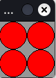

# Concept: functions, parameters and return value

You have used methods that belong to a board or a token so far, e.g. ``on_setup``, ``act``.

Now you learn to create your own functions. Functions are ``subroutines`` that allow you to reuse code,
instead of writing it over and over again.

## First example

you want to create four red circles as shown in the following picture:


This goes like this, for example:

``` python
import miniworldmaker as mwm

board = mwm.Board(80, 80)

c1 = Circle((20,20), 20)
c1.color = (255, 0, 0)
c2 = Circle((60,20), 20)
c2.color = (255, 0, 0)
c3 = Circle((60,60), 20)
c3.color = (255, 0, 0)
c4 = Circle((20,60), 20)
c4.color = (255, 0, 0)

board.run()
```



The program is correct. But if you want all four circles to be green, you have to change the program in four places.
four places.

Instead, you can outsource the creation of the circle and the definition of the color to subroutines:

``` python
import miniworldmaker as mwm

board = Board(80, 80)

def create_circle(x, y):
    c = mwm.Circle((x, y), 20)
    c.color = (255, 0, 0)
    
create_circle(20, 20)
create_circle(60, 20)
create_circle(60, 60)
create_circle(20, 60)

board.run()
```

Here a function `create_circle` was defined.

* The function has the **name** `create_circle`.
* The function receives the values `x` and `y` as **pass parameters** - At this point the circle is to be created.
* In the **method body**, a circle is first created and then a color is assigned to it.
* The function is called using its **name** and passing the **arguments** (e.g. 20, 20).

## General: Defining functions

Often you want to automate complicated things, e.g. creating tokens.

This can be done by defining functions yourself - This is generally done like this:

``` python
def function_name(<parameter>):
    <code_block>
```

e.g.:

``` python
def create_circle(x, y):
    c = Circle((x, y), 20)
    c.color = (255, 0, 0)
```

Your function consists of a *signature* and a *function body*.

*The signature is the first line of the function. It contains all the information
  you need to call the function. This is the **name** and **parameter**.
  The name of this function is `create_token`, the parameters are `x`and `y`.
  Parameters are needed to pass more information to the function. In the example
  the information *where* the object should be created.

* The function body is a code block. It contains all the commands that are processed one after the other when the
  are processed one after the other. Here at the function call first a circle is created and afterwards
  the color of the circle is defined.
  
  The commands are processed from top to bottom when the function is called.

## Call of functions

A function is called with the help of its name. Thereby you pass the function the
arguments defined as parameters.

Generally one writes:
`method_name(<parameter>)`

This can look like this, for example:

``` python
create_token(4,2)
```

Here a token is created at the position `x=4` and `y=2`.

## Draw complex figures

With the help of functions you can draw complex figures:

``` python
import miniworldmaker as mwm

board = mwm.Board(400, 220)

def create_face(x, y):
    c = mwm.Circle((x, y), 40)
    c.color = (255,255,0)
    c = mwm.Circle((x + 15, y - 10), 10)
    c = mwm.Circle((x - 15, y - 10), 10)
    a = Arc((x, y + 20), 40, 20, 180, 360)
    a.center = a.position
    a.color = (255, 0, 0)
    
create_face(60, 60)
create_face(260, 60)
create_face(160, 160)

board.run()
```

In the function `create_face` a face is created.
This can then be created in different places.


## Create tokens automatically

With the help of functions you can shorten the creation of tokens:

Here 10 tokens with 10 commands are created. Without functions you would have needed 30 commands.

``` python
import miniworldmaker as mwm

board = mwm.TiledBoard()
board.rows = 8

def create_token(x, y):
    t = token()
    t.position = (x,y)
    t.add_costume("images/player.png")

def create_wall(x, y):
    t = token()
    t.position = (x,y)
    t.add_costume("images/wall.png")
    
create_token(4,2)
create_wall(4,4)
create_wall(5,4)
create_wall(6,4)
create_wall(6,3)
create_wall(6,2)
create_wall(6,1)
create_wall(5,1)
create_wall(4,1)
create_wall(3,1)

board.run()
```

Output:


## Register properties and methods.

The following program automatically creates "raindrops".

In the raindrop function, not only properties are set for each drop, but also methods are registered.

``` python
import miniworldmaker as mwm
import random

board = mwm.Board()
board.add_background((80,180,255))
def raindrop(x,y):
    c = mwm.Circle((x, y), random.randint(10, 20))
    speed = random.randint(1,5)
    c.color = (0,0,random.randint(100,255), 100)
    c.static = True
    @c.register
    def act(self):
        self.move_down(random.randint(1,3))
    @c.register
    def on_detecting_not_on_board(self):
        self.remove()
        
@board.register
def act(self):
    if board.frame % 5 == 0:
        raindrop(random.randint(0,400),0)
    

board.run()
```

 <video controls loop width=450px>
  <source src="../_static/raindrops.webm" type="video/webm">
  Your browser does not support the video tag.
</video>

## Return values

The previous functions executed a subroutine and received information about parameters, if any.

You can also use return values to return information.

In the simple case this looks like this:

``` python
def is_even(x):
    if x % 2 == 0:
        return True
    else:
        return False

print(is_even(4))
```

In the last line the following happens: Before the function `print` can be executed, the function
function `is_even` must be evaluated. The result of the function (here: `True`) is then used
instead of the function call.

The following program creates random circles. If these are left of the center
they are colored red, otherwise white.

``` python
import miniworldmaker as mwm
import random

board = mwm.Board(400, 50)
        

def is_left(obj):
    if obj.x <= 200:
        return True
    else:
        return False

for i in range(20):
    x = random.randint(0,400)
    y = 25
    c = mwm.Circle((x, y), 10)
    if is_left(c):
        c.color = (255,0,0)

board.run()
```


