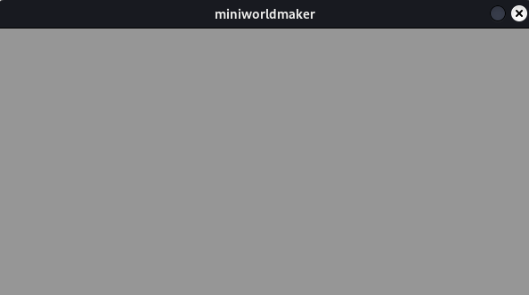
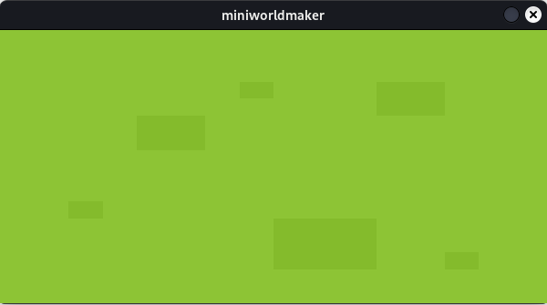

# Boards and Tokens

Los geht es!

## Die erste Welt

Wir erstellen eine erste Welt. Diese kann mit folgendem Code erzeugt
werden:

```{code-block} python
from miniworldmaker import *
board = Board(600, 300)
board.run()
```

Was passiert hier?

* In der ersten Zeile wird die miniworldmaker-Bibliothek importiert.
* In der zweiten Zeile wird ein neues ``Board`` erstellt. Dieses ist 600 Pixel breit und 300 Pixel hoch.
* In der 3. Zeile wird das Board erstellt. Später wirst du noch genauer erfahren, was diese Zeile bedeutet. 
* Für jetzt reicht es zu wissen, dass diese Zeile immer am Ende deiner Programme stehen muss.



## Hintergrund

Wir verändern das Programm oben, um einen Hintergrund hinzuzufügen:

Dafür musst du zunächst ein Bild in den Unterordner `images` deines Projekts legen. Die Verzeichnisstruktur sieht dann so aus:

```
project
│   my_board.py # file with your python code
└───images
│   │   grass.png
```

Mit der Methode ``add_background`` kannst du nun das Bild als Hintergrund zu dem Spielfeld hinzufügen:

``` python
from miniworldmaker import *

board = Board(600, 300)
board.add_background("images/grass.png")
board.run()
```



:::{note}

Es gibt verschiedene Arten von Boards im miniworldmaker. Das `TiledBoard` ist speziell für Spiele auf gekachelten Flächen gedacht
und das `PhysicsBoard` ist speziell für Spiele mit einer Physikengine gedacht.
:::

:::{seealso}
[Concept: Naming und Variablen](concept_naming)
:::

:::{seealso}
[Concept: Imports](concept_imports)
:::