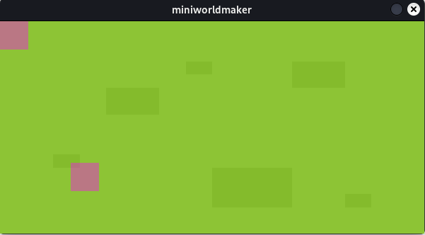
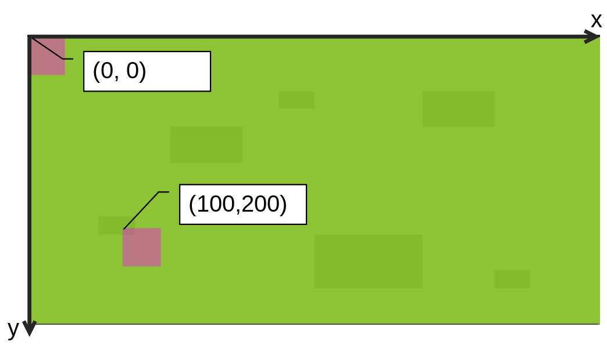
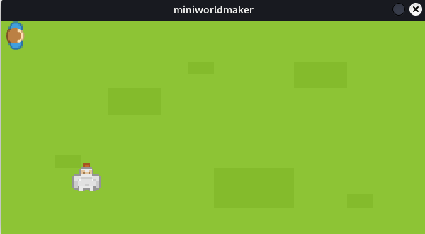
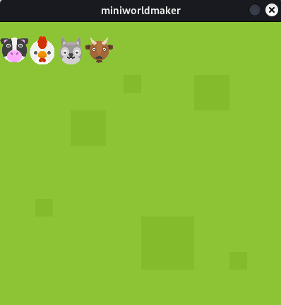
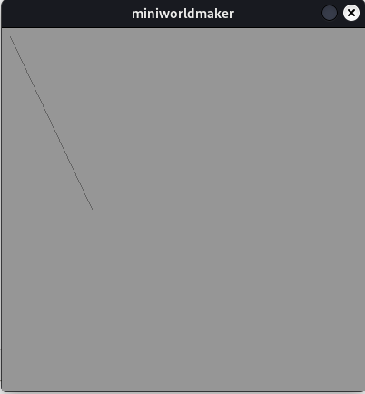
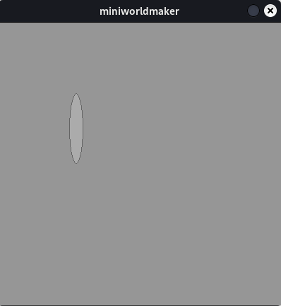
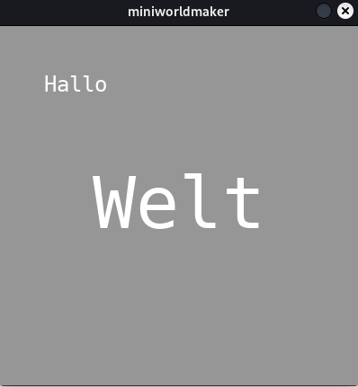
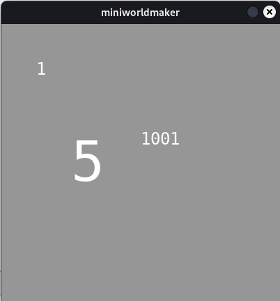

# Tokens

Ein **Token** ist ein Spielstein auf deinem Board.

Alle Objekte auf deinem Board sind `Tokens`, die auf dem ``Board`` bewegt
werden können und die miteinander kommunizieren können.
## Ein Token erstellen

Nachdem du das `Board` erstellt hast, wird nun ein `Token`, *(d.h. eine
Spielfigur)* auf dem Board platziert. Dies geht so:

``` {code-block} python
from miniworldmaker import *

board = Board(600, 300)
board.add_background("images/grass.png")
token = Token((0, 0))
token = Token((100, 200))
board.run()

```

In der Zeile ``token = Token((0,0))`` wird ein Token an der Position x=0, y=0 erstellt, in der Zeile 
``token = Token((100, 200))`` wird ein Token an der Position x=100, y=200 erstellt.

Die Tokens haben noch kein Kostüm, daher werden sie zunächst als lila Rechtecke dargestellt:




Beachte, dass der *Ursprung* des Koordinatensystems oben links liegt.



## Kostüme

Jedes `Token` hat ein `Costume`, welches das Aussehen des Tokens definiert.

Mit ``add_costume`` kannst du deinem Token ein Bild als Kostüm hinzufügen. 
Zuerst musst du diese Bilder dazu in den Unterordner `images` deines Projekts kopieren, z.B. so:

```
project
│   my_board.py # file with your python code
└───images
│   │   grass.png
│   │   knight.png
│   │   player.png
```

Jetzt kannst du sie so als Kostüm hinzufügen:

``` python
from miniworldmaker import *

board = Board(600, 300)
board.add_background("images/grass.png")
token = Token((0, 0))
token.add_costume("images/player.png")
token = Token((100, 200))
token.add_costume("images/knight.png")
board.run()
```

Ausgabe:


### Beispiel: Mehrere Kostüme

Hier werden vier Tokens angelegt, die alle unterschiedliche Kostüme haben:

``` python
from miniworldmaker import *

board = Board()
board.add_background("images/soccer_green.jpg")

t1 = Token((0,20))
t1.add_costume("images/cow.png")
t2 = Token((40,20))
t2.add_costume("images/chicken.png")
t3 = Token((80,20))
t3.add_costume("images/dog.png")
t4 = Token((120,20))
t4.add_costume("images/goat.png")

board.run()
```

Ausgabe:



:::{admonition} FAQ

Typische Probleme:

* Mein Token ist **falsch ausgerichtet**, was soll ich tun?

  Ein Token ist dann korrekt ausgerichtet, wenn das Bild nach oben
  guckt. Wenn das Bild per Default in eine andere Richtung
  ausgerichtet ist, dann hast du zwei Möglichkeiten

  * Du kannst das Bild mit einem Bildeditor drehen

  * Du kannst in Miniworldmaker die Orientierung des Kostüms ändern.
    Dies geht mit `my_token.costume.orientation = 90` Setze für
    orientation den passenden Wert, damit das Kostüm korrekt
    ausgerichtet ist.

  Manchmal ist es auch nötig, einzustellen, dass sich zwar das Token
  drehen kann, das Kostüm aber immer gleich ausgerichtet sein soll.
  Dies geht mit `my_token.costume.is_rotatable = False`.
:::

## Die Position

Das Token wurde in der oberen linken Ecke erstellt. Wenn du das Token an einer beliebigen Stelle erstellen willst, dann musst du beim Aufrufen eine Position übergeben.

Der miniworldmaker verwendet dazu ein Koordinatensystem, die obere Linke Ecke ist die Position (0,0):

### Position auf einem PixelBoard

Auf einem `Board` bezeichnet die `position` die x und y-Koordinate, die du am Bildschirm ablesen kannst. 
Als `position` eines Tokens wird immer die obere linke Ecke des Tokens bezeichnet.


## Die Position ändern

Die `Position` eines Tokens kannst du mit Hilfe des Attributs `position` ändern.

`position = (x, y)` setzt die Position des Tokens an die Koordinaten (x, y)

Beispiel:

```
from miniworldmaker import *

board = TiledBoard()
board.columns = 20
board.rows = 8
board.tile_size = 42
board.add_background("images/soccer_green.jpg")
board.speed = 30
player = Token()
player.add_costume("images/player.png")
player.position = (3,4)
board.run()
```

Ausgabe:


## Arten von Tokens

Es gibt einige spezielle Tokens, die du verwenden kannst:

### Linien

Die Syntax zum Zeichnen einer Linie sieht folgendermaßen aus:

``` python
  Line(startpoint, endpoint)
```

Die Parameter `startpoint` und `endpoint` sind jeweils Tupel, z.B. (1, 2) für x=1 und y=2.

Wenn du eine Linie von (10,10) zu (100, 200) zeichnen willst so musst du z.B. folgendes schreiben:

``` python
from miniworldmaker import *

board = Board()
Line((10,10), (100, 200))
board.run()
```



### Kreise

Kreise kannst du allgemein folgendermaßen erstellen:

``` python
  Line(position, radius)
```

:::{note}
Die übergebene Position bei Kreisen ist der *Mittelpunkt* des Kreises
:::

Wenn du einen Kreis an der Stelle (100,200) mit Radius 20 erstellen willst, musst du folgendes schreiben:


``` python
from miniworldmaker import *

board = Board()
Circle((100,200), 20)
board.run()

```


### Rechteck

Ein Rechteck wird beschrieben durch Position, Breite und Höhe:

``` python
Rectangle(position, width, height)
```

Der Parameter `position` beschreibt die obere linke Ecke des Rechtecks.

Willst du ein Rechteck an der Position (100, 100) mit Breite 20 und Höhe 100 zeichnen, so musst du folgendes schreiben:

``` python
from miniworldmaker import *

board = Board(800, 600)
Rectangle((100, 100), 20, 100)
board.run()
```


### Ellipse

Ellipsen werden im Prinzip wie Rechtecke beschrieben, d.h. die Ellipse wird dann so gezeichnet, dass sie genau in das Rechteck hineinpasst. `width` und `height` beziehen sich hier jeweils auf den Durchmesser der Ellipse

``` python 
Ellipse(position, width, height)
```

Willst du eine Ellipse an der Position (100, 100) mit Breite 20 und Höhe 100 zeichnen, so musst du folgendes schreiben:

``` python
from miniworldmaker import *

board = Board(800, 600)
Rectangle((100, 100), 20, 100)
board.run()
```




### Text

Text-Tokens kannst du folgendermaßen erstellen:

```python 
Text(position, text)
```

Anschließend kannst du mit ``font_size`` die Größe des Textes beeinflussen. Mit `width` und `height` kannst du abfragen wie viel Platz der Text
einnimmt.

Beispiel:

```python
from miniworldmaker import *

board = Board()

t1 = Text((50,50), "Hallo")
t2 = Text((100,150), "Welt")
t2.font_size = 80
t2.x = (board.width - t2.width) / 2 # center text

board.run()
```



### Number

Mit Number-Tokens kannst du z.B. Spielstände zeichnen. Du kannst diese folgendermaßen erstellen:

```python 
Number(position, text)
```

Anschließend kannst du mit `set_number()` die Zahl verändern, mit `inc()` um eins erhöhen und mit `get_number()` abfragen.

Beispiel:

``` python
from miniworldmaker import *

board = Board()

t1 = Number((50,50), 1)
t2 = Number((100,150), 4)
t3 = Number((200,150), 0)
t2.font_size = 80
t2.inc()
t3.set_number(1001)
print(t3.get_number()) # 1001

board.run()
```


