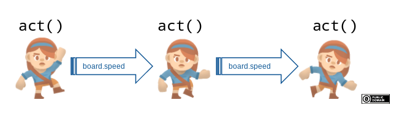

# Acting und Events

Du kannst bis jetzt ein Board erstellen und Tokens darauf gestalten.
Diese können sich aber noch nicht bewegen.

Für dynamische Programme sind mehrere Funktionen besonders relevant:

* Die `on_setup()`-Methode wird ganz am Anfang aufgerufen. Hier wird dein Board eingerichtet und konfiguriert.
* Die `act`-Methode wird in jedem `Frame` genau einmal aufgerufen. 
* Es gibt verschiedene Event-Methoden, wie z.B.`on_key_pressed`, `on_mouse_left`, `on_clicked_left`, ..., mit denen du auf bestimmte Ereignisse reagieren kannst.

## Die act()-Methode

Das Spielfeld und alle Tokens können über die Methode `act()` gesteuert
werden. Diese Methode wird immer wieder aufgerufen (genau genommen: Alle
`board.speed` Zeiteinheiten) bis das Spiel beendet wird.



Wenn du ein Token erstellst, kannst du mit dem Decorator `@register`
eine `act()`-Methode zum Spielfeld oder zu deinen Token hinzufügen:

Beispiel:

``` python
import miniworldmaker as mwm

board = mwm.Board()
board.add_background("images/grass.jpg")
player = mwm.Token((90,90))
player.add_costume("images/player.png")
@player.register
def act(self):
    player.y = player.y - 1

board.run()
```

<video controls loop width=100%>
  <source src="../_static/pixel_move1.webm" type="video/webm">
  Your browser does not support the video tag.
</video> 

:::{seealso}
[Hier](concept_functions.md) findest du eine etwas umfangreichere Erklärung, wie du Code mit Funktionen schreiben kannst.
:::

### Orientierung eines Kostüms

Man sieht hier ein Problem: Die Standard-Ausrichtung des Tokens ist nach *oben*, das Bild ist aber nach *rechts* orientiert.

Mit Hilfe von `token.costume.orientation` (oder `token.orientation`) kannst du die Orientierung korrigieren:

``` python
import miniworldmaker as mwm

board = mwm.Board()
board.add_background("images/grass.jpg")
player = mwm.Token((90,90))
player.add_costume("images/player.png")
player.costume.orientation = -90 
@player.register
def act(self):
    player.y = player.y - 1

board.run()
```

Nun läuft schaut die Figur in die Richtung, in die es sich bewegt.

 <video controls loop width=100%>
  <source src="../_static/pixel_move2.webm" type="video/webm">
  Your browser does not support the video tag.
</video> 

:::{seealso}
Innerhalb von Methoden kannst du mit `self` die Attribute und Methoden des jweiligen Objekts aufrufen.
Siehe [hier](concept_self.md) mehr dazu.
:::

:::{seealso}
Mit Hilfe von `board.speed` und `board.fps` kannst du einstellen, wie oft das Board neu gezeichnet wird
und wie oft `act()` aufgerufen wird, [siehe hier](concept_framerate.md) mehr dazu.
:::

## Ereignisse

Events(Ereignisse) sind ein zentrales Konzept des Miniworldmakers:

* Mit Events können Eingaben abgefragt werden (z.B. Mausklicks oder
  Tastatureingaben).
* Mit Events können Objekte miteinander kommunizieren (z.B. über
  Nachrichten)

### Ein Ereignis registrieren

Damit das Board oder ein Player auf ein Ereignis reagiert, muss dieses -wie die 
`act()` oder `setup()` Methode- registriert werden.

``` python
@player.register
def on_key_down_w(self):
    self.move()
```

Hier wird die Methode `on_key_down_w` registriert, die überprüft, ob die
Taste <kbd>w</kbd> gedrückt wurde.

Sobald die Taste betätigt wird, bewegt sich das Token `player` um einen
Schritt nach vorne.

Beispiel:

``` python
import miniworldmaker as mwm

board = mwm.Board()
board.add_background("images/grass.jpg")
player = mwm.Token((90,90))
player.add_costume("images/player.png")
player.costume.orientation = -90 
@player.register
def on_key_down_w(self):
    player.y = player.y - 1

board.run()
```

:::{note}
Jede registrierte Methode benötigt als ersten Parameter
das Schlüsselwort `self`.
Mit diesem Schlüsselwort kannst du
innerhalb der Methode auf Attribute und Methoden des Objekts zugreifen, siehe dazu auch [self](concept_self.md)
:::

### Beispiel

``` python
import miniworldmaker as mwm

board = mwm.TiledBoard()
board.columns = 20
board.rows = 8
board.tile_size = 42
board.add_background("images/soccer_green.jpg")
board.speed = 30
player = miniworldmaker.Token()
player.add_costume("images/player_1.png")
@player.register
def on_key_down_w(self):
    self.move()
@player.register
def on_key_down_a(self):
    self.turn_left()
@player.register
def on_key_down_d(self):
    self.turn_right()
@player.register
def on_key_down_s(self):
    self.move_back()
board.run()
```

Ausgabe:

 <video controls loop width=100%>
  <source src="../_static/token_events.webm" type="video/webm">
  Your browser does not support the video tag.
</video> 

### on_key_down und on_key_pressed

Es gibt die beiden Funktionen `on_key_down(self, key)` und
`on_key_pressed(self, key)`:

* `on_key_down` wird genau einmal aufgerufen, wenn die Taste gedrückt wird.
* `on_key_pressed` hingegen wird immer wieder aufgerufen, solange die Taste gedrückt wird.

Beispiel:

``` python
import miniworldmaker as mwm

board = mwm.Board()
board.add_background("images/grass.jpg")
player = mwm.Token((90,90))
player.add_costume("images/player.png")
player.costume.orientation = -90 
@player.register
def on_key_down_w(self):
    player.y = player.y - 1

player2 = mwm.Token((180,180))
player2.add_costume("images/player.png")
player2.costume.orientation = -90 
@player2.register
def on_key_pressed_s(self):
    player2.y = player2.y - 1
    
board.run()
```

 <video controls loop width=100%>
  <source src="../_static/keydown.webm" type="video/webm">
  Your browser does not support the video tag.
</video> 

```{note}
Beide Funktionen gibt es sowohl in der Variante ``on_key_down_b(self)``, 
``on_key_pressed_c(self)`` um das betätigen einer konkreten Taste
abzufragen als auch in der Variante ``on_key_down(self, key)`` 
``on_key_pressed(self, key)`` um alle Tastaturabfragen zu verarbeiten.
```

## Nachrichten senden

Mit `send message(self, message)` kannst du eine globale Nachricht an
**alle** Objekte und das Board senden. Diese Nachrichten können mit
`on_message` verarbeitet werden.

Beispiel:

``` python
@player.register
def on_message(self, message):
    if message == "Example message":
        do_something()
```