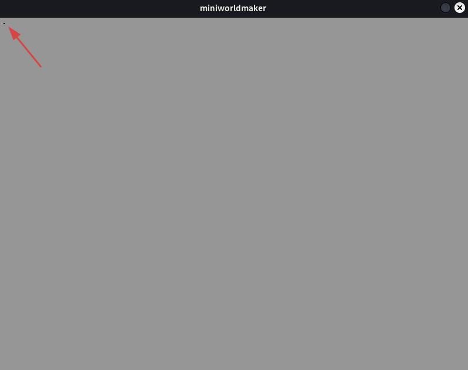
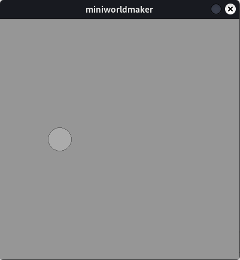

# Drawing with Miniworldmaker - Basics


## Preface


This tutorial is strongly inspired by the great lecture notes of Prof. Dr. Michael Kipp https://michaelkipp.de/processing/, which is related to Processing.

The miniworldmaker port of processing takes some ideas and concepts from Processing, but often implements them in a slightly different way. In this tutorial you will learn how to program with the miniworldmaker. The miniworldmaker has a *Processing* mode, which is based on the popular graphics programming environment.

## How to draw on a PC?

Monitors consist of a grid of small squares. These squares are so small that they look like dots to us. These smallest squares are called *pixels*.

The pixels are arranged in a *coordinate system*. However, this is structured slightly differently, because usually the origin is in the upper left corner:


``` {note}
Computer scientists usually count starting with 0, i.e. the upper left corner has coordinates (0,0). If the screen window is 800x600
then the lower right corner has the coordinates (799, 599)
```

## The first program


A miniworldmaker program consists of several parts:

``` {code-block} python
---
emphasize-lines: 1,2,6
lineno-start: 1
---

from miniworldmaker import *
board = Board()

# Your code here

board.run()
```

* 1: The miniworldmaker library is imported
* 2: A board is created.
* 6: At the end the mainloop is started, this must always be the last line of your program.

In between there is a *comment* - comments always start with a # and are ignored by the computer and are made for **humans**. They are used to give hints to programmers, here e.g. that your own code comes to this place.

This could look like this:

``` python
from miniworldmaker import *

board = Board()

Point((10,10))

board.run()
```



You can also resize the board by passing two arguments to the board when you create it:

``` python
from miniworldmaker import *

board = Board(200, 400)
board.run()
```

## Draw basic geometric shapes.

Next you will learn to draw basic geometric shapes.

### Lines

The syntax for drawing a line looks like this:

``` python
  Line(startpoint, endpoint)
```

The parameters `startpoint` and `endpoint` are tuples, e.g. (1, 2) for x=1 and y=2.

If you want to draw a line from (10,10) to (100, 200) you have to write e.g. the following:

``` python
from miniworldmaker import *

board = Board()
line((10,10), (100, 200))
board.run()
```


### Circles

You can create circles in general as follows:

``` python
  Line(position, radius)
```

:::{note}
The passed position for circles is the *center* of the circle.
:::

If you want to create a circle at location (100,200) with radius 20, you must write the following:


``` python
from miniworldmaker import *

board = Board()
Circle((100,200), 20)
board.run()

```



### Rectangle

A rectangle is described by its position, width and height:

``` python
Rectangle(position, width, height)
```

The parameter `position` describes the upper left corner of the rectangle.

If you want to draw a rectangle at position (100, 100) with width 20 and height 100, you have to write the following:

``` python
from miniworldmaker import *

board = Board()
Rectangle((100, 100), 20, 100)
board.run()
```


### Ellipse

Ellipses are described in the same way as rectangles, i.e. the ellipse is then drawn so that it fits exactly inside the rectangle. Width and height refer to the diameter of the ellipse.

``` python
ellipse(position, width, height)
```

If you want to draw an ellipse at position (100, 100) with width 20 and height 100, you must write the following:

``` python
from miniworldmaker import *

board = Board()
ellipse((100, 100), 20, 100)
board.run()

```


### Move rectangle and ellipse to the center.


Often you don't want to create a rectangle or an ellipse at the upper left position, but at the center point. There are several ways to achieve this without manually calculating the position.

#### 1. from_center


With the class method from_center you can create an ellipse at the center.

``` python
from miniworldmaker import *

board = Board()
Ellipse.from_center((50, 100), 100, 200)
board.run()
```


#### 2. Move with ellipse.center

You can move the ellipse to the center after moving it;

``` python
from miniworldmaker import *

board = Board()
ellipse((50, 100), 100, 200)
ellipse.center = ellipse.position
board.run()
```


## More complex basic geometric shapes


### Arc

You can draw arcs and segments of circles with the following command:

``` python
Arc(position, width, height, start_angle, end_angle)
```

Meaning of the parameters:

* ``position``: The position as a 2-tuple.

* ``width``, ``height``: Width and height when creating an ellipse. Choose both equal to get the radius for an arc or choose different values to get the arc and section of an ellipse.
  
* ``start_angle``, ``end_angle``: The angles of the section. The angles are measured from an imaginary line *counterclockwise*.


#### Example:

``` python
from miniworldmaker import *

board = Board()
a1 = Arc.from_center((200, 200), 200, 200, 30, 242)
board.run()
```

### Triangle


You can create a triangle with the following command:

``` python
Triangle(p1,p2, p3)
```

p1, p2 and p3 are points, which you can write as tuples.

#### Example:

``` python
from miniworldmaker import *

board = Board()
Triangle((10,10), (100,100), (200,10))
board.run()
```

### Polygon


You create a polygon (i.e. an n-corner) with the following command:

``` python
polygon(pointlist)
```

``pointlist`` is a list of points. For example, you can create the triangle from the previous example as a polygon as follows:

#### Example:

``` python
from miniworldmaker import *

board = Board()
polygon([(10,10), (100,100), (200,10)])
board.run()
```

`````{admonition} training

````{admonition} Exercise 1.1: House with basic shapes
  

Draw a house with basic shapes:


<details>
<summary><a>Solution approach</a></summary>.

``` python
from miniworldmaker import *

board = Board()
board.size = (120,210)
Rectangle((10,100), 100, 100)
Triangle((10,100), (60, 50), (110, 100))

board.run()
```
</details>

````

````{admonition} Exercise 1.2: Face

Draw a face with basic shapes


<details>
<summary><a>solution approach</a></summary>

``` python
from miniworldmaker import *
import random
board = board((100,100))
board.size = (100, 100)
Circle.from_center((50,50),50)
Arc.from_center((50,80),40,20, 180, 360)
Circle.from_center((30,30),10)
Circle.from_center((70,30),10)
Line((50,50),(50,70))
board.run()
```
</details>
````
`````
