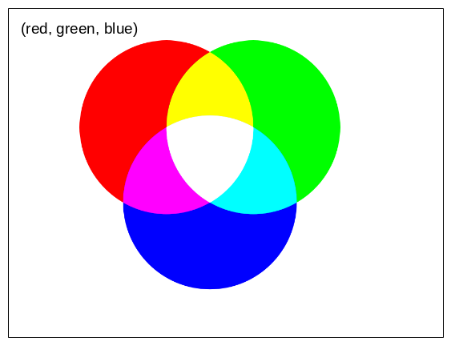
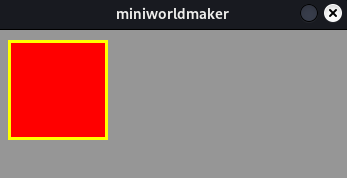
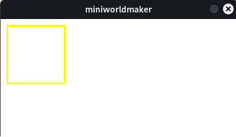
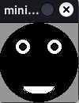

# Colors and contours


## Colorize


A geometric shape can be colored with the ``fill_color`` attribute:

``` python
from miniworldmaker import *

board = Board(350, 150)
r = Rectangle((10,10), 100, 100)
r.fill_color = (255, 0, 0)

g = Rectangle((120,10), 100, 100)
g.fill_color = (0, 255,0)

b = Rectangle((230,10), 100, 100)
b.fill_color = (0, 0 ,255)

board.run()
```

A **color** is specified as a 3-tuple:

* the first value is the *red* portion

* The second value is the *green* portion

* The third value is the *blue* portion

By "mixing" these colors you get a concrete color:



### Variables

We have used *variables* here. Previously, when we created an object, we could not access it. Here we have given the rectangles names (e.g. r) that can later be used to access the objects again.

So ``r.fill_color = (255, 0, 0)`` means that we change the fill color of the rectangle named r before.
  
## border

Every geometric shape can have a **border**.
You can specify the border as an integer value with the ``border`` attribute and the color with the ``border-radius`` attribute:

The following image creates a red rectangle with a yellow border:

``` python
from miniworldmaker import *

board = Board(350, 150)
r = Rectangle((10,10), 100, 100)
r.fill_color = (255, 0, 0)
r.border = 3
r.border_color = (255, 255,0)

board.run()
```

Output:




## Fill

You can also show figures that have only a border but no fill. The ``fill`` attribute determines whether an object has a fill.

For example, the following rectangle has no fill:

``` python
from miniworldmaker import *

board = Board(350, 150)
r = Rectangle((10,10), 100, 100)
r.fill = False
r.border = 3
r.border_color = (255, 255,0)

board.run()
```

## The board


All figures are drawn on a ``board``. The board also has various properties that can be changed, such as size and background color.

Note the following code, which sets the size and background of the board.

``` python
  from miniworldmaker import *

  board = Board()
  board.add_background((255,255,255))
  board.size = (400,200)
  r = Rectangle((10,10), 100, 100)
  r.fill = False
  r.border = 3
  r.border_color = (255, 255,0)

  board.run()
```

Output:



`````{admonition} Training

````{admonition} Exercise 2.1: Black Face

Draw the following shape:




<details>
<summary><a>Solution approach</a></summary>.

``` python
from miniworldmaker import *

board = Board()
board.size = (120,210)
Rectangle((10,100), 100, 100)
Triangle((10,100), (60, 50), (110, 100))

board.run()
```
</details>

`````
