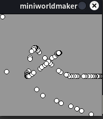
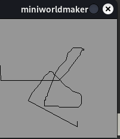
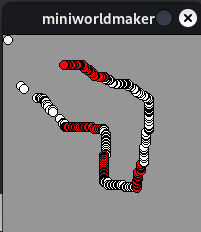
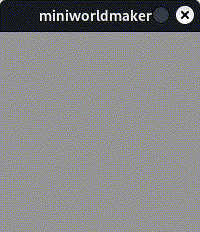

# Interaction


## on_setup and act


Until now, you simply wrote commands one below the other and the commands were then processed from top to bottom.

If you want to write an interactive program, you have to break this a bit.

For this you can **register** methods that are called at certain times or react to certain events.

We'll start with two simple methods, `on_setup` and `act`.

  * `on_setup` is called once when the `board` is created.

  * `act` is called over and over again, once per time unit.

The following program:

``` python
from miniworldmaker import *

board = Board()
board.size = (120,210)

@board.register
def on_setup(self):
    print("setup")
  
@board.register
def act(self):
    print("act")
```

returns e.g. the following output

```
setup
act
act
act
```

## Code blocks
The line ``def on_setup(self):`` ends with a colon. Below it you see a code block:

The contents of the function are all *indent*, everything that is equally indented belongs to a block.

``` python
from miniworldmaker import *

board = Board()
board.size = (120,210)

@board.register
def on_setup(self):
    print("This ")
    print("is ")
    print("part ")
    print("of a code block ")
print("This but not ")
```

When ``on_setup`` is called, the four lines below it are called, but not the 5th line.

... note::
  Usually in Python you use *4 spaces* when indenting a block of code.
  It is not a mistake if you use only 3,2,1 or 5 spaces or a tab as long as you always indent the same
  but this is considered bad style by experienced programmers.

## Frame Rate - How often act() is called


You can set how often ``act()`` is called by configuring the ``board.fps`` and ``board.speed`` attributes.

* ``board.fps`` defines the ``frame rate``. Analogous to a flipbook, where you turn the pages at a fixed speed,
  the frame rate defines how many times per second the image is redrawn.
  ``board.fps`` has the default value 60, i.e. 60 frames per second are displayed.

* The attribute ``board.frame`` stores the current frame. The frames since program start are counted up.
  
* ``board.speed`` defines how often the program logic (e.g. act) is called per second.
  A value of 60 means that the act() method is called every 60th frame.

``` python
  from miniworldmaker import *

  board = Board()
  board.size = (120,210)

  @board.register
  def on_setup(self):
      board.fps = 1
      board.speed = 3
      
  @board.register
  def act(self):
      print(board.frame)

  board.run()
```

The program above has the output:

```
  3
  6
  9
  12
  15
```


It is counted up very slowly, because exactly one frame per second is played and every 3. frame
(so every 3 seconds) the function ``act()`` is called.


````{warning}

  Warning: it can lead to unforeseen side effects if you indent code incorrectly, consider for example the following program:

``` python
from miniworldmaker import *

board = Board()
board.size = (120,210)

@board.register
def on_setup(self):
    print(1)

print(2)

@board.register
def act(self):
    print(3)
print(4)

board.run()
```

The program has the output:

```
1
2
4
1
3
3
```

````

This is because ``on_setup()`` is executed first, after the board is created in line 3.
Then the two unindented functions are executed and as soon as ``run()`` is started, the function
``act()`` is called. Make sure that your instructions are inside the code blocks of act and on_setup.

## Mouse interactions


Interactions take place in miniworldmaker via **events**. Events can be called by a wide variety of system events,
e.g. when the user has made an input with the keyboard or with the mouse.

First, let's look at mouse interactions:

With the method ``get_mouse_position`` you can query the mouse position:

 `` python
from miniworldmaker import *

board = Board()

@board.register
def on_setup(self):
    board.size = (200,200)

@board.register
def act(self):
    Ellipse(board.get_mouse_position(), 10, 10)

board.run()
```

The circle now follows your mouse position:



If you want to draw lines, you need the current and the last mouse position. This can be done as follows:

``` python
from miniworldmaker import *

board = Board()

@board.register
def on_setup(self):
    board.size = (200,200)

@board.register
def act(self):
    Line(board.get_prev_mouse_position(), board.get_mouse_position())

board.run()
```



## Listener methods


It would be nice if we could still react to specific events, such as key presses or mouse clicks.
For this we can register specific listener methods, e.g. ``on_mouse_pressed``.

``` python
from miniworldmaker import *

board = Board()

@board.register
def on_setup(self):
    board.size = (200,200)

@board.register
def act(self):
    Ellipse(board.get_mouse_position(), 10, 10)

@board.register
def on_mouse_left(self, position):
    board.fill_color = (255, 0, 0)
  
@board.register
def on_mouse_right(self, position):
    board.fill_color = (255, 255, 255)
  
board.run()
```



## Query keyboard input

You can also query input from the keyboard:

``` python
from miniworldmaker import *

board = Board()

@board.register
def on_setup(self):
    board.size = (200,200)

@board.register
def on_key_down_a(self):
    a = Ellipse.from_center((100, 100), 100, 100)
    a.fill_color = (255, 0, 0)

@board.register
def on_key_down_b(self):
    a = ellipse.from_center((100, 100), 100, 100)
    a.fill_color = (0, 255, 0)

    
board.run()
```

This program responds to the keys a and b, pressing the <kbd>a</kbd> key draws a red ellipse, pressing the <kbd>b</kbd> key draws a green ellipse.

### Working with randomness

Python provides some ways to create interesting graphical effects with the random library:

For example, a circle is created in a random color:

``` python
from miniworldmaker import *
import random
board = Board()

@board.register
def on_setup(self):
    board.size = (200,200)

@board.register
def on_key_down_a(self):
    a = Ellipse.from_center((100, 100), 100, 100)
    a.fill_color = (random.randint(0, 255), random.randint(0, 255), random.randint(0, 255))

    
board.run()
```

Output:



