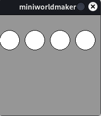
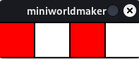
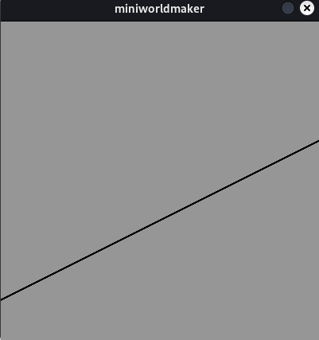
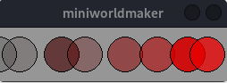

# Loops

## The for loop

The for-loop repeats -simplified- a command n times:

### Example

The following loop is executed 5 times:

``` python
for i in range(5):
    print("I'm in a loop!")
```

The program gives the following output

```
I'm in a loop!
I'm in a loop!
I'm in a loop!
I'm in a loop!
I'm in a loop!
```

## The counter variable

You can use the variable i as a counter variable. It counts up (starting from 0):

### Example

``` python
for i in range(5):
    print(i)
```

The program gives the following output

```
0
1
2
3
4
```

## General form:

Generally written:

``` python
for i in range(max):
    <codeblock>
```

or

``` python
for i in range(min, max):
    <codeblock>
```

You can specify how many times the loop will be run or specify specific ranges:

### Examples: Drawing with loops

You can draw with loops:

``` python
from miniworldmaker import *

board = Board(200, 200)

for i in range(4):
    Circle((20 + 50 * i, 50), 20)
    
board.run()
```



### Checkerboard pattern

With the module operator you can check if a result is divisible by 2, namely
``x divisible by 2 exactly if x % 2 == 0`

This can be used to draw chessboard-like patterns by combining loops with an if query:

``` python
from miniworldmaker import *

board = Board(200, 50)

for i in range(4):
    rect = Rectangle((50 * i, 0), 50, 50)
    if i % 2 == 0:
        rect.color = (255,0,0, 255)
    else:
        rect.color = (255, 255, 255, 255)
    
board.run()
```



### Graphs

Graphs can also be drawn in this way:

``` python
from miniworldmaker import *

board = Board(400, 400)


for x in range(400):
    gl = 0.5*x + 50
    y = 400 - gl
    Point((x, y))
    
board.run()
```



### Nested loops

You can use nested loops to draw multidimensional patterns.

``` python
from miniworldmaker import *

board = Board(200, 200)

for i in range(4):
    for j in range(4):
        Circle((20 + 50 * i, 20 + 50 * j), 20)
    
board.run()
```


## The while loop

The while loop generally has the following structure:

``` python
while <condition>:
    <code block>
```

* As long as the condition is true, the loop is repeated over and over. This also makes it possible to create infinite loops.

Example:

The following program generates a random pattern:

``` python
from miniworldmaker import *
import random
board = Board(255, 60)
x = 0

while x < 255:
    c = Circle((x, 30), 20)
    c.color = (x,0,0,random.randint(0,255))
    x = x + random.randint(10,50)
    
board.run()
```



## The mainloop

Your whole program runs strictly inside a while loop:

``` python
while <no quit>
  <draw images on screen>
  <handle logic and events>
```

The for-loop is not suitable for this, because you have to know in advance, how many loop passes
are to be run through.

## Loops within registered methods

If you want to execute a loop inside the `act` method or an event method, then you need to know the following:

The complete loop within such a method is executed within a single frame. A loop is not suitable here, e.g., to move a figure, since this is drawn again every frame - a loop runs however completely within a frame.

### Example

The example of a traffic light system is a good way to illustrate this. The sequence of the loop can be visualized well with a state diagram.

``` {mermaid}
stateDiagram
    [*] --> Green

    Green --> GreenYellow
    GreenYellow --> Red
    Red --> RedYellow
    RedYellow --> Green
```

In code you can implement this as follows:

``` python

from miniworldmaker import *

state = "green

while True:
    if state == "green":
        state = "green-yellow
        print("green")
    elif state == "green-yellow":
        state = "red"
        print("green-yellow")
    elif state == "red":
        state = "red-yellow"
        print("red")
    elif state == "red-yellow":
        state = "green"
        print("red-yellow")
board.run()
```

In the mainloop the while loop is "replaced" by the mainloop:

``` python
from miniworldmaker import *

board = Board(100,240)
state = "green
g = Circle ((50,40), 40)
y = Circle ((50,120), 40)
r = Circle ((50,200), 40)

@board.register
def act(self):
    global state
    if board.frame % 20 == 0:
        if state == "green":
            g.color = (0,255,0)
            y.color = (255,255,255)
            r.color = (255,255,255)
            state = "green-yellow
            print("green")
        elif state == "green-yellow":
            g.color = (0,255,0)
            y.color = (255,255,0)
            r.color = (255,255,255)
            state = "red
            print("green-yellow")
        elif state == "red":
            g.color = (255,255,255)
            y.color = (255,255,255)
            r.color = (255,0,0)
            state = "red-yellow
            print("red")
        elif state == "red-yellow":
            g.color = (255,255,255)
            y.color = (255,255,0)
            r.color = (255,0,0)
            state = "green
            print("red-yellow")
board.run()
```

As you can see, the program code has been changed only in some places, the program flow remains the same.
The `while` loop is replaced here by the `act` method.

