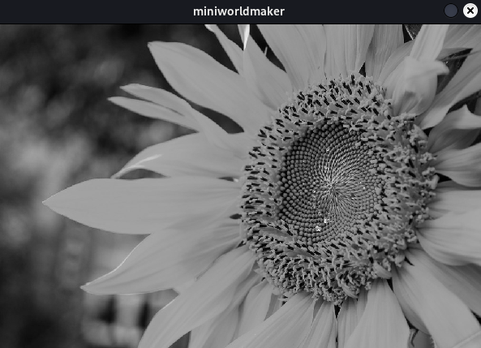
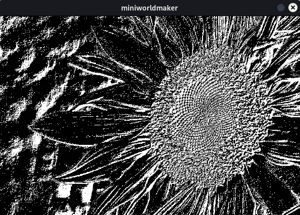

# Image editing

## What are images

Images are made up of tiny little pixels that all have a specific color:


Image processing consists of changing and manipulating these pixels according to certain criteria.

For this we need `arrays` which are a special form of lists (arrays have limited sizes).

## Loading the background

In miniworldmaker we can load the `background` with the function
`arr = background.to_colors_array()`
load.

For example, if we write this minimal program:

``` python
from miniworldmaker import *

board = board()
arr = board.background.to_colors_array()
print(arr)
board.run()
```

then we edit the default background in the following:


You get a nested, two-dimensional array that looks like this:

```
[[[150 150 150]
  [150 150 150]
  [150 150 150]
  ...
  [150 150 150]
  [150 150 150]
  [150 150 150]]

 [[150 150 150]
  [150 150 150]
  [150 150 150]
  ...
  [150 150 150]
  [150 150 150]
  [150 150 150]]

 [[150 150 150]
  [150 150 150]
  [150 150 150]
  ...
  [150 150 150]
  [150 150 150]
  [150 150 150]]

 ...

 [[150 150 150]
  [150 150 150]
  [150 150 150]
  ...
  [150 150 150]
  [150 150 150]
  [150 150 150]]

 [[150 150 150]
  [150 150 150]
  [150 150 150]
  ...
  [150 150 150]
  [150 150 150]
  [150 150 150]]

 [[150 150 150]
  [150 150 150]
  [150 150 150]
  ...
  [150 150 150]
  [150 150 150]
  [150 150 150]]]
```

The innermost list represents each 3-tuple of colors. [150, 150, 150].

These describe respectively the red, green and blue part of the respective pixel. Each color is created by "mixing" these 3 basic colors:


The minimum value for each color is 0, the maximum value is 255.

The image array consists of:

* A list of columns
* and each of these columns contains a color value for each row (which itself is a list of 3 values).


## Change the background

You can iterate over this array as follows:

``` python
from miniworldmaker import *
grey
board = board()
arr = board.background.to_colors_array()
for x in range(len(arr)): # iterate over all rows
    for y in range(len(arr[0])): # iterate over all columns of row
        arr[x][y][0] = 0
print(arr)
board.run()
```

The counter variable x iterates over the columns and selects one column at a time.
The counter variable y is now iterated over each selected column:


With the statement `arr[i][j][0] = 0` the first color, i.e. the red part, is set to 0.
The array looks like this:

```
[[[ 0 150 150]
  [ 0 150 150]
  [ 0 150 150]
  ...
  [ 0 150 150]
  [ 0 150 150]
  [ 0 150 150]]

 [[ 0 150 150]
  [ 0 150 150]
  [ 0 150 150]
  ...
  [ 0 150 150]
  [ 0 150 150]
  [ 0 150 150]]

 ...

 [[ 0 150 150]
  [ 0 150 150]
  [ 0 150 150]
  ...
  [ 0 150 150]
  [ 0 150 150]
  [ 0 150 150]]]
```

We can now load this array again as background with the command `background.from_array(arr)`, this is how the complete program looks like:

``` python
from miniworldmaker import *

board = board()
arr = board.background.to_colors_array()
for x in range(len(arr)):
    for y in range(len(arr[0])):
        arr[x][y][0] = 0
board.background.from_array(arr)
board.run()
```

...and this is how the result looks like. The gray color loses its red components and becomes green-bluish:


Here we simply assigned the red value 0 to each pixel. But we can also assign a value between 0 and 255 to each pixel.

You can also iterate over this list in a different way and, for example, color only every second line:

``` python
from miniworldmaker import *

board = board()
arr = board.background.to_colors_array()
for x in range(0, len(arr),2 ):
    for y in range(len(arr[0])):
        arr[x][y][0] = 0
print(arr)
board.background.from_array(arr)
board.run()
```


In the same way it is possible to use the value Dependent on the counter variable i - This way you can create color transitions, e.g. like this
:

``` python
from miniworldmaker import *

board = board()
arr = board.background.to_colors_array()
print(arr)
for x in range(len(arr)):
    for y in range(len(arr[0])):
        arr[x][y][0] = ((x +1 ) / board.width) * 255
board.background.from_array(arr)
board.run()

```

As the x value increases. (x+1) / board.width gives a value between 0 and 1.
Multiplying this by 255 gives a value between 0 and 255. If a value is all the way to the left, its red value is minimal. If it is all the way to the right,
the red value is maximum.

You get the following color transition.


You can also do this with the y variable, and extend the program as follows:

``` python
from miniworldmaker import *

board = board()
arr = board.background.to_colors_array()
for x in range(len(arr)):
    for y in range(len(arr[0])):
        arr[x][y][1] = ((y +1 ) /board.width) * 255
board.background.from_array(arr)
board.run()
```

At the top the green value is minimum, at the bottom it is maximum:


You can now put this together:

``` python
from miniworldmaker import *

board = board()
arr = board.background.to_colors_array()
for x in range(len(arr)):
    for y in range(len(arr[0])):
        arr[x][y][0] = ((x +1 ) / board.width) * 255
        arr[x][y][1] = ((y +1 ) /board.width) * 255
board.background.from_array(arr)
board.run()
```

You get this color transition:


## Image processing

So far we have now edited a monochrome background, but of course this is exactly what we can do with an image as background.

This way we can put different filters over the image.

For example, we load the sunflower from above as a background image:


``` python
from miniworldmaker import *

board = Board(600,400)
board.add_background("images/sunflower.jpg")
arr = board.background.to_colors_array()
for x in range(len(arr)):
    for y in range(len(arr[0])):
        arr[x][y][0] = 0
board.background.from_array(arr)
board.run()
```

As the red values are removed from the image, the image gets a thorough tint. So we have written a first color filter here.
This is what the result looks like:


Next we manipulate the brightness. For this we can multiply both the red, green and blue value with a constant.

``` python
from miniworldmaker import *

board = Board(600,400)
board.add_background("images/sunflower.jpg")
arr = board.background.to_colors_array()
constant = 2
for x in range(len(arr)):
    for y in range(len(arr[0])):
        arr[x][y][0] = arr[x][y][0] * constant
        arr[x][y][1] = arr[x][y][1] * constant
        arr[x][y][2] = arr[x][y][2] * constant
board.background.from_array(arr)
board.run()
```

However, the first attempt looks like this!


How did this happen?

Each hue has a value between 0 and 255, but during multiplication some of our values became larger than 255 and therefore "overflowed".
You can see this by particularly dark areas that should be light.

So we have to make sure that the result is smaller than 255, e.g. like this:

``` python
from miniworldmaker import *

board = Board(600,400)
board.add_background("images/sunflower.jpg")
arr = board.background.to_colors_array()
constant = 2
for x in range(len(arr)):
    for y in range(len(arr[0])):
        arr[x][y][0] = min(arr[x][y][0] * constant, 255)
        arr[x][y][1] = min(arr[x][y][1] * constant, 255)
        arr[x][y][2] = min(arr[x][y][2] * constant, 255)
board.background.from_array(arr)
board.run()
```


# Image processing II (with functions)

## Brightness

Often we need the brightness of a pixel. The "easiest way to calculate this is to calculate the average of the r,g and b values:

``` python
from miniworldmaker import *

board = board(600,400)
board.add_background("images/sunflower.jpg")
arr = board.background.to_colors_array()

def brightness(r, g, b):
    return (int(r) + int(g) + int(b)) / 3

print(brightness(arr[10][20]))
 
board.background.from_array(arr)
board.run()
```

In the brightness function the values r, g and b must first be converted:
They are `uint8` values, so the result must never be greater than 255 (otherwise an "overflow" occurs). Therefore, the variables must be converted to the `int` data type, so that the result of the addition is also an `int` value and thus arbitrarily large.

We can use this to color each pixel gray, depending on its brightness:

``` python
from miniworldmaker import *

board = board(600,400)
board.add_background("images/sunflower.jpg")
arr = board.background.to_colors_array()

def brightness(r, g, b):
    return (int(r) + int(g) + int(b)) / 3

for x in range(len(arr)):
    for y in range(len(arr[0])):
        
        arr[x][y] = brightness(arr[x][y][0], arr[x][y][1], arr[x][y][2])
        
board.background.from_array(arr)
board.run()
```



### Color difference and perceived color difference

When working with images and tones, it is important to know how we humans perceive them.

The *perceived* brightness is not the same as the brightness calculated here. However, for the following purposes, the form used here to calculate brightness is sufficient.

## Edge detection

An important function in image processing is the detection of edges. This is also important in artificial intelligence,
because edge detection is a first step to recognize objects in an image.

### How does edge detection work?

### Helper functions

To focus on the algorithm itself, we use some helper functions:

1. is there a pixel in the image?:

``` python
def in_array(arr, x, y):
    if x >= 0 and x < len(arr):
        if y >= 0 and y < len(arr[0]):
            return True
    return False
```

2. return all neighbor cells of a pixel:

``` python
def neighbor_cells(arr, x, y):
    neighbors = []
    for x0 in range(x-1, x+1):
        for y0 in range(y-1, y+1):
            if in_array(arr, x0, y0):
                neighbours.append(arr[x0][y0])
    return neighbors
```

3 We prepare the image. With `arr.copy()`` we can create a copy of the image in which we store only the brightness values.

This way we don't have to calculate with all three color values later.


This is how the basic structure looks like:

``` python
from miniworldmaker import *

board = Board(600,400)
board.add_background("images/sunflower.jpg")
arr = board.background.to_colors_array()
grey_arr = arr.copy()

def brightness(r, g, b):
    return (int(r) + int(g) + int(b)) / 3

def in_array(arr, x, y):
    if x >= 0 and x < len(arr):
        if y >= 0 and y < len(arr[0]):
            return True
    return False
    

def neighbor_cells(arr, x, y):
    neighbors = []
    for x0 in range(x-1, x+1):
        for y0 in range(y-1, y+1):
            if in_array(arr, x0, y0):
                neighbours.append(arr[x0][y0])
    return neighbors

for x in range(len(arr)):
    for y in range(len(arr[0])):
        grey_arr[x][y] = brightness(arr[x][y][0], arr[x][y][1], arr[x][y][2])
        
board.background.from_array(arr)
board.run()
```

and now we add the edge detection algorithm:

The algorithm works like this: We calculate the average brightness value of all neighboring cells using the neighbor_cells function and color the image accordingly.

``` python
from miniworldmaker import *

board = Board(600,400)
board.add_background("images/sunflower.jpg")
arr = board.background.to_colors_array()
grey_arr = arr.copy()

def brightness(r, g, b):
    return (int(r) + int(g) + int(b)) / 3

def in_array(arr, x, y):
    if x >= 0 and x < len(arr):
        if y >= 0 and y < len(arr[0]):
            return True
    return False
    

def neighbor_cells(arr, x, y):
    neighbors = []
    for x0 in range(x-1, x+1):
        for y0 in range(y-1, y+1):
            if in_array(arr, x0, y0):
                neighbours.append(arr[x0][y0])
    return neighbors

for x in range(len(arr)):
    for y in range(len(arr[0])):
        grey_arr[x][y] = brightness(arr[x][y][0], arr[x][y][1], arr[x][y][2])

for x in range(len(arr)):
    for y in range(len(arr[0])):
        neighbors = neighbors_cells(grey_arr, x, y)
        sum_neighbours = 0
        for neighbor in neighbor_cells(grey_arr, x, y):
            sum_neighbours += neighbour[0]
        mean_neighbours = sum_neighbours / len(neighbors)
        diff = grey_arr[x][y][0] - mean_neighbours
        arr[x][y] = (diff, diff, diff)
        
board.background.from_array(arr)
board.run()
```



The colors are still inverted, so we need a function that inverts the colors again, so that the black background becomes white and the edges become black instead of white.

This goes like this:

``` python
for x in range(len(arr)):
    for y in range(len(arr[0])):
        arr[x][y][0] = 255 - arr[x][y][0]
        arr[x][y][1] = 255 - arr[x][y][1]
        arr[x][y][2] = 255 - arr[x][y][2]
```


We can improve this algorithm in several ways. One possibility is to color only cells white that exceed a certain threshold and all other cells black, one could also make the field of neighboring cells larger, ...

Try it out!