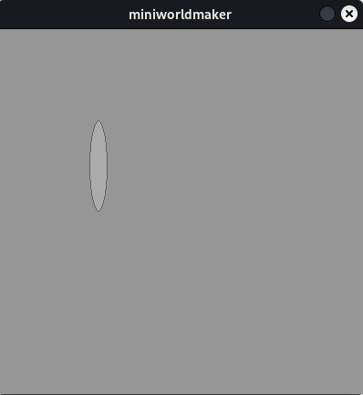

# Zeichnen mit dem Miniworldmaker - Grundlagen


## Vorwort


Dieses Tutorial ist stark inspiriert vom großartigen Vorlesungsskript von Prof. Dr. Michael Kipp https://michaelkipp.de/processing/, welches sich auf Processing bezieht. 

Der miniworldmaker-Port von processing übernimmt einige Ideen und Konzepte von Processing, setzt dies aber oft auf leicht abweichende Art um. In diesem Tutorial lernst du das Programmieren mit dem miniworldmaker kennen. Der miniworldmaker hat einen *Processing*-Modus, der sich an der populären Grafikprogrammierumgebung orientiert.

## Wie zeichnet man auf einem PC?

Monitore bestehen aus einem Gitter kleinester Quadrate. Diese Quadrate sind so klein, dass sie für uns wie Punkte aussehen. Man nennt diese kleinsten Quadrate *Pixel*.

Die Pixel sind in einem *Koordinatensystem* angeordnet. Dieses ist allerdings leicht anders aufgebaut, denn in der Regel ist der Ursprung in der oberen linken Ecke:


```{note}
Informatiker zählen in der Regel beginnend mit 0, d.h. die obere linke Ecke hat die Koordinaten (0,0). Ist das Bildschirmfenster 800x600 groß, 
so hat die untere rechte Ecke die Koordinaten (799, 599)
```

## Das erste Programm


Ein miniworldmaker-Programm besteht aus mehreren Teilen:

```{code-block} python
---
emphasize-lines: 1,2,6
lineno-start: 1
---

from miniworldmaker import *
board = Board()

# Your code here

board.run()
```

* 1: Die miniworldmaker Bibliothek wird importiert
* 2: Ein Spielfeld wird erstellt.
* 6: Am Ende wird die mainloop gestartet, dies muss immer die letzte Zeile deines Programms sein.

Dazwischen findet sich ein *Kommentar* - Kommentare beginnen immer mit einer # und werden vom Computer ignoriert und sind für **Menschen** gemacht. Sie dienen dazu, Programmierern Hinweise zu geben, hier z.B. das an diese Stelle dein eigener Code kommt.

Dieser könnte z.B. so aussehen:

``` python
from miniworldmaker import *

board = Board()

Point((10,10))

board.run()
```


Du kannst auch die Größe des Boards anpassen, indem du dem Board beim erstellen zwei Argumente übergibst:

``` python
from miniworldmaker import *

board = Board(200, 400)
board.run()
```

## Zeichnen geometrischer Grundformen.

Als nächstes lernst du, geometrische Grundformen zu zeichnen.

### Linien

Die Syntax zum Zeichnen einer Linie sieht folgendermaßen aus:

``` python
  Line(startpoint, endpoint)
```

Die Parameter `startpoint` und `endpoint` sind jeweils Tupel, z.B. (1, 2) für x=1 und y=2.

Wenn du eine Linie von (10,10) zu (100, 200) zeichnen willst so musst du z.B. folgendes schreiben:

``` python
from miniworldmaker import *

board = Board()
Line((10,10), (100, 200))
board.run()
```


### Kreise

Kreise kannst du allgemein folgendermaßen erstellen:

``` python
  Line(position, radius)
```

:::{note}
Die übergebene Position bei Kreisen ist der *Mittelpunkt* des Kreises
:::

Wenn du einen Kreis an der Stelle (100,200) mit Radius 20 erstellen willst, musst du folgendes schreiben:


``` python
from miniworldmaker import *

board = Board()
Circle((100,200), 20)
board.run()

```


### Rechteck

Ein Rechteck wird beschrieben durch Position, Breite und Höhe:

``` python
Rectangle(position, width, height)
```

Der Parameter `position` beschreibt die obere linke Ecke des Rechtecks.

Willst du ein Rechteck an der Position (100, 100) mit Breite 20 und Höhe 100 zeichnen, so musst du folgendes schreiben:

``` python
from miniworldmaker import *

board = Board()
Rectangle((100, 100), 20, 100)
board.run()
```


### Ellipse

Ellipsen werden im Prinzip wie Rechtecke beschrieben, d.h. die Ellipse wird dann so gezeichnet, dass sie genau in das Rechteck hineinpasst. `width` und `height` beziehen sich hier jeweils auf den Durchmesser der Ellipse

``` python 
Ellipse(position, width, height)
```

Willst du eine Ellipse an der Position (100, 100) mit Breite 20 und Höhe 100 zeichnen, so musst du folgendes schreiben:

``` python
from miniworldmaker import *

board = Board()
Ellipse((100, 100), 20, 100)
board.run()

```



### Rechteck und Ellipse in die Mitte verschieben.


Oft will man ein Rechteck oder eine Ellipse nicht an der oberen linken Position erstellen, sondern am Mittelpunkt. Es gibt mehrere Möglichkeiten, wie man dies erreichen kann, ohne die Position manuell auszurechnen.

#### 1. from_center


Mit der Klassenmethode from_center kannst du eine Ellipse am Zentrum erstellen.

``` python  
from miniworldmaker import *

board = Board()
Ellipse.from_center((50, 100), 100, 200)
board.run()
```


#### 2. Verschieben mit ellipse.center

Du kannst die Ellipse nach dem Verschieben an den Mittelpunkt verschieben;

``` python
from miniworldmaker import *

board = Board()
Ellipse((50, 100), 100, 200)
ellipse.center = ellipse.position
board.run()
```


## Komplexere geometrische Grundformen


### Arc

Kreisbögen und Kreisausschnitte zeichnest du mit folgendem Befehl:

``` python
Arc(position, width, height, start_angle, end_angle)
```

Bedeutung der Parameter:

* ``position``: Die Position als 2-Tupel

* ``width``, ``height``: Breite und Höhe bei Erstellung einer Ellipse. Wähle beide gleich, damit sich der Radius für einen Kreisbogen ergibt oder wähle unterschiedle Werte, damit sich der Bogen und Ausschnitt einer Ellipse ergibt.
  
* ``start_angle``, ``end_angle``: Die Winkel des Ausschnitts. Die Winkel werden von einer gedachten Linie *gegen den Uhrzeigersinn* gemessen.


#### Beispiel:

``` python
from miniworldmaker import *

board = Board()
a1 = Arc.from_center((200, 200), 200, 200, 30, 242)
board.run()
```

### Triangle


Ein Dreieck erstellst du mit folgendem Befehl:

``` python
Triangle(p1,p2, p3)
```

p1, p2 und p3 sind Punkte, die du jeweils als Tupel schreiben kannst.

#### Beispiel:

``` python
from miniworldmaker import *

board = Board()
Triangle((10,10), (100,100), (200,10))
board.run()
```

### Polygon


Ein Polygon (d.h. ein n-Eck) erstellst du mit folgendem Befehl:

``` python
Polygon(pointlist)
```

``pointlist`` ist eine Liste von Punkten. Das Dreieck aus dem vorherigen Beispiel kannst du z.B. folgendermaßen als Polygon erstellen:

#### Beispiel:

``` python
from miniworldmaker import *

board = Board()
Polygon([(10,10), (100,100), (200,10)])
board.run()
```

`````{admonition} Training

````{admonition} Übung 1.1: Haus mit Grundformen
  

Zeichne ein Haus mit Grundformen:


<details>
<summary><a>Lösungsansatz</a></summary>

``` python
from miniworldmaker import *

board = Board()
board.size = (120,210)
Rectangle((10,100), 100, 100)
Triangle((10,100), (60, 50), (110, 100))

board.run()
```
</details>

````

````{admonition} Übung 1.2: Gesicht

Zeichne ein Gesicht mit Grundformen


<details>
<summary><a>Lösungsansatz</a></summary>

``` python
from miniworldmaker import *
import random
board = Board((100,100))
board.size = (100, 100)
Circle.from_center((50,50),50)
Arc.from_center((50,80),40,20, 180, 360)
Circle.from_center((30,30),10)
Circle.from_center((70,30),10)
Line((50,50),(50,70))
board.run()
```
</details>
````
`````
