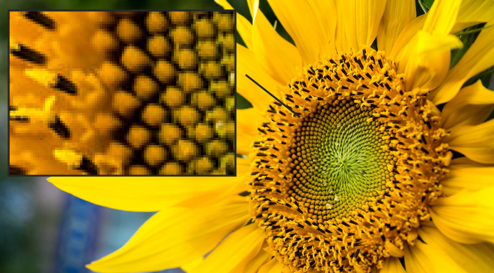
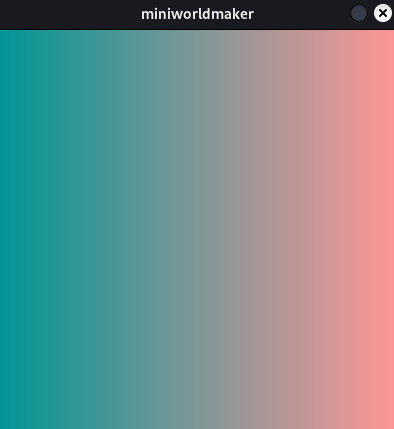

# Bildbearbeitung

## Was sind Bilder

Bilder bestehen aus winzig kleinen Pixeln, die alle eine bestimmte Farbe haben:



Bildbearbeitung besteht darin, diese Pixel nach bestimmten Kriterien zu verändern und zu manipulieren.

Dazu benötigen wir `Arrays` die eine spezielle Form von Listen sind (Arrays haben begrenze Größen).

## Laden des Hintergrunds

Im miniworldmaker können wir den `Hintergrund`  mit der Funktion 
`arr = background.to_colors_array()`
laden.

Wenn wir z.B. dieses minimale Programm schreiben:

```python
from miniworldmaker import *

board = Board()
arr = board.background.to_colors_array()
print(arr)
board.run()
```

, dann bearbeiten wir im folgenden den Standard-Hintergrund:


Du erhälst ein verschachteltes, zweidimensionales Array, das folgendermaßen aussieht:

```
[[[150 150 150]
  [150 150 150]
  [150 150 150]
  ...
  [150 150 150]
  [150 150 150]
  [150 150 150]]

 [[150 150 150]
  [150 150 150]
  [150 150 150]
  ...
  [150 150 150]
  [150 150 150]
  [150 150 150]]

 [[150 150 150]
  [150 150 150]
  [150 150 150]
  ...
  [150 150 150]
  [150 150 150]
  [150 150 150]]

 ...

 [[150 150 150]
  [150 150 150]
  [150 150 150]
  ...
  [150 150 150]
  [150 150 150]
  [150 150 150]]

 [[150 150 150]
  [150 150 150]
  [150 150 150]
  ...
  [150 150 150]
  [150 150 150]
  [150 150 150]]

 [[150 150 150]
  [150 150 150]
  [150 150 150]
  ...
  [150 150 150]
  [150 150 150]
  [150 150 150]]]
```

Die innerste Liste steht jeweils für ein 3-Tupel an Farben. [150, 150, 150]. 

Diese beschreiben jeweils den rot, grün und blau-Anteil des jeweiligen Pixels. Jede Farbe wird durch "Mischen" dieser 3 Grundfarben erzeugt:


Der Minimalwert für jede Farbe ist 0, der Maximalwert ist 255.

Das Bild-Array besteht:

* Aus einer Liste von Spalten
* und jede dieser Spalten enthält für jede Zeile einen Farbwert (der selbst wiederrum eine Liste mit 3 Werten ist)


## Verändern des Hintergrunds

Man kann über dieses Array folgendermaßen iterieren:

``` python
from miniworldmaker import *

board = Board()
arr = board.background.to_colors_array()
for x in range(len(arr)): # iterate over all rows
    for y in range(len(arr[0])): # iterate over all columns of row
        arr[x][y][0] = 0
print(arr)
board.run()
```

Die Zählervariable x iteriert über die Spalten und wählt jeweils eine Spalte aus. 
Über jede ausgewählte Spalte wird nun mit der Zählervariablen y iteriert:


Mit der Anweisung `arr[i][j][0] = 0` wird jeweils die erste Farbe, also der rot-Anteil auf 0 gesetzt.
Das Array sieht folgendermaßen aus:

```
[[[  0 150 150]
  [  0 150 150]
  [  0 150 150]
  ...
  [  0 150 150]
  [  0 150 150]
  [  0 150 150]]

 [[  0 150 150]
  [  0 150 150]
  [  0 150 150]
  ...
  [  0 150 150]
  [  0 150 150]
  [  0 150 150]]

 ...

 [[  0 150 150]
  [  0 150 150]
  [  0 150 150]
  ...
  [  0 150 150]
  [  0 150 150]
  [  0 150 150]]]
```

Dieses Array können wir nun wieder mit dem Befehl `background.from_array(arr)` als Hintergrund laden, so sieht das vollständige Programm aus:

``` python
from miniworldmaker import *

board = Board()
arr = board.background.to_colors_array()
for x in range(len(arr)):
    for y in range(len(arr[0])):
        arr[x][y][0] = 0
board.background.from_array(arr)
board.run()
```

...und so sieht das Ergebnis aus. Die Farbe Grau verliert ihre rot-Anteile und wird dadurch grün-bläulich:


Hier haben wir einfach jedem Bildpunkt den rot-Wert 0 zugewiesen. Wir können aber auch jedem Bildpunkt einen Wert zwischen 0 und 255 zuweisen.

Man kann auch anders über diese Liste iterieren und z.B. nur jede zweite Zeile färben:

``` python
from miniworldmaker import *

board = Board()
arr = board.background.to_colors_array()
for x in range(0, len(arr),2 ):
    for y in range(len(arr[0])):
        arr[x][y][0] = 0
print(arr)
board.background.from_array(arr)
board.run()
```


Genauso ist es möglich, den Wert Abhängig von der Zählervariablen i zu verwenden - Auf diese Weise kann man Farbübergänge erzeugen, z.B. so
:

``` python
from miniworldmaker import *

board = Board()
arr = board.background.to_colors_array()
print(arr)
for x in range(len(arr)):
    for y in range(len(arr[0])):
        arr[x][y][0] = ((x +1 ) / board.width) * 255
board.background.from_array(arr)
board.run()

```

Mit zunehmenden x-Wert steigt der x-Wert an. (x+1) / board.width ergibt einen Wert zwischen 0 und 1. 
Multipliziert man diesen mit 255 erhält man einen Wert zwischen 0 und 255. Ist ein Wert ganz links, ist sein rot-Wert minimal. Ist es ganz rechts, 
ist der rot-Wert maximal.

Man erhält folgenden Farbübergang.



Dies kann man auch mit der y-Variable machen, und das Programm wie folgt erweitern:

``` python
from miniworldmaker import *

board = Board()
arr = board.background.to_colors_array()
for x in range(len(arr)):
    for y in range(len(arr[0])):
        arr[x][y][1] = ((y +1 ) /board.width) * 255
board.background.from_array(arr)
board.run()
```

Oben ist der grün-Wert minimal, unten ist er maximal:


Man kann dies nun zusammensetzen:

```python
from miniworldmaker import *

board = Board()
arr = board.background.to_colors_array()
for x in range(len(arr)):
    for y in range(len(arr[0])):
        arr[x][y][0] = ((x +1 ) / board.width) * 255
        arr[x][y][1] = ((y +1 ) /board.width) * 255
board.background.from_array(arr)
board.run()
```

Man erhält diesen Farbübergang:


## Bildbearbeitung

Bisher haben wir nun einen einfarbigen Hintergrund bearbeitet, aber genau dies geht natürlich auch mit einem Bild als Hintergrund.

Auf diese Weise können wir verschiedene Filter über das Bild legen.

Wir laden z.B. die Sonnenblume von oben als Hintergrundbild:


```python
from miniworldmaker import *

board = Board(600,400)
board.add_background("images/sunflower.jpg")
arr = board.background.to_colors_array()
for x in range(len(arr)):
    for y in range(len(arr[0])):
        arr[x][y][0] = 0
board.background.from_array(arr)
board.run()
```

Da die rot-Werte aus dem Bild entfernt werden, erhält das Bild einen gründlichen Farbton. Wir haben hier also einen ersten Farbfilter geschrieben.
So sieht das Ergebnis aus:


Als nächstes manipulieren wir die Helligkeit. Dazu können wir sowohl den rot, grün als blau-Wert mit einer Konstante multiplizieren.

```python
from miniworldmaker import *

board = Board(600,400)
board.add_background("images/sunflower.jpg")
arr = board.background.to_colors_array()
constant = 2
for x in range(len(arr)):
    for y in range(len(arr[0])):
        arr[x][y][0] = arr[x][y][0] * constant
        arr[x][y][1] = arr[x][y][1] * constant
        arr[x][y][2] = arr[x][y][2] * constant
board.background.from_array(arr)
board.run()
```

Der erste Versuch sieht allerdings so aus!


Wie ist dies passiert? 

Jeder Farbton hat einen Wert zwischen 0 und 255, beim Multiplizieren wurden allerdings einige unserer Werte größer als 255 und sind daher "übergelaufen".
Du erkennst dies an besonders dunklen Bereichen, die eigentlich hell sein sollten.

Wir müssen also sicherstellen, dass das Ergebnis kleiner als 255 ist, z.B. so:

``` python
from miniworldmaker import *

board = Board(600,400)
board.add_background("images/sunflower.jpg")
arr = board.background.to_colors_array()
constant = 2
for x in range(len(arr)):
    for y in range(len(arr[0])):
        arr[x][y][0] = min(arr[x][y][0] * constant, 255)
        arr[x][y][1] = min(arr[x][y][1] * constant, 255)
        arr[x][y][2] = min(arr[x][y][2] * constant, 255)
board.background.from_array(arr)
board.run()
```


