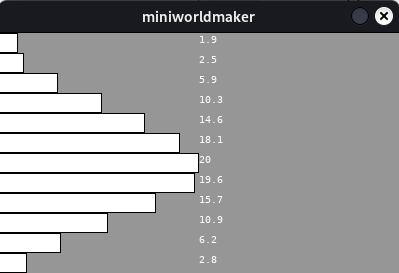

# Listen

Oft wollen wir viele ähnliche Elemente gleichzeitig zugreifen z.B. Monate:

Angenommen wir wollen die durchschnittlichen Monatstemperaturen in einer Stadt speichern und haben folgende Daten gemessen:

``` python

jan =  1.9
feb = 2.5 
mar = 5.9
apr = 10.3
mai = 14.6
jun = 18.1
jul = 20
aug = 19.6
sep = 15.7
okt = 10.9
nov = 6.2
dez = 2.8
```

Wenn die Daten weiter verarbeitet werden sollen, dann wird dies sehr unpraktisch, da wir jedesmal jeden einzelnen Wert "anfassen" müssen. Daher verwendet man stattdessen Listen.


Man verwendet daher für diesen Einsatzzweck Listen, bei der gleichartige Elemente unter einem gemeinsamen **Namen** zusammengefasst werden und mit Hilfe eines **Index** zugreifbar sind.

## Was sind Listen?

Listen sind eine Zusammenfassung von Daten, bei der jedes Datum durch einen Index identifiziert wird. Die einzelnen Werte einer Liste nennt man *Elemente*.

### Listen erzeugen

Man kann in Python Listen auf verschiedene Art und Weise erzeugen. Die einfachste Möglichkeit ist es, Listen mit Hilfe von eckigen Klammern zu erzeugen:

```python
l = [1, 2, 3]
l = ["mini", "worlds"]
``` 

Listen können selbst unterschiedliche Datentypen enthalten, d.h. auch dies ist eine Liste:

```python
l = ["hi", 1, 2, [3, 4]]
```

Wie du siehst, ist es sogar möglich (und oft notwendig) eine Liste innerhalb einer Liste zu erstellen. 

### Länge einer Liste

Die Länge einer Liste kannst du mit der Funktion len() berechnen:

```python
print(len([1, 2, 3])) # 3
print(len(["mini", "worlds"])) # 2
```

### Auf Elemente zugreifen

Mit Hilfe des `Index` kannst du auf Elemente einer Liste zugreifen. die Syntax dafür ist folgende

```python
variable_name[index]
```

z.B.

``` python
numbers = [2, 4, 8, 16, 32]
print(numbers[0]) # 2
print(numbers[2]) # 8
print(numbers[3]) # 16
```

### Listenelemente verändern

Du kannst mit Hilfe des Index auch Listenelemente verändern:

```python
numbers = [2, 4, 8, 16, 32]
numbers[0] = 1
print(numbers) # [1, 4, 8, 16, 32]
```

### append()

Listen in Python haben eine **dynamische** Größe und können verändert werden. So kannst du jederzeit mit append() ein Element an eine Liste anhängen:

```python
numbers = [2, 4, 8, 16, 32]
numbers.append(64)
print(numbers) # [2, 4, 8, 16, 32, 64]
```

### in

Mit dem Schlüsselwort `in` kannst du überprüfen, ob ein Element in einer Liste enthalten ist.

```python
numbers = [2, 4, 8, 16, 32]
print(2 in numbers) # True
print(3 in numbers) # False
```

Dies ist ein bedeutender Unterschied zu anderen Programmiersprachen, die als Datenstruktur anstelle von Listen *Arrays* kennen. Arrays sind nicht veränderbar und haben eine feste Länge.

## Beispiel : Monate

Am Beispiel der Monate schauen wir uns dies nochmal genauer an. Anstelle von einzelnen Variablen kann man die Monate als Liste anlegen:

``` python
months = []
months.append(1.9)
months.append(2.5)
months.append(5.9)
months.append(10.3)
months.append(14.6)
months.append(18.1)
months.append(20)
months.append(19.6)
months.append(15.7)
months.append(10.9)
months.append(6.2)
months.append(2.8)
```

Alternativ könnte man die Liste auch so anlegen:
```python
months = [1.9, 2.5, 5.9, 10.3, 14.6, 18.1, 20, 19.6, 15.7, 10.9, 6.2, 2.8]
```

Wenn wir die Liste ausgeben, erhalten wir folgendes:

```
print(months)
> [1.9, 2.5, 5.9, 10.3, 14.6, 18.1, 20, 19.6, 15.7, 10.9, 6.2, 2.8]
```

Wir können auf die einzelnen Listenelemente mit einem Index zugreifen:

``` python
print(months[1], months[4])
```

```
> 2.5 14.6
```

Und wir können mit einer Schleife über die Liste iterieren. So können wir z.B. die Durchschnittstemperatur berechnen:

``` python
for month in months:
    sum = sum + month
    
print(sum/12) # output 10.708
```

Dies können wir nutzen, um die Daten zu visualisieren:

``` python
from miniworldmaker import *

board = Board(400, 240)

months = []
months.append(1.9)
months.append(2.5)
months.append(5.9)
months.append(10.3)
months.append(14.6)
months.append(18.1)
months.append(20)
months.append(19.6)
months.append(15.7)
months.append(10.9)
months.append(6.2)
months.append(2.8)

i = 0 
for month in months:
    Rectangle((0,i), month * 10, 20)
    n = Number((200,i), month)
    n.font_size = 10
    i = i + 20
    
board.run()
```



## Grafische Objekte speichern

Wir können auch Objekte in Arrays speichern. Dies wird z.B. oft bei der Kollissionserkennung benötigt.

z.B. wollen wir ein Programm schreiben, bei denen grüne Kreise eingesammelt und rote Punkte vermieden werden sollen. Dies können wir folgendermaßen mit Listen umsetzen:

``` python
from miniworldmaker import *
import random

board = Board(400, 200)
points = Number((0,0), 0)

red_circles = []
green_circles = []

@board.register
def act(self):
    if self.frame % 100 == 0:
        c = Circle((400, random.randint(0,200), 40))
        c.color = (255, 0, 0)
        red_circles.append(c)
    elif self.frame % 50 == 0:
        c = Circle((400, random.randint(0,200), 40))
        c.color = (0, 255, 0)
        green_circles.append(c)
    for circle in red_circles:
        circle.move_left()
    for circle in green_circles:
        circle.move_left()

@board.register
def on_mouse_left(self, mouse_position):
    tokens = self.get_tokens_at_position(mouse_position)
    for token in tokens:
        if token in red_circles:
            token.remove()
            points.set_number(points.get_number() - 1)
        elif token in green_circles:
            token.remove()
            points.set_number(points.get_number() + 1)
            
board.run()
```

Wenn man die grünen Kreise anklickt, wird der Punktestand um 1 erhöht, ansonsten um 1 verringert.

Die Kollissionserkennung funktioniert mit Hilfe von Listen: die Kreise werden jeweils in die Liste red_circles und green_circles hinzugefügt - Auf diese Weise kann man mit `circle in green_circles` überprüfen, ob ein Kreis in einer dieser beiden Listen enthalten ist.

<video loop autoplay muted width="400">
<source src="../_static/collecting.webm" type="video/webm">
Your browser does not support the video tag.
</video> 