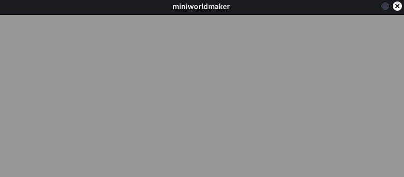
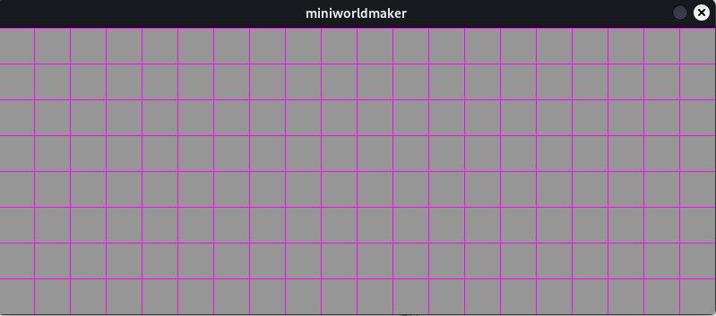

# Das Spielfeld

Los geht es!

## Die erste Welt

Wir erstellen eine erste Welt. Diese kann mit folgendem Code erzeugt
werden:

``` python
from miniworldmaker import *
board = TiledBoard()
board.columns = 20
board.rows = 8
board.tile_size = 40

board.run()
```

Es wird ein Spielfeld mit 8 Zeilen und 20 Spalten erstellt. Es sieht so aus:



Das Spielfeld besteht aus einzelnen Kacheln. Mit `board.grid` kannst du um die einzelnen Kacheln anzeigen:

``` python
from miniworldmaker import *
board = TiledBoard()
board.columns = 20
board.rows = 8
board.tile_size = 40
board.grid = True

board.run()
```



## Hintergründe

Auf diesem Spielfeld kannst du nun Hintergründe platzieren. 

Lege dazu im Unterordner ``images`` in deinem Programmverzeichnis Dateien ab.

```
project
│   my_board.py # file with your python code
└───images
│   │   grass.png
|   |   stone.png
```

Du kannst nun folgendermaßen einen Hintergrund hinzufügen:

``` python
from miniworldmaker import *
board = TiledBoard()
board.columns = 20
board.rows = 8
board.tile_size = 40
board.add_background("images/grass.png")
board.run()
```

Der Hintergrund wird automatisch auf die Größe des Boards skaliert. 


Du kannst deinen Hintergrund auch *texturieren, dann wird dein Hintergrund auf Größe einer Kachel skaliert.

```python
from miniworldmaker import *
board = TiledBoard()
board.columns = 20
board.rows = 8
board.tile_size = 40
board.add_background("images/stone.png")
board.background.is_textured = True
board.run()
```


## Tokens

Auf einem  ``Board`` kannst du Spielsteine (Tokens) platzieren.

Dies geht so:

```python
from miniworldmaker import *
board = TiledBoard()
board.columns = 20
board.rows = 8
board.tile_size = 40
board.add_background("images/stone.png")
board.background.is_textured = True
t1 = Token((0,0))
t2 = Token((3,4))
board.run()
```

Es werden hier zwei Tokens erstellt, die auf den Positionen (0,0) (oben links") und (3,4) platziert werden:


Als nächstes sollen die Tokens ebenfalls ein Bild erhalten. Tolle Bilder erhälst du auf der Seite von kenney.nl, z.B. [hier](https://www.kenney.nl/assets/sports-pack)

Hier wurden z.B. drei Bilder hinzugefügt:

```
project
│   my_board.py # file with your python code
└───images
│   │   grass.png
|   |   stone.png
|   |   player_blue.png
|   |   player_red.png
|   |   ball.png
```

So könnte der Programmcode aussehen. Mit ``add_costume`` wird ein Kostüm zu den Tokens hinzugefügt:

``` python
from miniworldmaker import *
board = TiledBoard()
board.columns = 20
board.rows = 8
board.tile_size = 40
board.add_background("images/stone.png")
board.background.is_textured = True
t1 = Token((0,0))
t2 = Token((3,4))
t1.add_costume("images/player_blue.png")
t2.add_costume("images/player_red.png")
board.run()
```

Ausgabe:

