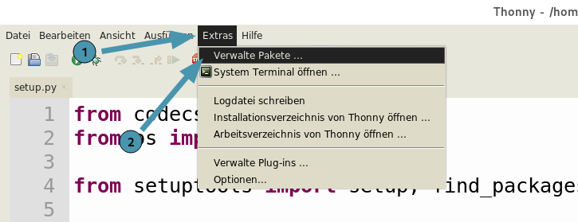

Installation
============

Du kannst miniworldmaker auf deinem Computer oder mit Thonny installieren:

## Auf deinem Computer

1. Installiere zuerst Python. 
    Python kannst du z.B. unter [Python](https://www.python.org) herunterladen. Alternativ kannst du auch die Entwicklungsumgebung [Thonny](https://thonny.org/) installieren - Diese bringt Python direkt mit.

2. Installiere das Framework mit:

   ```
   pip install miniworldmaker
   ```
  
3. Installiere eine geeignete Entwicklungsumgebung, z.B.:

   * [Thonny](https://thonny.org/)

   * [PyCharm](https://www.jetbrains.com/de-de/pycharm/)
   


...jetzt kannst du loslegen.    

## Mit Thonny

Klicke zunächst auf "Extras -> Verwalte Pakete" 



Gebe dann im Suchfeld "miniworldmaker" ein und installiere den miniworldmaker


