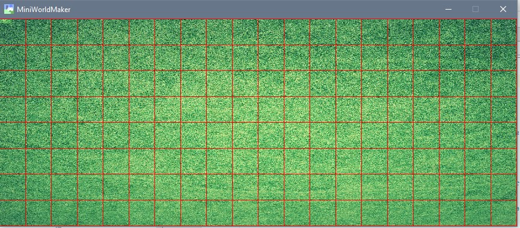

Das Spielfeld
=============

Los geht es!

### Eine erste Welt

Wir erschaffen die erste Welt. Dies geht mit folgendem Code:

```
from miniworldmaker import *


class MyBoard(TiledBoard):

    def setup(self):
        self.columns = 20
        self.rows = 8
        self.tile_size = 42
        self.add_image(path="images/soccer_green.jpg")

board = MyBoard()
board.show()
```

Zunächst wird eine eigene *Klasse* MyBoard erstellt. Diese ist eine Kindklasse von TiledBoard
und erlaubt es dir, alle möglichen Spiele zu bauen, die auf Tiles basieren.

  * Zeile 1: Mit der **import** Anweisung wird die Bibliothek miniworldmaker importiert.
  * Zeile 4: Das eigene Spielfeld wird als Kindklasse der Klasse Tiledboard erstellt.
  * Zeile 6: Die setup() - Methode wird bei Erstellen eines neuen Objektes aufgerufen (d.h. hier in Zeile 7).
  * Zeile 7-9: Die Größe des Spielfeldes wird initialisiert.
  * Zeile 7: Deinem Board wird ein Hintergrund hinzugefügt. Achte darauf, dass die Datei an dem angegebenen Pfad liegt.

Diese beiden Zeilen:
```
board = MyBoard()
board.show()
```

Sind so ähnlich immer die letzten beiden Zeilen deines Programms: 
Hier wird mit dem Befehl MyBoard() ein konkretes Spielfeld erzeugt und anschießend wird mit
board.show() das Board angewiesen, sich zu zeigen.

Je nach Hintergrundbild sieht das Ergebnis bei dir so aus:


### Das Grid anzeigen

Wenn du möchtest kannst du dir auch die Grenzen der einzelnen Tiles anzeigen lassen.
Ändere dazu die Methode setup() in der Klasse MyBoard ab:

```
    def setup()
        ...
        self.background.grid_overlay = True
```

So sieht es dann aus:



### PixelBoards und TiledBoards

Es gibt verschiedene Unterklassen der Klasse Board:

  * Ein PixelGrid ist für Pixelgenaue Darstellung von Inhalten gedacht.
  
  * Ein TiledBoard ist für Boards gedacht, bei denen sich die Akteure auf quadratischen Kacheln bewegen.
  
Die meisten der Funktionen unterscheiden sich nur geringfügig, da beide Boards Unterklassen der Klasse **Boards** sind.

```eval_rst
.. inheritance-diagram:: miniworldmaker.boards.pixel_board.PixelBoard miniworldmaker.boards.tiled_board.TiledBoard
   :top-classes: miniworldmaker.tokens.boards.Board
   :parts: 1
```

