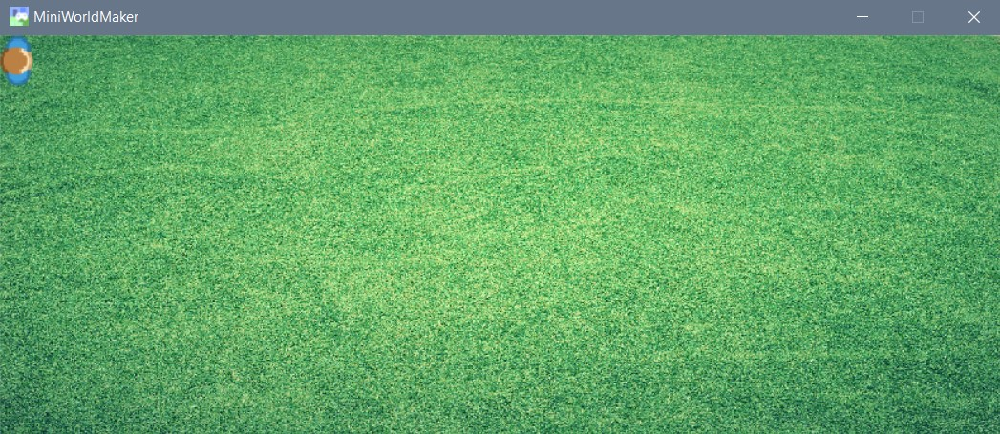

Tokens
=======

Ein Token ist ein Spielstein auf deinem Spielbrett. 

Alle Objekte in deiner Miniworld sind Tokens, die auf dem Spielbrett bewegt werden können.

### Ein Token erstellen

Als nächtes wird ein Token, d.h. eine Spielfigur auf dem Board platziert.

Dies geht so:

```
import miniworldmaker

board = miniworldmaker.TiledBoard()
board.columns = 20
board.rows = 8
board.tile_size = 42
board.add_image(path="images/soccer_green.jpg")
board.speed = 30
player = miniworldmaker.Token()
player.add_image(path="images/player.png")


board.run()
```


  * In Zeile 9 wird ein Player-Objekt erstellt.
  
  * In Zeile 10 wird dem Player-Objekt ein Bild zugewiesen. 




--> Mehr Informationen. Siehe [Tokens](../key_concepts/tokens.md)
