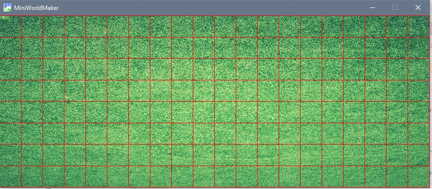

Das Spielfeld
=============

Los geht es!

### Eine erste Welt

Wir erschaffen die erste Welt. Dies geht mit folgendem Code:

```
from miniworldmaker import *

class MyBoard(TiledBoard):

    def __init__(self):
        super().__init__(columns=20, rows=8, tile_size=42, tile_margin=1)
        self.add_image(path="images/soccer_green.jpg")

board = MyBoard()
board.show()
```

Zunächst wird eine eigene *Klasse* MyBoard erstellt. Diese ist eine Kindklasse von TiledBoard
und erlaubt es dir, alle möglichen Spiele zu bauen, die auf Tiles basieren.

  * Zeile 1: Mit der **import** Anweisung wird die Bibliothek miniworldmaker importiert.
  * Zeile 3: Das eigene Spielfeld wird als Kindklasse der Klasse Tiledboard erstellt.
  * Zeile 5-6: Die __init__() - Methode wird bei Erstellen eines neuen Objektes aufgerufen (d.h. hier in Zeile 7).
  Am Anfang der __init__() - Methode wird zunächst mit super().__init__() die Methode der Vaterklasse aufgerufen,
  welche die Größe des Spielfeldes und der einzelnen Kacheln festlegt.
  * Zeile 7: Deinem Board wird ein Hintergrund hinzugefügt. Achte darauf, dass die Datei an dem angegebenen Pfad liegt.

Je nach Hintergrundbild sieht das Ergebnis bei dir so aus:


### Das Grid anzeigen

Wenn du möchtest kannst du dir auch die Grenzen der einzelnen Tiles anzeigen lassen.
Ändere dazu die Methode __init__() in der Klasse MyBoard ab:

```
    def __init__(self):
        super().__init__(columns=20, rows=8, tile_size=42, tile_margin=1)
        self.background.grid_overlay = True
        self.add_image(path="images/soccer_green.jpg")
```

So sieht es dann aus:



### PixelBoards und TiledBoards

Es gibt verschiedene Unterklassen der Klasse Board:

  * Ein PixelGrid ist für Pixelgenaue Darstellung von Inhalten gedacht.
  
  * Ein TiledBoard ist für Boards gedacht, bei denen sich die Akteure auf quadratischen Kacheln bewegen.
  
Die meisten der Funktionen unterscheiden sich nur geringfügig, da beide Boards Unterklassen der Klasse **Boards** sind.

```eval_rst
.. inheritance-diagram:: miniworldmaker.boards.pixel_board.PixelBoard miniworldmaker.boards.tiled_board.TiledBoard
   :top-classes: miniworldmaker.tokens.boards.Board
   :parts: 1
```

Die beiden Boards werden etwas unterschiedlich erstellt:

```
pixel_board = PixelBoard(colums = 100, rows = 100)
tiled_board = TiledBoard(columns = 10, rows = 10, tile_size = 5, tile_margin = 0)
```

Da die Größen der einzelnen Zellen immer 1 beträgt, muss man die Werte beim erstellen eines solchen Boards nicht angeben.


