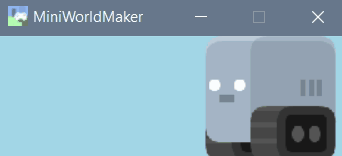

Animationen
===========

2D-Animationen kannst du dir vorstellen wie ein Daumenkino. 

Dadurch, dass schnell hintereinander das Bild eines Akteurs/Token geändert wird, macht es den Anschein, als würde sich der Akteur bewegen.

Folgendermaßen kannst du Animationen erstellen:

#### 1. Bilder hinzufügen

Füge in der __init__()-Methode einfach mehrere Bilder hinzu:

```
    def __init__(self):
        super().__init__()
        self.add_image("images/robot_blue1.png")
        self.add_image("images/robot_blue2.png")
```

### 2. Animation starten
 
Lege die Geschwindigkeit fest und starte die Animation:
```
    def __init__(self):
        super().__init__()
        self.add_image("images/robot_blue1.png")
        self.add_image("images/robot_blue2.png")
        [...]
        self.costume.animation_speed = 30
        self.costume.is_animated = True
```

In den letzten beiden Zeilen wird angegeben, dass das Kostüm des Actors mit der Geschwindigkeit 30 wechseln soll 
(probiere hier unterschiedliche Werte aus) und ganz am Ende wird die Animation gestartet.

Schaue dir dazu auch das Beispiel [roboanimation](https://github.com/asbl/miniworldmaker/blob/master/examples/moving/roboanimation.py) auf github an:

