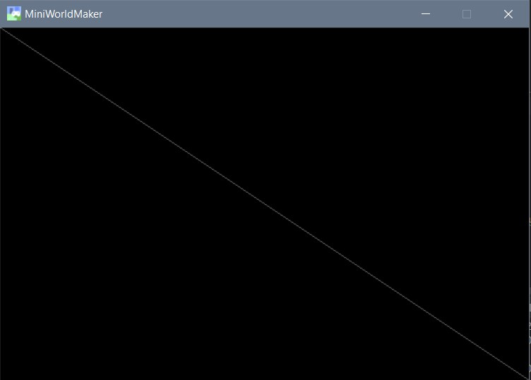
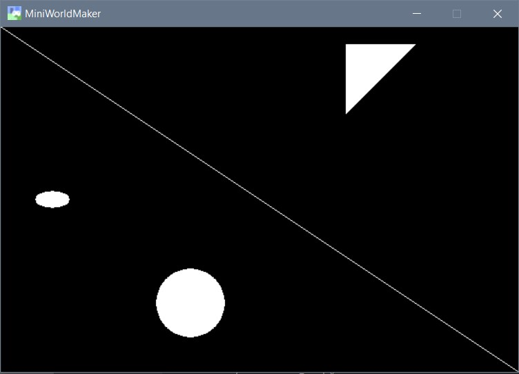

Erste Schritte
===============

Kopiere zunächst das folgende Rahmenprogramm in deinen Code-Editor:

```
from miniworldmaker import *

class MyBoard(ProcessingBoard):
    def on_setup(self):
        pass
    
my_board = MyBoard(600, 400)
my_board.show()
```
Dieses Rahmenprogramm macht folgendes:

  * Im oberen Teil des Quellcodes wird eine eigene Klasse (d.h. ein Bauplan) für deine eigene Miniwelt erstellt.
  Es handelt sich um ein spezielles ProcessingBoard.
  
  * Im unteren Teil wird von diesem Bauplan ein neues Fenster mit Breite 600 und Höhe 400 erstellt.
  
  
### Das erste Bild

Du kannst Bilder erstellen, indem du in die setup()-Methode Grafikobjekte hinzufügst:

Dies geht z.B. so:

```
from miniworldmaker import *


class MyBoard(ProcessingBoard):
    def on_setup(self):
        self.fill((0, 0, 0, 255))
        Line((0, 0), (600, 400), color=(100, 100, 100, 255))


my_board = MyBoard(600, 400)
my_board.show()
```

Der Hintergrund wird zunächst komplett schwarz gefärbt. Anschließend wird eine Diagonale quer durch das Bild gezeichnet.



### Zeichnen der Grundformen

Die Syntax für die wichtigsten Befehle lautet

  * Linie: **Line((x, y), (x, y), thickness)** 
  * Kreis: **Circle((x,y), radius, thickness)**
  * Ellipse: **Ellipse((x, y), width, height, thickness)
  * Polygon: **Polygon(\[(x1, y1), (x2, y2), (x3, y3), ...\], thickness)
  
 Der Parameter **thickness** ist optional und gibt die Dicke der Linien an. Wenn du and dieser Stelle eine 0 setzt, 
 dann wird das entsprechende Objekt ausgefüllt gezeichnet.

Beispiel:

```
from miniworldmaker import *


class MyBoard(ProcessingBoard):
    def on_setup(self):
        self.fill((0, 0, 0, 255))
        Line((0, 0), (600, 400))
        Circle((200, 300), 40, 0)
        Ellipse((60, 200), 40, 20, 0)
        Polygon([(400, 100), (480, 20), (400, 20)], 0)


my_board = MyBoard(600, 400)
my_board.show()
```

Der Code ergibt folgendes Bild:



### Das Koordinatensystem

Am Computer verwendet man in der Regel ein etwas anderes Koordinatensystem als im Mathematikunterricht


Die obere linke Ecke ist der Ursprung (0|0). Daher bedeuten große y-Werte, dass ein Punkt weiter unten liegt.

Jedes Objekt besitzt folgende Eigenschaften

  * object.x - Die x-Koordinate des Objekts
  * object.y - Die y-Koordinate des Objekts
  * object.position - Die Position des Objekts als 2-Tupel, z.B. (400, 200)
  
Weiterhin kannst du auch die Rotation ändern mit

  * object.direction
  
### Farben

Jedes Objekt kann mit einem weiteren Parameter eingefärbt werden. 

Eine Farbe ist ein 4-Tupel: (r, g, b, alpha) . Jeder dieser 4 Parameter ist eine Zahl zwischen 0 und 255. 

Die ersten 3 Parameter geben den Anteil von rot, grün und blau im Bild an. Der letzte Parameter gibt die Transparenz der Farbe an. 
Ein Wert von 0 bedeutet, dass das Objekt absolut transparent (und damit unsichtbar ist). Ein Wert von 255 bedeutet, dass das Objekt nicht
transparent ist.

Im folgenden Beispiel wurde ein mittlerer Transparenzwert gewählt, so dass die unten liegenden Kreise noch sichtbar sind:

```
from miniworldmaker import *


class MyBoard(ProcessingBoard):

    def on_setup(self):
        self.fill((255, 255, 255, 255))
        self.circle1 = Circle((40, 40), 60, 0, color = (255, 0, 0, 100))
        self.circle2 = Circle((80, 100), 60, 0, color = (0, 255, 0, 100))
        self.circle3 = Circle((120, 40), 60, 0, color = (0, 0, 255, 100))


my_board = MyBoard(230, 200)
my_board.show()
```


### Animationen

Du kannst OBjekte animieren, in dem du Befehle in der Methode act() ergänzt. Diese Methode wird bei jedem Frame einmal aufgerufen.

Beispiel:
```
from miniworldmaker import *


class MyBoard(ProcessingBoard):

    def on_setup(self):
        self.fill((0, 0, 0, 255))
        self.circle1 = Circle((20, 400), 20, 1)
        self.circle2 = Circle((110, 410), 20, 1)
        self.circle3 = Circle((180, 420), 19, 1)
        self.circle4 = Circle((210, 500), 21, 1)
        self.circle5 = Circle((350, 400), 20, 1)
        # self.l1 ist eine Objektvariable. Du kannst in allen Methoden der Klasse auf die Variable zugreifen

    def act(self):
        self.circle1.y -= 1
        self.circle2.y -= 2
        self.circle3.y -= 3
        self.circle4.y -= 1
        self.circle5.y -= 2


my_board = MyBoard(400, 400)
my_board.show()
```

So sieht das Programm aus:


### Events

Events sind Ereignisse auf die das Programm reagieren kann. Ein Event kann z.B. sein:
  * Eine Maustaste wurde gedrückt oder die Maus wurde bewegt.
  * Eine Taste wurde gedrückt.
  * Das Board wurde neu erstellt.
  
Events rufen automatisch spezielle Funktionen auf. Wenn du diese Funktionen **überschreibst**, 
kannst du das Verhalten des Programms auf die Ereignisse steuern.

Folgende Funktionen kannst du überschreiben:

  * **on_setup()** - Beim erstellen des Boards
  * **on_key_pressed(self, keys)** - Wenn eine Taste gedrückt wird (wird immer wieder aufgerufen,
  wenn du die Taste gedrückt lässt)
  * **on_key_down(self, keys)** - Wenn die Taste gerade herunter gedrückt wird
  * **on_key_up(self, keys)** - Wenn die Taste wieder losgelassen wird
  * **on_mouse_left(self, mouse_pos)** - Wenn die linke Maustaste gedrückt wird
  * **on_mouse_right(self, mouse_pos)** - Wenn die rechte Maustaste gedrückt wird
  * **on_mouse_motion(self, mouse_pos)** - Wenn die Maus bewegt wird (Wird bei Bewegung immer wieder aufgerufen)
  * **act()** - Unabhängig von Events wird diese Methode immer wieder aufgerufen
  
Beispiel:
```
from miniworldmaker import *


class MyBoard(ProcessingBoard):

    def on_setup(self):
        self.color = (255, 255, 255, 50)
        self.fill((0,0,0,255))

    def act(self):
        Ellipse(self.get_mouse_position(), 80, 80, 1, self.color)

    def on_mouse_left(self, mouse_pos):
        self.color = (200, 100, 100, 50)

    def on_mouse_right(self, mouse_pos):
        self.color = (255, 255, 255, 50)


my_board = MyBoard()
my_board.show()
```


[](https://repl.it/@a_siebel/Processing-Example-1)

