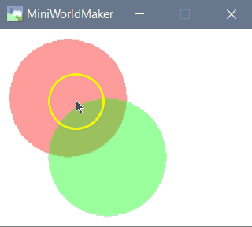

Variablen
=========

Variablen definieren
--------------------

Bereits in den vorherigen Beispielen haben wir Variablen verwendet.

Du kannst neue Variablen definieren, indem du schreibst:

```
self.variablenname = wert
```

  * Das **self** bezieht sich immer auf das aktuelle Objekt. 
  Hast du z.B. mehrere Kreise erzeugt, so bedeuted **self**, das sich der Variablenname
  auf *diesen* Kreis und auf keinen anderen bezieht.
  * Eine Variable ist ein **Name** für ein Objekt. Ein Objekt kann eine Zahl, ein Wort,
  eine geometrische Form oder vieles mehr sein. Dadurch, dass du dem Objekt einen Namen gibst,
  kannst du darauf zugreifen und es verändern.
  
Betrachte dazu folgendes Beispiel:
```
class MyBoard(ProcessingBoard):

    def on_setup(self):
        self.circle1 = Circle((40, 40), 60, 0, color = (255, 0, 0, 100))
        self.circle2 = Circle((80, 100), 60, 0, color = (0, 255, 0, 100))

    def on_mouse_left(self, mouse_pos):
        self.circle1.x = 150
```

Ein Board vom Typ MyBoard besitzt zwei Kreise. Dadurch, dass den Kreisen **Namen** gegeben wurden
(nämlich self.circle1 und self.circle2) kann man auch an anderer Stelle auf die Kreise zugreifen.

Hier wird die x-Koordinate des ersten Kreises auf den Wert 150 gesetzt.



Die Random-Funktion
---------------------

Die Random-Funktion erlaubt es dir, Dingen zufällige Werte zuzuweisen. 
Zunächst musst du am Anfang deiner Datei die Bibliothek random importieren:
```
import random
```

Dann reicht für das erste ein einzelner Befehl aus.

```
random.randint(0, 5)
```

Dies erzeugt eine zufällige Zahl zwischen 0 und 5


Das folgende Programm lässt einen Kreis an eine zufällige Stelle springen:
```
from miniworldmaker import *
import random


class MyBoard(ProcessingBoard):

    def on_setup(self):
        self.circle1 = Circle((40, 40), 60, 0, color=(255, 0, 0, 255))

    def on_mouse_left(self, mouse_pos):
        self.circle1.x = random.randint(0, 260)
        self.circle1.y = random.randint(0, 200)


my_board = MyBoard(260, 200)
my_board.show()

```