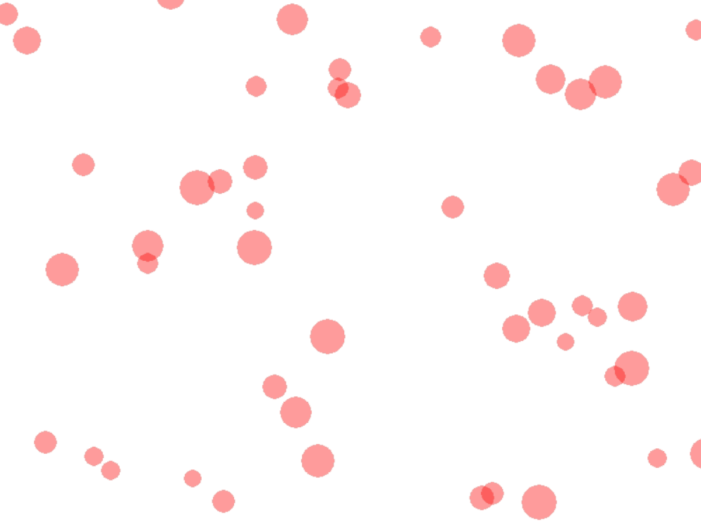

Schleifen und Listen
====================

Listen
------

### Listen erstellen
Eine Liste enthält mehrere Objekte, ohne dass du für jedes einen neuen Namen geben musst.

Beispiel:

```
liste = [0, 1, 2, 3, 4]
```

Die Liste enthält die Zahlen 0-4.

Man kann Listen auch erstellen, indem man zuerst eine leere Liste erstellt und dann nacheinander Zahlen ergänzt:

```
liste2 = []
liste2.append(5)
liste2.append(6)
liste2.append(7)
```

Diese Liste enthält die Zahlen 5, 6 und 7

Genauso kann eine Liste aber auch Objekte beliebiger Art enthalten.

```
cliste = []
cliste.append(Circle((40, 40), 60, 0, color=(255, 0, 0, 100)))
```

Dies fügt einen Kreis einer Liste hinzu.


### Auf Listenelemente zugreifen


Auf die Listenelemente kann man mit einem **Index** zugreifen:

```
liste2 = []
liste2.append(5)
liste2.append(6)
liste2.append(7)
print(liste2[0], liste2[1])
```

gibt 5 6 aus. Das 0-te Listenelement ist 6, das 1-te Listenelement ist 6.


Schleifen
---------

Mit Hilfe von Schleifen kannst du Dinge wiederholen. Wenn du z.B. nicht 5, sondern 50 Kreise erstellen willst,
dann geht dies am einfachsten mit einer Schleife:

```
class MyBoard(ProcessingBoard):

    def on_setup(self):
        self.fill((255, 255, 255, 255))
        for i in range(50):
            Circle((random.randint(0,260), random.randint(0,200)), 10, 0, color=(255, 0, 0, 100))
```

[](https://repl.it/@a_siebel/circles)

Das Programm erstellt 50 Kreise an zufälliger Position

Mit Hilfe von Listen kannst du alle Kreise auch gleichzeitig bewegen
```
class MyBoard(ProcessingBoard):

    def on_setup(self):
        self.fill((255, 255, 255, 255))
        self.lst = []
        for i in range(50):
            self.lst.append(Circle((random.randint(0, 800), random.randint(0, 600)), random.randint(10, 20), 0, color=(255, 0, 0, 100)))

    def act(self):
        for circle in self.lst:
            circle.y-=random.randint(0,2)
```
[](https://repl.it/@a_siebel/circles2)


