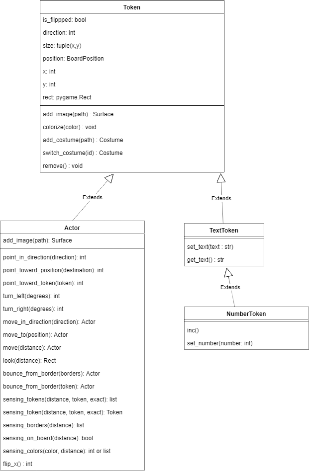

Actors
======

### Create new Actor-Class

Next, an actor is placed on the board.

This is basically similar to creating the playing field:


```
class Player(Actor):

    def __init__(self):
        super().__init__()
        self.add_image(path="images/char_blue.png")
```

 * The first line creates a new class as a child class of the class Actor.
  * In the third line, the __init__() method is created again, which is called when a new Player object is created.
  * Line 4 calls the parent class init() method, which initializes many things behind the scenes.
  * Row 5 then adds an image to the Player object.

### Add the player to the board


  So far we have only created one template to create player objects.
  Now we want to create concrete objects and add them to the playing field.
    Add the __init__() method of the playing field class:

```
    def __init__(self):
        super().__init__(columns=20, rows=8, tile_size=42, tile_margin=1)
        player1 = Player( )
        self.add_to_board(player1, position=(3, 3))
```

  * Line 3 creates the player object (and calls the init() method).
  * Line 4 adds the created object to the playing field so that the figure does not live in "no man's land".


Lines 3 and 4 can also be combined:

```
  player1 = self.add_actor(Player(), position=(3, 3))
```


Alternatively you can create the actor directly by adding a parameter position and passing it to the parent class.
```
class Player(Actor):

    def __init__(self, position):
        super().__init__(position)
        self.add_image(path="images/char_blue.png")
```

An object can now be created with:

```
  player1 = Player(position=(3, 3))
```

### Actors and tokens

Actors are a child class of the general class Token. Therefore they can access all attributes and methods of this class.
In addition, they can also move and have sensors to scan their environment.

If you want to create static objects (walls, subsurface, etc.), it makes more sense to use the class token, because these objects can be displayed a bit more performant.

The following UML diagram shows you how the classes are modeled.

