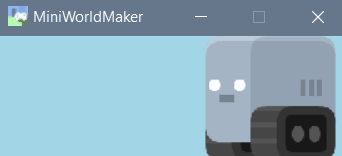

Animations
==========

You can imagine 2D animations like a flip book. 

The fact that the image of an actor/token is changed quickly one after the other makes it seem as if the actor is moving.

Here's how you can create animations:

### 1. add images

Simply add multiple images in the __init__() method:

```
    def __init__(self):
        super().__init__()
        self.add_image("images/robot_blue1.png")
        self.add_image("images/robot_blue2.png")
```


### Start second animation
 
Set the speed and start the animation:
```
    def __init__(self):
        super().__init__()
        self.add_image("images/robot_blue1.png")
        self.add_image("images/robot_blue2.png")
        [...]
        self.costume.animation_speed = 30
        &lt;font color="#ffff00"&gt;-==- proudly presents
```

In the last two lines it is indicated that the costume of the actor should change with the speed 30 
(try different values here) and at the very end the animation will start.

See also the example [roboanimation](https://github.com/asbl/miniworldmaker/blob/master/examples/moving/roboanimation.py) on github:

