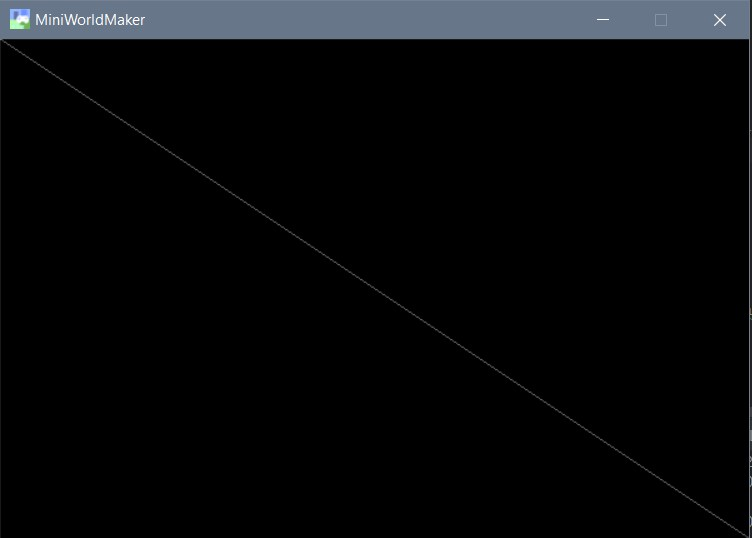
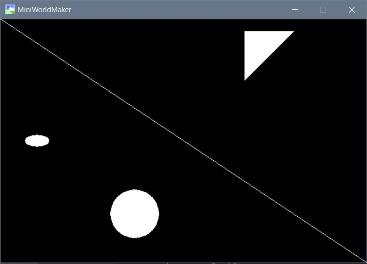
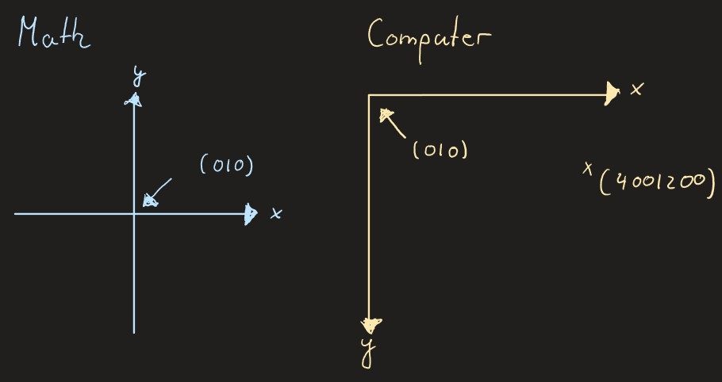
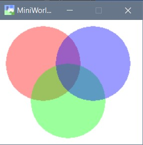
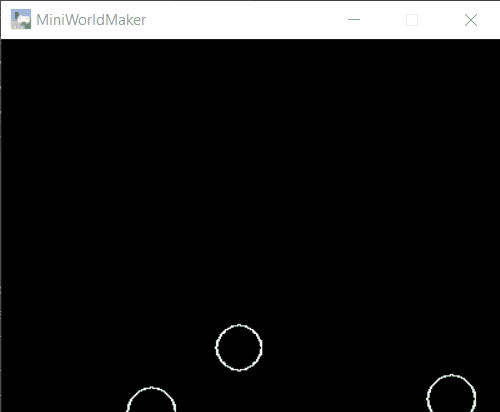

First Steps
===============

First copy the following supporting program into your code editor:

```
from miniworldmaker import *

class MyBoard(ProcessingBoard):
    def on_setup(self):
        pass
    
my_board = MyBoard(600, 400)
my_board.show()
```
This framework programme does the following:

  * In the upper part of the source code, a separate class (i.e. a blueprint) is created for your own miniworld.
  It is a special ProcessingBoard.
  
  * In the lower part, a new window with width 600 and height 400 is created from this blueprint.
  
  
### The first image

You can create images by adding graphic objects to the setup() method:

This works like this:

```
from miniworldmaker import *


class MyBoard(ProcessingBoard):
    def on_setup(self):
        self.fill((0, 0, 0, 255)))
        Line((0, 0), (600, 400), color=(100, 100, 100, 255))


my_board = MyBoard(600, 400)
my_board.show()
```

The background is first colored completely black. A diagonal is then drawn across the image.



### Drawing the basic shapes

The syntax for the most important commands is as follows

  * Line: **Line((x, y), (x, y), thickness)** 
  * Circle: **Circle((x,y), radius, thickness)**
  * Ellipse: **Ellipse((x, y), width, height, thickness)
  * Polygon: **Polygon(\[(x1, y1), (x2, y2), (x3, y3), ...\], thickness)
  
 The **thickness** parameter is optional and specifies the thickness of the lines. If you set this to 0, 
 then the corresponding object is filled in and drawn.

Example:

```
from miniworldmaker import *


class MyBoard(ProcessingBoard):
    def on_setup(self):
        self.fill((0, 0, 0, 255)))
        Line((0, 0), (600, 400))
        Circle((200, 300), 40, 0)
        Ellipse((60, 200), 40, 20, 0)
        Polygon([(400, 100), (480, 20), (400, 20)], 0)


my_board = MyBoard(600, 400)
my_board.show()
```

The code results in the following image:



### The coordinate system

The computer usually uses a slightly different coordinate system than in mathematics lessons.



The upper left corner is the origin (0|0). Therefore, large y-values mean that a point is further down.

Each object has the following properties

  * object.x - The x-coordinate of the object
  * object.y - The y coordinate of the object.
  * object.position - The position of the object as a 2-tuple, e.g. (400, 200)
  
You can also change the rotation with

  * object.direction
  
### Colors

Each object can be colored with an additional parameter. 

A color is a 4-tuple: (r, g, b, alpha) . Each of these 4 parameters is a number between 0 and 255. 

The first 3 parameters indicate the proportion of red, green and blue in the image. The last parameter indicates the transparency of the color. 
A value of 0 means that the object is absolutely transparent (and therefore invisible). A value of 255 means that the object is not
is transparent.

In the following example, an average transparency value was selected so that the circles below are still visible:

```
from miniworldmaker import *


class MyBoard(ProcessingBoard):

    def on_setup(self):
        self.fill((255, 255, 255, 255)))
        self.circle1 = Circle((40, 40), 60, 0, color = (255, 0, 0, 100))
        self.circle2 = Circle((80, 100), 60, 0, color = (0, 255, 0, 100))
        self.circle3 = Circle((120, 40), 60, 0, color = (0, 0, 255, 100))


my_board = MyBoard(230, 200)
my_board.show()
```

Beispiel:



### Animations

You can animate Objects by adding commands to the act() method. This method is called once for each frame.

Example:
```
from miniworldmaker import *


class MyBoard(ProcessingBoard):

    def on_setup(self):
        self.fill((0, 0, 0, 255)))
        self.circle1 = Circle((20, 400), 20, 1)
        self.circle2 = Circle((110, 410), 20, 1)
        self.circle3 = Circle((180, 420), 19, 1)
        self.circle4 = Circle((210, 500), 21, 1)
        self.circle5 = Circle((350, 400), 20, 1)
        # self.l1 is an object variable. You can access the variable in all methods of the class.

    def act(self):
        self.circle1.y -= 1
        self.circle2.y -= 2
        self.circle3.y -= 3
        self.circle4.y -= 1
        self.circle5.y -= 2


my_board = MyBoard(400, 400)
my_board.show()
```

This is the program:




### Events

Events are events to which the program can react. An event can be, for example:
  * A mouse button was pressed or the mouse was moved.
  * A key was pressed.
  * The board has been rebuilt.
  
Events automatically call up special functions. If you **overwrite these functions**, 
you can control the behavior of the program on the events.

You can overwrite the following functions:

  **on_setup()** - When creating the board
  **on_key_pressed(self, keys)** - When a key is pressed (is called again and again),
  if you keep the button pressed)
  **on_key_down(self, keys)** - When the key is just pressed down
  **on_key_up(self, keys)** - When the key is released again
  **on_mouse_left(self, mouse_pos)** - When left mouse button is pressed
  **on_mouse_right(self, mouse_pos)** - When right mouse button is pressed
  **on_mouse_motion(self, mouse_pos)** - When the mouse is moved (Is called again and again during movement)
  **act()** - This method is called again and again independent of events.
  
Example:
```
from miniworldmaker import *


class MyBoard(ProcessingBoard):

    def on_setup(self):
        self.color = (255, 255, 255, 50)
        self.fill((0,0,0,255)))

    def act(self):
        Ellipse(self.get_mouse_position(), 80, 80, 1, self.color)

    def on_mouse_left(self, mouse_pos):
        self.color = (200, 100, 100, 50)

    def on_mouse_right(self, mouse_pos):
        self.color = (255, 255, 255, 50)


my_board = MyBoard()
my_board.show()
```


[](https://repl.it/@a_siebel/Processing-Example-1)


Translated with www.DeepL.com/Translator