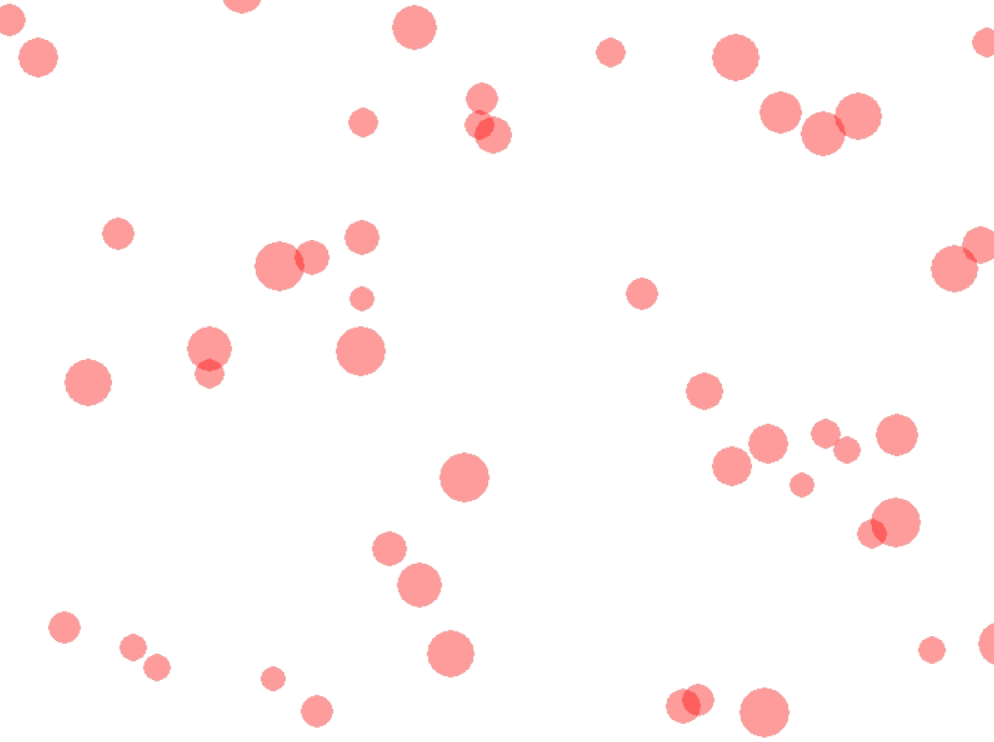

Listen and Schleifen
====================

Hören
------

### Listen erstellen
A list contains several objects, without that the any an new name to be.

Beispiel:

```
Liste = [0, 1, 2, 2, 2, 3, 4]
```

Die Liste enthält die Zahlen 0-4.

The can be listen even to erstellen, to you's only a leere list erstellen and then nacheinander Zahlen hinzufügen:

```
list2 = []
list2.append(5)
list2.append(6)
list2.append(7)
```

Diese Liste enthält die Zahlen 5, 6 und 7.

Ebenso kann eine Liste von Objekten jeglicher Art erstellt werden.

```
cliste = []
cliste.append(Circle((40, 40), 60, 0, 0, 0, 0, color=(255, 0, 0, 0, 0, 0, 100))))))))))))
```

Dadurch wird eine Liste eines Kreis hinzugefügt.


### Zugriff auf Listenelemente


Auf die Listenelemente kann mit einem **Index** zugegriffen werden:

```
list2 = []
list2.append(5)
list2.append(6)
list2.append(7)
drucken(list2[0], list2[1])
```

Gibt 5 6 aus, das 0. Listenelement ist 6, das 1. Listenelement ist 6.


Schleifen
---------

With help of Schleifen can the Dinge wiederholen. Wenn Sie z.B. 50 Kreise statt 5 erstellen möchten,
Der einfachste Weg, der zu tun ist, ist mit einer Schleife:

```
Klasse MyBoard(ProcessingBoard):

    def on_setup(self):
        self.fill((255, 255, 255, 255, 255, 255, 255, 255))))))
        for i im Bereich (50):
            Circle((random.randint(0,260), random.randint(0,200)), 10, 0, 0, 0, 0, color=(255, 0, 0, 0, 0, 0, 100)))))
```

[](https://repl.it/@a_siebel/circles)

Das Programm erzeugt 50 Kreise an einer beliebigen Position.

Mit Hilfe von Listen können Sie auch alle Kreise gleichzeitig bewegen.
```
Klasse MyBoard(ProcessingBoard):

    def on_setup(self):
        self.fill((255, 255, 255, 255, 255, 255, 255, 255))))))
        self.lst = []
        for i im Bereich (50):
            self.lst.append(Circle((random.randint(0, 800), random.randint(0, 600)), random.randint(10, 20), 0, 0, color=(255, 0, 0, 0, 0, 0, 0, 100)))))))))

    def act(self):
        für Kreis in self.lst:
            circle.y-=random.randint(0,2)
```
[](https://repl.it/@a_siebel/circles2)


