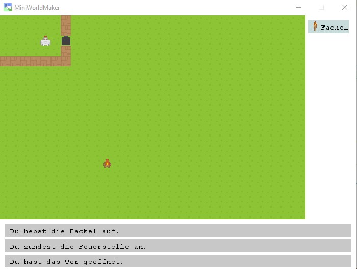

Examples
=========

Basics
-------

  * [Basic Framework](https://github.com/asbl/miniworldmaker/blob/master/examples/basics/basicframework.py) - Basic concepts for the creation of boards and actors.
  
  
Tiled Boards
------------ 

These examples will show you how to use tiled boards. Tiled boards are boards where the players move on square cells.

  * [Basic Movement](https://github.com/asbl/miniworldmaker/blob/master/examples/moving/move_on_tiled_board.py): Basic Movement, Reaction to events.

  * [The Crash](https://github.com/asbl/miniworldmaker/blob/master/examples/moving/thecrash.py): Collision detection, Creating and Removing Actors in Runtime.

  * [Rpg](https://github.com/asbl/miniworldmaker/blob/master/examples/games/rpg/rpg.py): This example shows you how to interact with the world.
  
  
  
Pixel Boards
------------

These examples show you how tu use boards with pixel-precise placement

  * [Roboanimation](https://github.com/asbl/miniworldmaker/blob/master/examples/moving/roboanimation.py): Shows you how to animate an actor
  
  * [Roboracing](https://github.com/asbl/miniworldmaker/blob/master/examples/pixelbased/roboracing.py): Keyboard controlled movement.
  
  * [Roboracing 2](https://github.com/asbl/miniworldmaker/blob/master/examples/pixelbased/roboracing2.py): Keyboard controlled movement.
  
  * [Asteroids](https://github.com/asbl/miniworldmaker/blob/master/examples/games/asteroids/asteroids.py): Collision detection
  
  
  