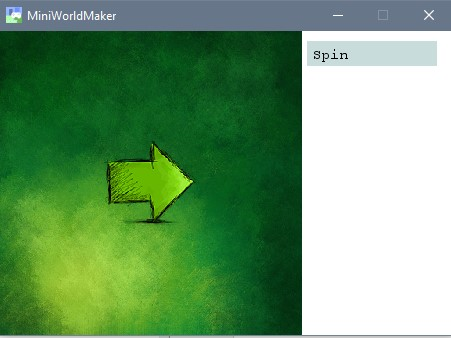
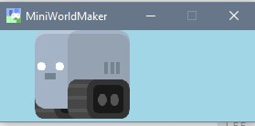
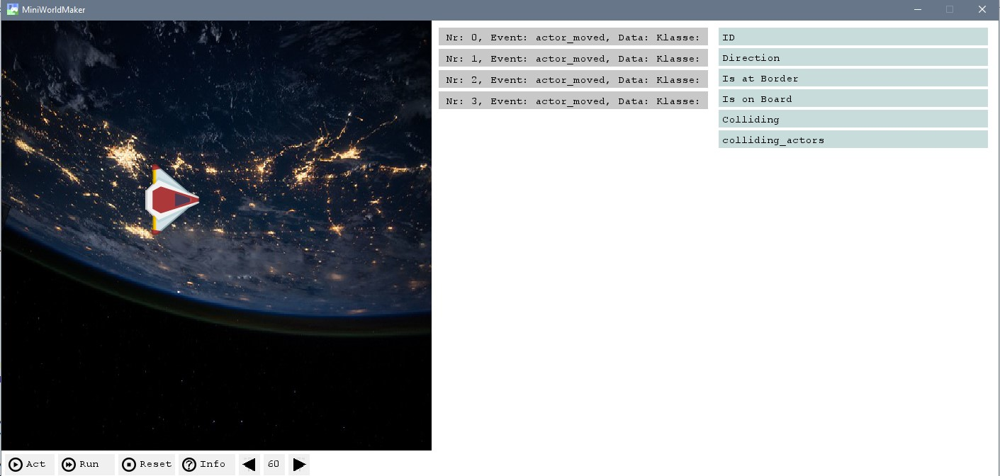

MiniWorldMaker
==========================================

  * MiniWorldMaker unterstützt sowohl Pixel-basierte Spiele als auch Spiele mit
  quadratischen Zellen (z.B. Rouge-Likes)

  * Einfaches Erstellen von Animationen

  * Musik und Soundeffekte

  * Integrierte Konsole für Ausgaben

  * Laden und Speichern in SQLite Datenbanken

  * Open Source

Siehe auch:

  * Dokumentation: http://miniworldmaker.it-teaching.de/
  * Github: https://github.com/asbl/miniworldmaker
  * Pypi: https://pypi.org/project/miniworldmaker/#history

Inhaltsverzeichnis
------------------
.. toctree::

       tutorial

Die Klassenbibliothek
=====================

Hier findest du alle Informationen, wenn du direkt auf Klassen, Methoden und Attribute zugreifen möchtest.

.. toctree::

       modules

.. image:: _images/rpg.jpg

Status
=====================

Hier findest du alle Informationen, wenn du direkt auf Klassen, Methoden und Attribute zugreifen möchtest.

.. toctree::

       status

.. automodule:: miniworldmaker

Indices and tables
==================

* :ref:`genindex`
* :ref:`modindex`
* :ref:`search`

