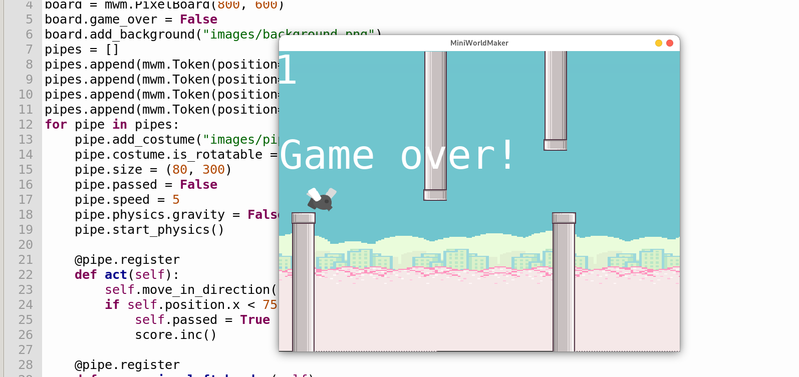

MiniWorldMaker
##############

MiniWorldMaker is a game-engine written in python and pygame designed for pupils to create 2D mini worlds and games.

* **Objects First** programming: Object oriented programming without classes.
* **Tiles and Pixel-Games**: For different types of games.
* **Integrated physics engine**: For physics based games, based on **pymunk**
* Integrated Manager for GUI Elements, Music and Sound effects
* **Open Source**

Credits
========

* `Greenfoot <https://www.greenfoot.org/)>`_ 

Miniworldmaker is strongly inspired by the high-level abstraction approach to object orientation in Greenfoot. Miniworldmaker extends the approach with its own ideas.

* `Deepl <https://www.deepl.com/)>`_   
  
  Assistant for translating pages.
  
* `Kenney Assets <https://www.kenney.nl/assets)>`_ 
  
  Most of the images in the example-code are based on kenny assets. 

Links
=====

* `Codeberg Repository <https://codeberg.org/a_siebel/miniworldmaker>`_  

.. toctree::
  :maxdepth: 1
  :titlesonly:
  
  examples
  impressum

.. toctree::
  :maxdepth: 1
  :caption: Tutorial (Deutsch)
  :titlesonly:
  
  objectsfirst_german/index
  classesfirst_german/index

.. toctree::
  :maxdepth: 1
  :caption: Tutorial (English)
  :titlesonly:
  
  objectsfirst_english/index

.. toctree::
  :maxdepth: 1
  :caption: Key Concepts
  
  key_concepts/index

.. toctree::
  :maxdepth: 1
  :caption: API
  
  api/index

