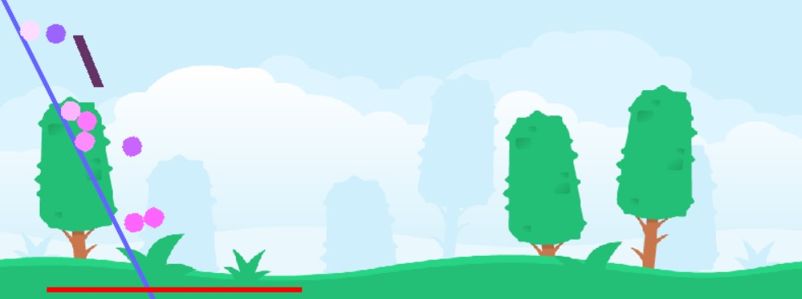

Boards
======

There are different types of boards:

### Tiledboard

A Board for Games based on Tiles (Like Rogue-Like RPgs).


### Examples:

  * Creating a TiledBoard-Subclass:  
    ```
    class MyBoard(TiledBoard):

        def on_setup(self):
            self.columns = 30
            self.rows = 20
            self.tile_size = 20
    ```

#### Attributes  

  * Every token on a TiledBoard is exactly on one Tile.
  
  * The position of a token is the tile on which it is placed.
  
  * Two tokens collide when they are on the same tile.
  
### PixelBoard

A board for pixel accurate games.


#### Attributes

  * The position of a token is the pixel at center of token.
  
  * New tokens are created with top-left corner of token rect at position.
  
  * Two tokens collide when their sprites overlap.

### Physicsboard

A board for games with physic-engine



### Attributes

  * Every token is added to the physic_engine
  
  * Before the method on_setup() (of a token) the method setup_physics() is called. In this method, 
  physical properties of a token can be defined.
