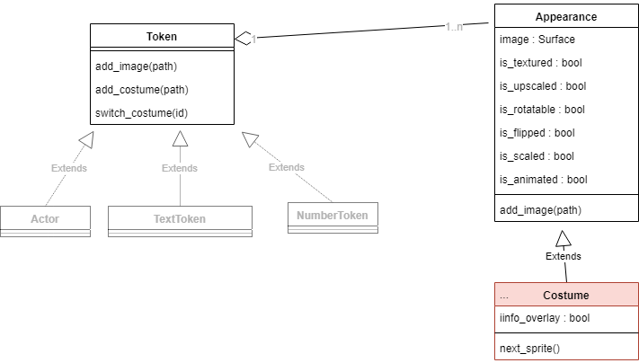

Costumes
=========

### Attributes
  * **costume.info_overlay**: Shows info overlay with border and direction
  * **costume.is_rotatable**: Should the image be rotated when token is rotated?
  * **costume.is_upscaled**: The image will be upscaled to token_size. The aspect ratio is maintained. 
  * **costume.is_scaled**: The image will be scaled to token_size. The aspect ratio wil lbe changed.