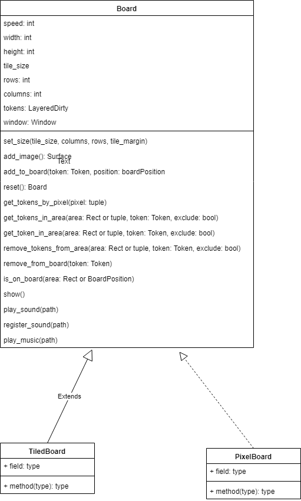

Boards
======

```eval_rst
.. inheritance-diagram:: miniworldmaker.boards.pixel_board.PixelBoard miniworldmaker.boards.tiled_board.TiledBoard
   :top-classes: miniworldmaker.tokens.boards.Board
   :parts: 1
```

```eval_rst
.. toctree::
   :glob:
   
   boards/*
```

