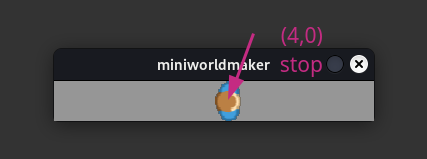

# Specialist concept: if-then reprimands

## if-statement

The if statement has the following syntax:

``python
if condition:
    codeblock
```

* ``condition`` can be any condition (e.g. `a < 3`) which can be checked by Python.

* ``codeblock`` is a code block where each line is indented the same distance. In this way it is possible to distinguish.

If the condition is met, then the complete codeblock is executed in sequence.

### Example

The following example moves the ``player`` up to the field `(0,4)`, there it stops.

``python
from miniworldmaker import *

board = TiledBoard()
board.columns = 8
board.rows = 1
board.speed = 30
player = token()
player.add_costume("images/player_1.png")

@player.register
def act(self):
    print(player.position)
    if player.position != (4,0):
        player.direction = "right"
        player.move()
    
board.run()
```



## if-elif-else

Often you want to define alternatives in case the condition does not occur:

This can be done with the help of the `elif` and `else` statement:

``python
from miniworldmaker import *

board = TiledBoard()
board.columns = 8
board.rows = 1
board.speed = 30
player = token()
player.add_costume("images/player_1.png")

@player.register
def act(self):
    print(player.position)
    if (player.position) == (3,0):
        print(self.positon, " Warning")
    elif player.position != (4,0):
        player.direction = "right"
        player.move()
        print(self.position, " Everything is ok!")
    else:
        print(self.position, " Error! All Systems down)
        
    
board.run()
```

The code does the same as the previous program - However, it is printed on the command line:

```
(0,0) Everything is ok
(0,1) Everything is ok
(0,2) Everything is ok
(0,3) Warning
(0,4) Error! All Systems down
```
