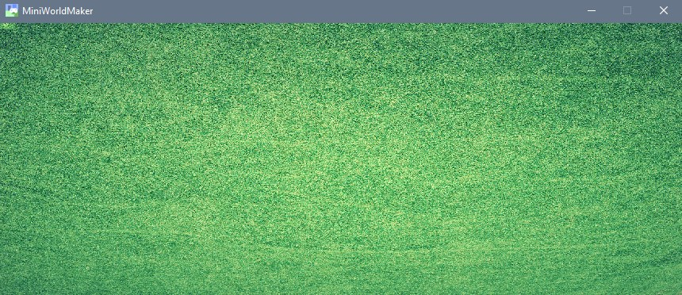

The playing field (Board)
*********************

Let's go!

The first world
==============

We create a first world. This can be created with the following code:

.. code-block:: python
  :emphasize-lines: 1,3,4,10
  :lineno-start: 1

  import miniworldmaker

  board = miniworldmaker.TiledBoard()
  board.add_background("images/soccer_green.jpg")
  board.columns = 20
  board.rows = 8
  board.tile_size = 42
  board.speed = 30

  board.run()

What happens here?
------------------

* Line 1: The miniworldmaker library is imported.
* Line 3: A new **object** of type `TiledBoard` is created.
* Line 4: The new object gets a `background`.
* Line 5-8: Various attributes of 'board' are changed.
* Line 10: The game is started. With `board.run()` a mainloop is started, which draws the board over and over again. This statement **must** always be the last line of your code.

Result:
---------

Depending on the background image, your result will look like this:

Some theory: How does Miniworldmaker work?
===================================================

In Miniworldmaker there are two different types of objects you can create:

* `Board`: A game board on which there are game pieces.
  
* `Token`: Game pieces that bring numerous attributes and methods, e.g. movement,
    collision detection, ....

In the next chapters you will learn how to create tokens that can communicate with each other.

Outlook: Different boards
=============================

There are several child classes of board

* A `TiledBoard` is suitable for boards where the actors move on "tiles".
  
* A `PixelBoard` is intended for pixel-precise representations.
  
* A `PhysicsBoard` simulates physical properties and objects on the board.
 
  Some features of the boards (e.g. collisions) differ slightly.

* For more information, see :doc:`Key Concepts: boards <../key_concepts/boards>`
* `More examples <https://codeberg.org/a_siebel/miniworldmaker/src/branch/main/examples/tests/1%20Costumes%20and%20Backgrounds>`_