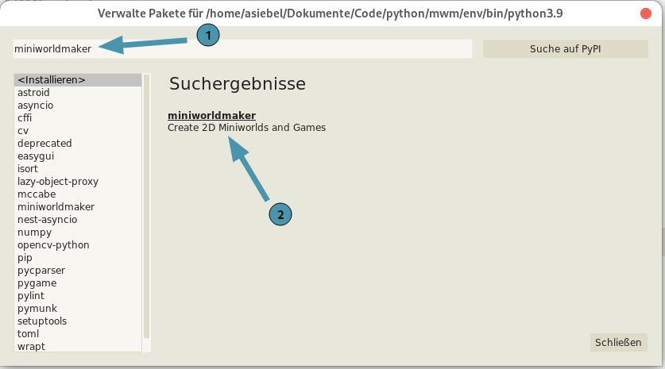

****************
Installation
****************

You can install miniworldmaker on your computer or with Thonny:

On your computer
###################

#. First install Python.

   You can download Python from `Python <https://www.python.org>`_.
   
   Alternatively you can also install the development environment `Thonny <https://thonny.org/>`_ - This brings Python directly.

#. Install the framework with:

.. code-block::
   
   pip install miniworldmaker
   
  
#. Install a suitable development environment, e.g.:

* `Thonny <https://thonny.org/>`_
* `Pycharm <https://www.jetbrains.com/de-de/pycharm/>`_

...now you can start.    

With Thonny
##########

First click on "Tools -> Manage Packages".

.. image:: ../_images/install_thonny1.png
  :width: 100%
  :alt: Miniworldmaker

Then type "miniworldmaker" in the search box and install miniworldmaker
  

