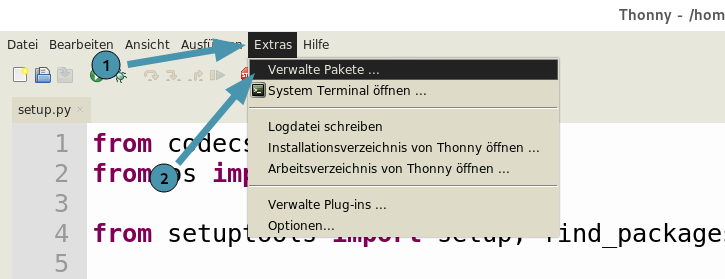

****************
Installation
****************

Du kannst miniworldmaker auf deinem Computer oder mit Thonny installieren:

Auf deinem Computer
###################

#. Installiere zuerst Python. 

   Python kannst du z.B. unter `Python <https://www.python.org>`_ herunterladen. 
   
   Alternativ kannst du auch die Entwicklungsumgebung `Thonny <https://thonny.org/>`_ installieren - Diese bringt Python direkt mit.

#. Installiere das Framework mit:

.. code-block:: 
   
   pip install miniworldmaker
   
  
#. Installiere eine geeignete Entwicklungsumgebung, z.B.:

* `Thonny <https://thonny.org/>`_
* `Pycharm <https://www.jetbrains.com/de-de/pycharm/>`_

...jetzt kannst du loslegen.    

Mit Thonny
##########

Klicke zunächst auf "Extras -> Verwalte Pakete" 

Gib dann im Suchfeld "miniworldmaker" ein und installiere den miniworldmaker
  
.. image:: ../_images/install_thonny2.png
  :width: 100%
  :alt: Miniworldmaker

