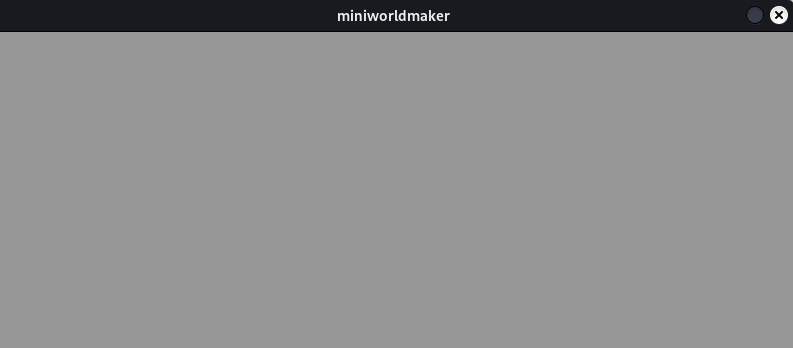

# Boards

Los geht es!

## Die erste Welt

Wir erstellen eine erste Welt. Diese kann mit folgendem Code erzeugt
werden:

```{code-block} python
---
lineno-start: 1
---
from miniworldmaker import *
board = TiledBoard()
board.columns = 20
board.rows = 8
board.tile_size = 40

board.run()
```

Was passiert hier?

* Zeile 1: Die miniworldmaker library wird importiert.

* Zeile 2: Ein neues **Objekt** vom Typ `TiledBoard` wird erzeugt. Im Folgenden kann man mit dem Namen `board` darauf zugreifen.

* Zeile 3-5: Es werden verschiedene Attribute von `board` verändert, indem mit board.attributsname darauf zugegriffen wird.

* Zeile 7: Das Spiel wird gestartet. Mit `board.run()` wird eine
    mainloop gestartet, die das Board immer und immer wieder neu
    zeichnet. Diese Anweisung **muss** immer die letzte Zeile deines
    Codes sein.

So sieht dein erstes Board aus.


## Hintergrund

Mit board.objektname hast du *Attribute* des Boards verändert, 
z.B. `columns`, `rows` oder `tile_size`. 
Das Board bringt außerdem einige *Methoden* mit, mit dem du es verändern kannst, 
z.B. die Methode `add_background()`. 

Methoden sind Anweisungen an das `board` etwas bestimmtes zu tun, z.B. einen Hintergrund hinzuzufügen.
Du erkennst sie daran, dass sie mit Klammern `()` enden. Manchmal steht auch etwas innerhalb dieser Klammern, 
wenn für die Anweisung weitere Informationen benötigt werden - Dazu später mehr.

Wir verändern das Programm oben, um einen Hintergrund hinzuzufügen:

```python
from miniworldmaker import *
board = TiledBoard()
board.add_background("images/soccer_green.jpg")
board.columns = 20
board.rows = 8
board.tile_size = 40

board.run()
```


## Die Größe des Boards

Die Größe des Boards

Nachdem du mit board = miniworldmaker.TiledBoard() ein Board angelegt hast, 
kannst du mit dem Namen board die Eigenschaften des Boards ändern.

Die wichtigsten Eigenschaften sind zunächst rows, columns und tile_size. 
Damit kannst du die Größe des Boards verändern:


## Etwas Theorie: Wie funktioniert der Miniworldmaker?

In Miniworldmaker gibt es zwei unterschiedliche Arten von Objekten, die
du erzeugen kannst:

* `Board`: Ein Spielbrett auf dem sich Spielfiguren befinden.

* `Token`: Spielfiguren die zahlreiche Attribute und Methoden mitbringen, z.B. Bewegung. Kollisionsabfrage, \....


In den nächsten Kapiteln lernst du, wie du Tokens erstellen kannst, die
miteinander kommunizieren können.

```{note}
Es gibt mehrere Kind-Klassen von Board

-   Ein `TiledBoard` ist geeignet für Boards, bei denen sich die Akteure
    auf \"Kacheln\" bewegen.
-   Ein `PixelBoard` ist für pixelgenaue Darstellungen vorgesehen
-   Ein `PhysicsBoard` simuliert physikalische Eigenschaften und Objekte
    auf dem Board.

Diese unterschiedlichen Boards sind für unterschiedliche Einsatzzwecke gedacht. Wähle für deine miniworld das passende Board aus.
```

## Ausblick

* Mehr Informationen, siehe [Key Concepts: Boards](/key_concepts/boards)
* [Weitere Beispiele](https://codeberg.org/a_siebel/miniworldmaker_cookbook/src/branch/main/tests/1%20Costumes%20and%20Backgrounds)
